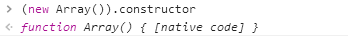

## js原型继承
(在ES2015/ES6中引入了class关键字，但只是语法糖，JavaScript 仍然是基于原型的)。

当谈到继承时，Javascript 只有一种结构：对象。每个对象都有一个私有属性(称为\[\[Prototype\]\])，它持有一个连接到另一个称为其 prototype 对象的链接。该原型对象具有一个自己的原型，等等，直到达到一个对象的 prototype 为 null。根据定义，null 没有 prototype，并作为这个原型链 中的最后一个环节。

### 原型
什么是原型呢？可以这样理解：每一个JavaScript对象在创建的时候就会与之关联另一个对象，这个对象就是我们所说的原型，每一个对象都会从原型"继承"属性。


``` javascript
function Person() {

}
// 虽然写在注释里，但是你要注意：
// prototype是函数才会有的属性
Person.prototype.name = 'Kevin';
var person1 = new Person();
var person2 = new Person();
console.log(person1.name) // Kevin
console.log(person2.name) // Kevin
```

Person是一个函数类，其中有prototype属性，这个属性所指向的对象，就是person1,person2所继承的对象实例。所以person1和person2都能直接拿到name属性，并且输出kevin


### new 运算符
当代码 new foo(...) 执行时：

 1. 一个新对象被创建。它继承自foo.prototype[函数类的prototype属性].
 2. 构造函数 foo 被执行。执行的时候，相应的传参会被传入，同时上下文(this)会被指定为这个新实例。new foo 等同于 new foo(), 只能用在不传递任何参数的情况。
 3. 如果构造函数返回了一个“对象”，那么这个对象会取代整个new出来的结果。如果构造函数没有返回对象，那么new出来的结果为步骤1创建的对象，ps：一般情况下构造函数不返回任何值，不过用户如果想覆盖这个返回值，可以自己选择返回一个普通对象来覆盖。当然，返回数组也会覆盖，因为数组也是对象。

### prototype和\_\_proto\_\_
 - 对于所有的对象，都有\_\_proto\_\_属性，这个属性对应该对象的原型

 - **对于函数对象**，除了\_\_proto\_\_属性之外，还有prototype属性，当一个函数被用作构造函数来创建实例时，该函数的prototype属性值将被作为原型赋值给所有对象实例（也就是设置实例的\_\_proto\_\_属性）

所以prototype的含义便是，该构造函数产生的实例的父类(实例)对象。

所以完成使用继承链的时候，要把函数的prototype绑定到一个**父类实例**上去。

``` javascript
function Ben_parent() {}
function Ben_son() {}
Ben_son.prototype = new Ben_parent();//原型继承
var ben_son = new Ben_son();
console.log(ben_son instanceof Ben_son);//true
console.log(ben_son instanceof Ben_parent);//true
```

### constructor
constructor 属性返回对创建此对象的数组函数的引用。



所以是直接返回一个创建你这个实例的函数对象回来了。
