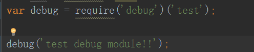
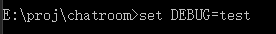
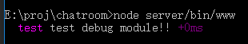

## debug模块
一般在nodejs需要进行调试的时候，可以使用console.log()方法来将调试信息输出到控制台，当发布到生产环境的时候，需要将这些调试信息都注释掉，为了方便切换而不需要改动程序代码，可以使用nodejs的debug模块

在JavaScript代码中直接console.log，可以在控制台中打印信息。但是这样的功能太单调，项目中模块很多，功能繁杂，如果没有一个约定好的console.log方法，很容易就导致打印的信息十分杂乱，可读性很差。

nodejs有一个debug模块，提供：

定义log模块，选择特定模块log输出

模块文字颜色高亮

log时间记录

输出log到文件等功能

debug模块的github和文档
<a>https://github.com/visionmedia/debug</a>

``` javascript
var debug = require('debug')('myapp:main');
debug('现在的时间是 %s' , new Date());
```

使用这个模块时，先用npm install安装。然后可以如图使用，在命令行情况下，设置DEBUG变量，即可在运行nodejs文件时输出对应的语句。


下图为例子




注意其实也是可以使用通配符的，比如mydebug:*,则可以通配到符合的debug。