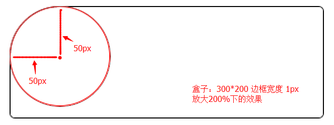

## border-radius 的工作原理

w3c属性值详解：
[ <length> | <percentage> ]：必须出现一个值，可长度可百分比，比如：border-top-left-radius:5px,border-top-left-radius:5px 50%都是可行

上图是 **border-top-left-radius:50px** 时候的效果，即是距离左上顶点50px位置做圆心，画成的一个弧成为圆角。

**通常我们都是用 CSS 的 border-radius 属性实现圆形：先画一个方形，然后将它的 border-radius 设置成50%。**

这样就可以保证四个角都是一个圆角，刚好构成一个圆形。