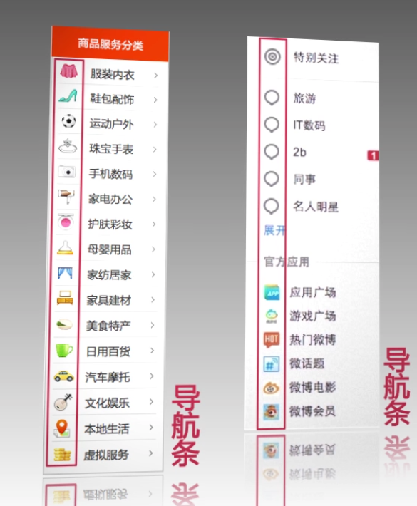
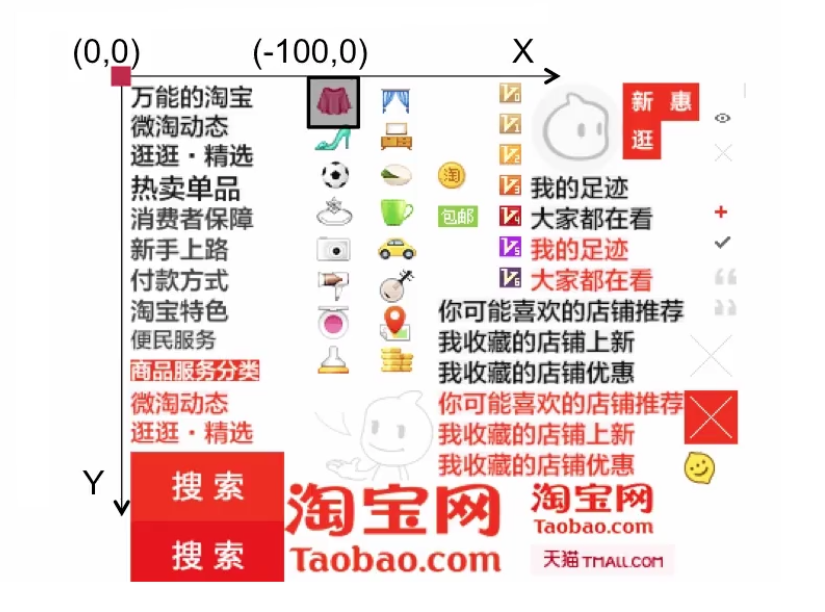

## css雪碧图

如图场景，这种导航栏的小图片，最正常的做法是用image标签解决。但是为了合并http请求，我们一般采用雪碧图技术，合成一张图片来制作。

所以雪碧图本质上就是为了 **有效减少http请求，加速内容显示**

所以我们首先要拿到一张雪碧图

比如有以下合成的png

当我们需要用到某个icon的时候，我们就会通过一个属性，去控制采取这张雪碧图的哪个部分。

那就是**background-position** 这个属性

这个属性依赖一个坐标系，如上图所示。然后控制属性值达成偏移就好。

有几点需要注意：

- background-position属性值如果是数值，那么指相对于容器自身数值的距离作为起始位置；如果是百分比或者是方向，那么指的是相对于容器自身（容器自身的宽度/高度 图片自身的宽度/高度） x 百分比 所得的数值作为起始位置。如图

- 如果不设置background-position属性值，那么默认起始位置为background-position：0% 0%。
- 方向值和百分比的计算方式是一样的，它们可以相互转换，left：0%，right：100%，center：50%。
- 如果background-position属性值只设置一个，那么另一个默认为center。