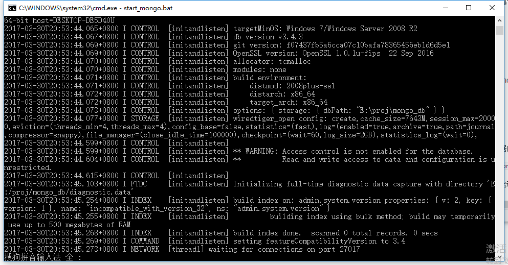

## MongoDB
MongoDB 是一个基于分布式文件存储的数据库。由 C++ 语言编写。旨在为 WEB 应用提供可扩展的高性能数据存储解决方案。
MongoDB 是一个介于**关系数据库和非关系数据库之间**的产品，是非关系数据库当中功能最丰富，最像关系数据库的。


MongoDB 将数据存储为一个文档，数据结构由键值(key=>value)对组成。MongoDB 文档类似于 JSON 对象。字段值可以包含其他文档，数组及文档数组。

mongodb中有三元素：**数据库，集合，文档**，其中“集合”

就是对应关系数据库中的“表”，“文档”对应“行”。

### 优点

<A>https://www.zhihu.com/question/20059632</a>
#### 实用性
MongoDB是一个面向文档的数据库，它并不是关系型数据库，直接存取BSON，这意味着MongoDB更加灵活，因为可以在文档中直接插入数组之类的复杂数据类型，并且文档的key和value不是固定的数据类型和大小，所以开发者在使用MongoDB时无须预定义关系型数据库中的”表”等数据库对象，设计数据库将变得非常方便，可以大大地提升开发进度。

#### 可用性和负载均衡
MongoDB在高可用和读负载均衡上的实现非常简洁和友好，MongoDB自带了副本集的概念，通过设计适合自己业务的副本集和驱动程序，可以非常有效和方便地实现高可用，读负载均衡。而在其他数据库产品中想实现以上功能，往往需要额外安装复杂的中间件，大大提升了系统复杂度，故障排查难度和运维成本。

#### 扩展性
在扩展性方面，假设应用数据增长非常迅猛的话，通过不断地添加磁盘容量和内存容量往往是不现实的，而手工的分库分表又会带来非常繁重的工作量和技术复杂度。在扩展性上，MongoDB有非常有效的，现成的解决方案。通过自带的Mongos集群，只需要在适当的时候继续添加Mongo分片，就可以实现程序段自动水平扩展和路由，一方面缓解单个节点的读写压力，另外一方面可有效地均衡磁盘容量的使用情况。整个mongos集群对应用层完全透明，并可完美地做到各个Mongos集群组件的高可用性。

#### 局限性
在某些场景下，MongoDB作为一个非关系型数据库有其局限性。MongoDB不支持事务操作，所以需要用到事务的应用建议不用MongoDB，另外MongoDB目前不支持join操作，需要复杂查询的应用也不建议使用MongoDB。


### 使用
首先必须得安装mongodb这个应用

安装好以后，每次执行都要去安装目录下的bin处执行mongod。

比如在windows下，默认安装目录为C:\Program Files\MongoDB\Server\3.4\bin

运行mongod.exe可以启动mongo服务器

运行的时候需要指定一个位置作为mongodb的存放数据的地方。

``` bat
C:\"Program Files"\MongoDB\Server\3.4\bin\mongod.exe --dbpath=E:\proj\mongo_db
```

用dbpath指定对应的位置，然后就可以看到数据库的启动了。



### shell交互

注意，bin目录下的mongo.exe可以进行shell交互

一些命令
```
db // 查看现在在执行哪个数据库

use xxdb // 切换现在的数据库

db.users.find() //显示全部users表里的数据，users是collection也就是关系型数据库里的表
```


### mongoose管理数据库
Node.js有针对MongoDB的数据库驱动：mongodb。你可以使用“npm install mongodb”来安装。

不过直接使用mongodb模块虽然强大而灵活，但有些繁琐，我就使用mongoose吧。

mongoose构建在mongodb之上，提供了**Schema、Model和Document**对象，用起来更为方便。

我们可以用Schema对象定义文档的结构（类似表结构），可以定义字段和类型、唯一性、索引和验证。Model对象表示集合中的所有文档。Document对象作为集合中的单个文档的表示。


注意mongodb不需要像关系型数据库一样设置主键，它自动会给每一个文档生成一个objectid的。