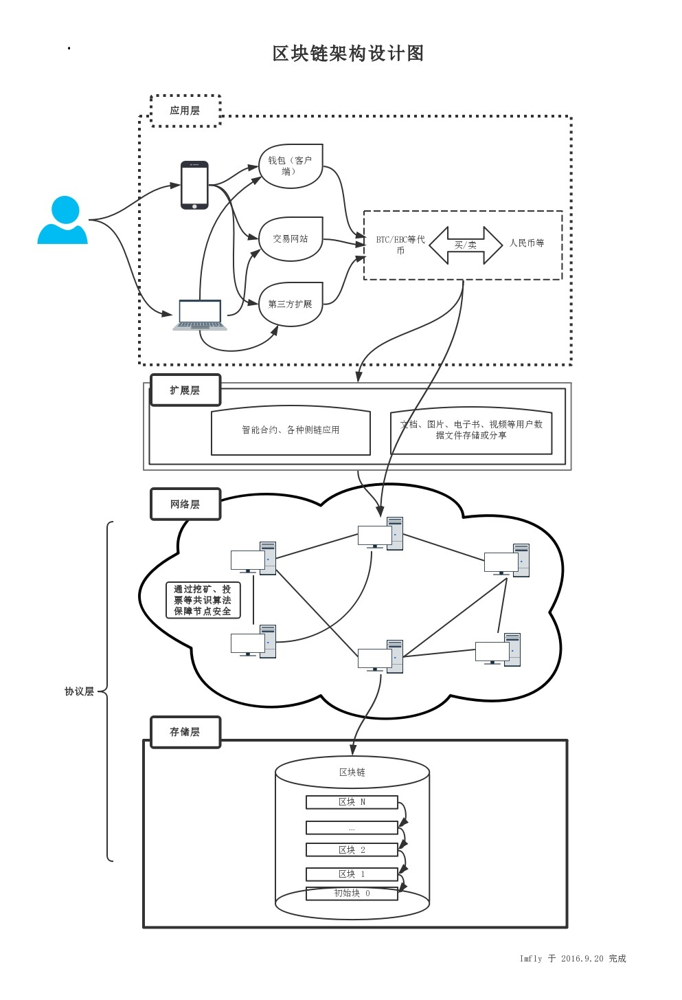

## 区块链架构基础
当对比特币有一个初步的了解之后，就可以来看看区块链总体的架构设计了。

**从架构设计上来说，区块链可以简单的分为三个层次，协议层、扩展层和应用层。** 其中，协议层又可以分为存储层和网络层，它们相互独立但又不可分割。

### 协议层
所谓的协议层，就是指代最底层的技术。这个层次通常是一个完整的区块链产品，类似于我们电脑的操作系统，它维护着网络节点，仅提供Api供调用。

通常官方会提供简单的客户端（通称为钱包），这个客户端钱包功能也很简单，只能建立地址、验证签名、转账支付、查看余额等。这个层次是一切的基础，构建了网络环境、搭建了交易通道、制定了节点奖励规则

从用到的技术来说，协议层主要包括 **网络编程、分布式算法、加密签名、数据存储技术等4个方面**

上面的架构设计图里，我把这个层面进一步分成了存储层和网络层。数据存储可以相对独立，选择自由度大一些，可以单独来讨论。选择的原则无非是性能和易用性。我们知道，系统的整体性能，主要取决于网络或数据存储的I/O性能，网络I/O优化空间不大，但是本地数据存储的I/O是可以优化的。比如，比特币选择的是谷歌的LevelDB，据说这个数据库读写性能很好，但是很多功能需要开发者自己实现。目前，困扰业界的一个重大问题是，加密货币交易处理量远不如现在中心化的支付系统（银行等），除了I/O，需要全方位的突破。

### 扩展层
这个层面类似于电脑的驱动程序，是为了让区块链产品更加实用。目前有两类，一是各类交易市场，是法币兑换加密货币的重要渠道，实现简单，来钱快，成本低，但风险也大。二是针对某个方向的扩展实现，比如基于亿书侧链，可为第三方出版机构、论坛网站等内容生产商提供定制服务等。特别值得一提的就是大家听得最多的“智能合约”的概念，这是典型的扩展层面的应用开发。所谓“智能合约”就是“可编程合约”，或者叫做“合约智能化”，其中的“智能”是执行上的智能，也就是说达到某个条件，合约自动执行，比如自动转移证券、自动付款等，目前还没有比较成型的产品，但不可否认，这将是区块链技术重要的发展方向。

### 应用层
这个层面类似于电脑中的各种软件程序，是普通人可以真正直接使用的产品，也可以理解为B/S架构的产品中的浏览器端（Browser）。这个层面的应用，目前几乎是空白。市场亟待出现这样的应用，引爆市场，形成真正的扩张之势，让区块链技术快速走进寻常百姓，服务于大众。大家使用的各类轻钱包（客户端），应该算作应用层最简单、最典型的应用。

### 参考
[一文看懂区块链架构设计](http://www.8btc.com/ebook-blockchain)
