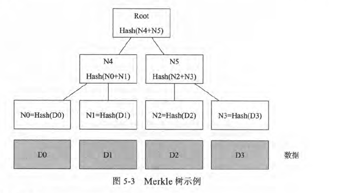
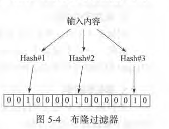

## 密码学基础

### Hash算法
常见的Hash算法包括MD5和SHA系列算法。

目前，**MD5和SHA1已经被破解**，一般至少推荐使用SHA2-256或更安全的算法。

#### 数字摘要
对消息内容进行hash运算，得到的就是数字摘要。

数字摘要主要用来解决 **内容未被篡改** 的问题。用户下载文件后自行在本地计算摘要，并与提供的摘要作对比。

#### hash攻击与防护
在数据库中，经常不会存明文数据，而是做hash后存储(保存密码hash值)。

然而，由于有时用户设置口令的强度不够，只是一些常见的简单字符串，如password 、
123456 等。有人专门搜集了这些常见口令，计算对应的Hash 值，制作成字典。这样通过
Hash 值可以快速反查到原始口令。这一类型以空间换时间的攻击方法包括字典攻击和彩虹
表攻击（只保存一条Hash 链的首尾值，相对字典攻击可以节省存储空间）等。

为了防范这一类攻击，**一般采用加盐（ salt ）的方法。保存的不是口令明文的Hash 值，
而是口令明文再加上一段随机字符串（即“盐”）之后的Hash 值。 Hash 结果和“盐”分别
存放在不同的地方，这样只要不是两者同时泄露，攻击者就很难破解了**。

### 对称密钥加密
加密和解密过程的 **密钥是相同的**。该类算法优点是 **加解密
效率（速度快， 空间占用小）和加密强度都很高**。缺点是参与方都需要提前持有密钥，一旦有人泄露则安全性被破坏；另

对称密码实现原理上可分为两种，**分组密码和序列密码**。

分组密码有比如：

 - DES(已很容易被暴力破解)
 - 3DES(不够安全)
 - AES(处理速度快，尚未有有效破解手段)
 - IDEA(1991年提出，密钥128位，更好的加密强度)

序列密码的代表算法是RC4，每次通过伪随机数生成器来生成伪随机密钥串。

对称加密算法适用于大量数据的加解密过程；不能用于签名场景；并且往往需要提前分发好密钥。

### 非对称密钥加密
顾名思义，非对称加密算法中，加密密钥和解密密钥是不同的，分别称为公钥（ public key ）和私钥（ private key ） 。私钥一般需要通过随机数算法生成，公钥可以根据私钥生成。

公钥一般是公开的，他人可获取的；私钥一般是个人持有，他人不能获取。

非对称加密算法的优点是 **公私钥分开，不安全通道也可使用。缺点是处理速度（特别是生成密钥和解密过程）往往比较慢** ，－般比对称加解密算法慢2 ～ 3 个数量级；同时加密强度也往往不如对称加密算法。

非对称加密算法的安全性往往需要基于数学问题来保障，目前主要有基于大数质因子分解、离散对数、椭圆曲线等经典数学难题进行保护。

代表算法包括：

 - RSA(利用大数质因子分解困哪的特性)

 - Diffie-Hellman(基于离散对数无法快速求解)

 - ElGamal(利用模运算求离散对数困难)

 - 椭圆曲线算法(Elliptic Curve C可ptography, ECC),基
于对椭圆曲线上特定点进行特殊乘法逆运算难以计算的特性。

 - SM2 ( ShangMi 2 ）：国家商用密码算法，由国家密码管理局于2010 年12 月17 日发布，同样基于椭圆曲线算法，加密强度优于RSA 系列算法。

### 选择明文攻击
由于公钥是公开可以获取的，因此任何
人都可以给定明文，获取对应的密文，这就带来选择明文攻击的风险。

攻击者的目标是通过这一过程获得关于加密算法的一些信息，以利于攻击者在将来更有效的破解由同样加密算法（以及相关钥匙）加密的信息。在最坏情况下，攻击者可以直接获得解密用的钥匙。这种攻击模式初看起来并不现实，因为很难想像攻击者可以选择任意的信息并要求加密系统进行加密。不过，在公钥密码学中，这就是一个很现实的模式。这是因为公钥密码方案中，加密用的钥匙是公开的，这样攻击者就可以直接用它来加密任意的信息。

zwlj:也就是攻击者给定明文，然后经过加密后得到密文，接着通过分析这些密文的规律得到一些线索。这些线索也许对破解很有帮助。

为了规避这种风险，现有的非对称加密算法（如RSA 、ECC ）都引入了一定的保护机制。
对同样的明文使用同样密钥进行多次加密，得到的结果完全不同，这就避免了选择明文攻击
的破坏。

### 混合加密机制
混合加密结合了对称密钥加密和非对称密钥加密。

核心思想就是：**先用计算复杂度高的非对称加密协商出一个临时的对称加密密钥（也称为会话密钥， 一般相对所加密内容来说要短得多），然后双方再通过对称加密算法对传递的大量数据进行快速的加解密处理。**

典型的应用案例是现在大家常用的HTTPS 协议。HTTPS 协议正在替换掉传统的不安全的HTTP 协议，成为最普遍的Web 通信协议。(详见https笔记)

### 消息认证码和数字签名
消息认证码和数字签名技术通过对消息的摘要进行加密，可用于消息防篡改和身份证明问题。

#### 消息认证码HMAC
消息认证码全称是“基于Hash 的消息认证码”（ Hash-based Message Authentication Code,HMAC ） 。

基本过程为：对某个消息利用提前共享的 **对称密钥** 和Hash 算法进行加密处理，得到HMAC 值。该HMAC 值持有方可以证明自己拥有共享的对称密钥，并且也可以利用HMAC确保消息内容未被篡改。

消息认证码一般用于 **证明身份** 的场景。如Alice 、Bob 提前共享和HMCA 的密钥和Hash 算法， Alice 需要知晓对方是否为Bob ，可发送随机消息给Bob 。Bob 收到消息后进行
计算，把消息HMAC 值返回给Alice, Alice 通过检验收到HMAC 值的正确性可以知晓对方
是否是Bob 。注意这里并没有考虑中间人攻击的情况，假定信道是安全的。

**当密钥可能被多方拥有的场景下，无法证明消息来自某个确切的身份。**

zwlj：结合了对称密钥和Hash，能证明身份有效，但是不能证明确切身份。

#### 数字签名
数字签名基于非对称加密，既可以用于 **证实某数字内容的完整性，又同时可以确认来源（或不可抵赖，Non-Repudiation ）**

Alice 通过信道发给Bob 一个文件，Alice 可以先对文件内容进行摘要，然后用自己的
私钥对摘要进行加密（签名），之后同时将文件和签名都发给Bob 。

Bob 收到文件和签名后，用Alice 的公钥来解密签名，得到数字摘要，与收到文件进行摘要后的结果进行比对。如果
一致，说明该文件确实是Alice 发过来的（别人无法拥有Alice 的私钥），并且文件内容没有
被修改过（摘要结果一致） 。

zwlj：结合了非对称密钥(私钥)和Hash

### 数字证书
数字证书解决的是 **公钥分发的问题** ，防止公钥伪造(可以看看https笔记)

证书需要由证书认证机构（ Certification Authority, CA ） 来进行签发和背
书。权威的证书认证机构包括DigiCert 、GlobalSign 、VeriSign 等。用户也可以自行搭建本地CA 系统，在私有网络中进行使用。

#### 证书信用链
实际上，要想知道CA 的公钥是否合法，一方面可以通过更上层的CA 颁发的证书来进
行认证；另一方面某些根CA (Root CA ）可以通过预先分发证书来实现信任基础。例如，主
流操作系统和浏览器里面。

往往会提前预置一些权威CA 的证书（通过自身的私钥签名，系统承认这些是合法的证书） 。之后所有基于这些CA 认证过的中间层CA (Intermediate CA)和后继CA 都会被验证合法。这样就从预先信任的根证书，经过中间层证书，到最底下的实体证书，构成一条完整的证书信任链。

某些时候用户在使用浏览器访问某些网站时，可能会被提示是否信任对方的证书。这
说明该网站证书无法被当前系统中的证书信任链进行验证，需要进行额外检查。另外，当信
任链上任一证书不可靠时，则依赖它的所有后继证书都将失去保障。

### Merkle树
Merkle树，也叫哈希树。是一种典型的二叉树结构，由一个根节点、一组中间节点和一组叶节点组成。在区块链系统出现之前，广泛用于文件系统和P2P 系统中

主要特点为：
 - 最下面的叶节点包含存储数据或其哈希值；
 - 非叶子节点（包括中间节点和根节点）都是它的两个孩子节点内容的哈希值。

默克尔树逐层记录哈希值的特点，让它具有了一些独特的性质：

 - 底层数据的任何变动，都会传递到其父节点，一层层沿着路径一直到树根。这意味树根的值实际上代表了对底层所有数据的“数字摘要” 。

Merkle树的典型应用场景为：

1. 快速比较大量数据(对于每一组数据排序后构建默克尔树，根相同时，两组数据必然相同[由于Hash计算可以十分迅速])
2. 快速定位修改(logn的时间定位到发生改变的数据块)
3. 零知识证明：仍以图5-3 为例，如何向他人证明拥有的某组数据（ D0·· … ·D3 ）中包括给定某个内容D0 而不暴露其他任何内容。很简单，构造如图所示的一个默克尔树，公布Nl 、N5 、Root 。DO 拥有者通过验证生成的Root 是否跟提供的值一致，即可很容易检测DO 存在。整个过程中验证者无法获知其他内容[0知识]。

在比特币中，默克尔树的目的是允许区块的数据可以零散地传送：节点可以从一个源下载区块头，从另外的源下载与其有关的树的其它部分，而依然能够确认所有的数据都是正确的。之所以如此是因为哈希向上的扩散：如果一个恶意用户尝试在树的下部加入一个伪造的交易，所引起的改动将导致树的上层节点的改动，以及更上层节点的改动，最终导致根节点的改动以及区块哈希的改动，这样协议就会将其记录为一个完全不同的区块（几乎可以肯定是带着不正确的工作量证明的）。

默克尔树协议对比特币的长期持续性可以说是至关重要的。在2014年4月，比特币网络中的一个全节点-存储和处理所有区块的全部数据的节点-需要占用15GB的内存空间，而且还以每个月超过1GB的速度增长。目前，这一存储空间对台式计算机来说尚可接受，但是手机已经负载不了如此巨大的数据了。未来只有商业机构和爱好者才会充当完整节点。简化支付确认（SPV)协议允许另一种节点存在，这样的节点被成为“轻节点”，它下载区块头，使用区块头确认工作量证明，然后只下载与其交易相关的默克尔树“分支”。这使得轻节点只要下载整个区块链的一小部分就可以安全地确定任何一笔比特币交易的状态和账户的当前余额。

### 布隆过滤器Bloom Filter
布隆过滤器是一种基于Hash 的高效查找结构，能够快速（常数时间内）回答“某个元素是否在一个集合内”的问题。

#### 基于Hash的快速查找
在布隆过滤器之前。

如果给定一个内容和存储数组，通过构造Hash 函数，让映射后的Hash 值总不超过数组的大小，则可以实现快速的基于内容的查找。例如，内容“ hello world ，，的Hash 值如果是“ 10 。”，则存放到数组的第100 个单元上去。如果需要快速查找任意内容，如“ hello world ” ，字符串是否在存储系统中，只需要将其在常数时间内计算Hash 值，并用Hash 值查
看系统中对应元素即可。该系统“完美地”实现了常数时间内的查找。

然而，令人遗憾的是，当映射后的值限制在一定范围（如总数组的大小）内时，会发现
Hash 冲突的概率会变高，而且范围越小，冲突概率越大。很多时候，存储系统的大小又不
能无限扩展，这就造成算法效率的下降。**为了提高空间利用率，后来人们基于Hash 算法的
思想设计出了布隆过滤器结构。**

#### 布隆过滤器原理
布隆过滤器采用了多个Hash 函数来提高空间利用率。对同一个给定输入来说，多个Hash 函数计算出多个地址，分别在位串的这些地址上标
记为1 。进行查找时，进行同样的计算过程，并查看对应元素，如果都为l ，则说明较大概率是存在该输入。

布隆过滤器相对单个Hash 算法查找，大大提高了
空间利用率，可以使用较少的空间来表示较大集合的存在关系。

布隆过滤器也存在冲突。这就造成了两种方法都存在着误报（ false positive ）的情况，但绝对不会漏报（ false negative ） 。

布隆过滤器在应用中误报率往往很低，例如，在使用7 个不同Hash 函数的情况下，记
录100 万个数据， 采用2 MB 大小的位串，整体的误判率将低于1% 。而传统的Hash 查找
算法的误报率将接近10% 。

### 同态加密
同态加密（ homomorphic encryption ）是一种特殊的加密方法，允许对密文进行处理得
到仍然是加密的结果。**即对密文直接进行处理，跟对明文进行处理后再对处理结果加密，得
到的结果相同。从抽象代数的角度讲，保持了同态性。**

同态加密在云计算和大数据的时代意义十分重大。目前，虽然云计算带来了包括低成
本、高性能和便捷性等优势，但从安全角度讲，用户还不敢将敏感信息直接放到第三方云上
进行处理。如果有：了比较实用的同态加密技术，则大家就可以放心地使用各种云服务了，同
时各种数据分析过程也不会泄露用户隐私。加密后的数据在第三方服务处理后得到加密后的
结果，这个结果只有用户自身可以进行解密，整个过程第二方平台无法获知任何有效的数据
信息。

另一方面，对于区块链技术，同态加密也是很好的互补。使用同态加密技术，运行在
区块链上的智能合约可以处理密文，而无法获知真实数据，极大地提高了隐私安全性。
