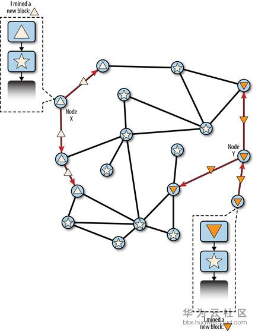
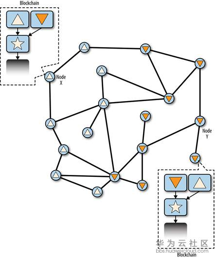
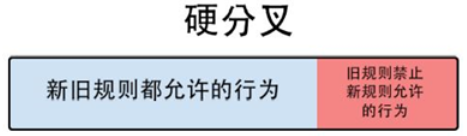
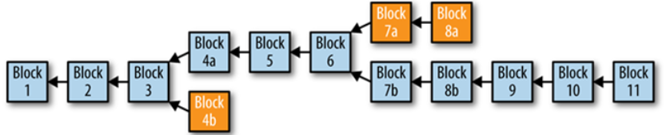
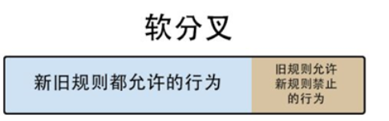

## 区块链分叉
每个具有转发功能的节点（包括矿工）收到来自其他节点的新区块时首先会验证新区块是否有效，如果有效才会进行转发，否则会拒绝该区块。

验证内容如下：

 - 区块头Hash值小于难度值（Target）（工作量证明有效）
 - 区块时间戳早于验证时间未来两小时（由于各节点时间差异和网络传输时间等原因，区块链通常允许时间戳有一定的误差）
 - 区块大小在可接受的范围内（无隔离见证的情况下为1000KB）
 - 区块中有且仅有第一笔交易为coinbase交易
 - 区块中所有交易符合交易验证的条件

1. 独立验证区块可以防止无效的区块在比特币网络中被大量传播。
2. 独立验证可防止小部分节点串通作恶导致无效区块被网络接受的情况。

### 接受新区块
当一个节点收到新区块并验证通过后，会尝试将新区块加入到区块链上，但此时可能遭遇三种不同的情况，我们来进行逐一讨论。

#### 1.将区块加入到主链上
这是一种最常见的情况，当节点收到新区块并验证通过后，直接将新区块链接到当前区块链最后一个区块后面
#### 2.将新区块加入主链产生的分支链上
由于比特币节点地域分布、网络传输等原因，每个节点在收到其他节点产生的新区块时间存在一定差异。假设有两个诚实节点X与Y在相近的时间内完成了工作量证明，此时他们还未收到其他节点广播的新区快，于是X与Y都将自己发现的区块广播到网络中，这时候会出现一些节点先接收到X发现的区块，而一些节点先接收到Y发现的区块。由于X与Y发现的区块都是有效的，所以这些节点都会把先接收到的区块加入到自己的主链中。

观察上图，注意到图上标了两个节点X和Y。X节点注明的是，正三角的block由这个节点产生，Y注明倒三角的block由Y产生。顺着黑实线，block分发给周围的节点。先接受到正三角的节点，验证完毕后会把正三角block加入自己的主链，表现在图中，节点也被打上正三角标记。没有接收到正三角和倒三角block的节点，node维持星星标记。

随着X与Y发现的新区块在网络中进一步被转发，先收到X发现区块的节点也会收到Y的区块，先收到Y发现区块的节点也会收到X的区块。此时这些节点会把晚收到的有效区块加入到主链产生的分支链上，整条区块链将产生短暂的分叉。

如上图，主链的星星block后面分叉除了正三角分支和倒三角分支。

在X与Y发现的区块被各节点接受后，矿工仅会把晚收到的有效区块连接到分支链上，然后继续基于自己的主链挖矿，即 **矿工组装的候选区块中Previous Block Hash总是对应自己主链上的最后一个区块**。

接着，节点Z完成了下一个工作量证明组装了一个新区块并开始广播该区块。节点会选择工作量最大（区块高度最高）的链作为自己的主链。并把区块放到那条分支的后头。

以上我们讨论的情况仅发生了一个区块分叉，实际中在一个区块分叉后可能再次产生同样的情况（分叉），所有节点处理方式是一样的。但是各节点在短时间内连续出现在相近时间完成工作量证明的概率呈指数下降。在比特币网络中一个区块的分叉每天都会发生，二个区块的分叉几周才会发生一次。而六个区块以上的分叉从未发生过，**这也是为什么我们通常认为一笔交易得到6个区块的确认是最保险的**。

### 硬软分叉
上一节我们了解了比特币如何达成最终一致性，其中可能发生的区块链分叉通常是自然发生又自然结束的。
比特币目前已有100多项改进提案（[详细可见](https://github.com/bitcoin/bips)），可以看到比特币社区开发者一直在致力于改进比特币。

一个分布式共识系统的升级是非常困难的，需要协调好所有的系统参与者。
**每次升级可能会伴随着区块链的共识规则改变**，这会导致整个网络中升级了软件的节点与未升级软件的节点运行在不同的规则下，于是分叉就产生了。

#### 硬分叉
如果区块链软件的共识规则被改变，并且这种规则改变无法向前兼容，旧节点无法认可新节点产生的区块，即为硬分叉。

这时候旧节点会拒绝新规则的区块，于是新节点和旧节点会开始在不同的区块链上运行（挖矿、交易、验证等），由于新旧节点可能长期存在，这种分叉也可能会长期持续下去。

上图中Block 4a与Block 4b是自然分叉的结果，最终在Block 5整个区块链达成了最终一致性

假设当区块链扩展到Block 6时发布了改变共识规则的新客户端版本，于是运行不同客户端的节点出现分歧：
运行新版本的矿工将接受新规则下产生的区块Block 7b;
运行旧版本的矿工由于不能认可新规则，将拒绝Block 7b，并挖出基于旧规则的Block 7a;
此时区块链即发生了硬分叉，新旧矿工将在各自的区块链上进行挖矿，他们的去留将决定两条链的生死和价值。

在没有得到几乎所有生态中的参与者同意的情况下，硬分叉很可能会分裂整个比特币生态，所以这是一种极具争议和危险的区块链升级技术。整个比特币社区对于硬分叉非常谨慎，到目前为止，比特币一共发生过两次软件升级造成的硬分叉，但都是意外情况（软件BUG）引起，最终矿工们通过回退或全体升级达成了一致使事态影响没有扩大。

#### IFO（Initial Fork Offerings）
IFO是继ICO后被创造出的新概念，**一些社区或集团为了改进比特币的机制而分叉出一条新的区块链**，这实际是一种硬分叉的场景。

如2017年8月1号，Bitcoin Cash（BCH）区块链成功在区块高度478559与主链分离。**这一新的加密货币默认区块大小为8MB，并且可以实现区块容量的动态调整**。

由于旧节点只认可小于1MB的区块，所以运行BCH客户端节点产生的区块无法向前兼容，将被旧节点拒绝，最后运行不同客户端的矿工将会长期运行在两条不同的区块链上（BTC和BCH）。

#### 软分叉
如果区块链的共识规则改变后，这种改变是向前兼容的，旧节点可以兼容新节点产生的区块，即为软分叉。

实际上，软分叉通常刚开始并不会产生两条区块链，因为新规则下产生的块会被旧节点接受，旧节点只是无法识别新规则的真实意义。所以新旧节点仍然处于同一条区块链上，对整个系统的影响也就较小。

软分叉在比特币历史上发生过多次，这里以BIP-34举例：Coinbase交易的输入中有一个字段coinbase data内容可以任意定制。BIP-34就是要求在coinbase data中必须包含块高度（Block Height）信息且将块版本（Block version）从“1”修改为“2”。
显然在旧规则下，节点并不关心coinbase data是什么内容，完全可以兼容包含块高度信息的区块，所以不会就此产生分叉。

软分叉提供了一种逐步升级比特币的方式，除了BIP-34，还有BIP-65、BIP-66、BIP-9等特性进行了软分叉升级，它们的升级方式也有一定的区别

**软分叉相比硬分叉虽然“温和”了不少，但由于软分叉必须向前兼容，也就是说不能增加新字段，只能在已有结构下做修改，所以升级空间有限。**
