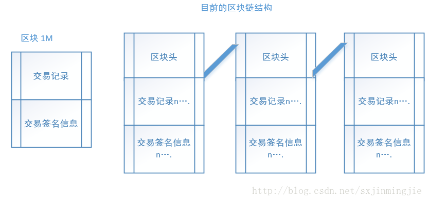
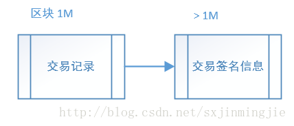
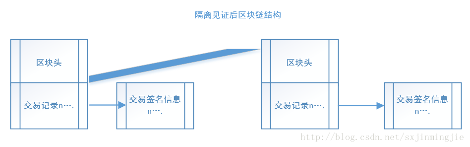
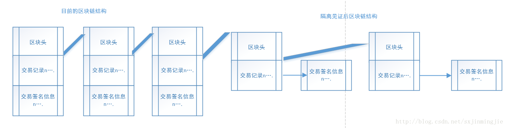
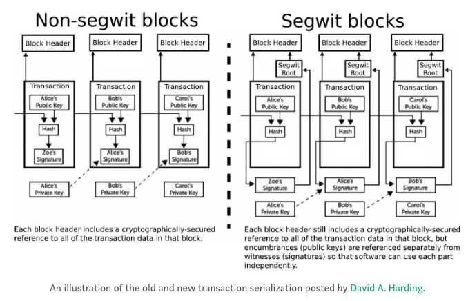
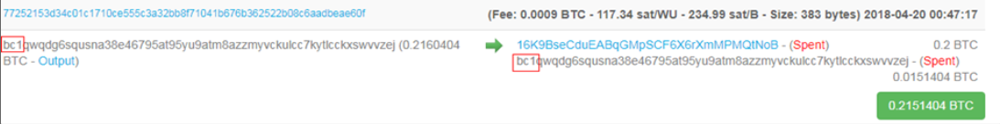

## 隔离见证&闪电网络
在比特币中，**见证（witness）通常指的是锁定脚本(unlocking script)和解锁脚本(scriptSig)**,在之前对于比特币交易的学习中我们知道锁定脚本与解锁脚本都是交易(transcation)的一部分。顾名思义，**隔离见证就是指将锁定脚本与解锁脚本中的部分内容从交易中分离出来，放入一个独立的数据结构中。隔离见证简称Segwit**

### 隔离见证直观解释
隔离见证是对比特币的一种 **升级扩容方案**，由于交易量的增加和比特币区块大小的限制，区块很快被填满，导致交易处理的效率越来越低。

扩容其实十分必要了，只有区块的容量扩大，容纳更多交易这个才能在单位时间内处理更多的交易。

在比特币交易中交易是以输入输出的信息存在，输入信息证明资金的所有权，在转账过程中，转账者需要用自己的私钥签名表明能够使用这个资金，同时加上接收者的地址，说明这笔资金是转账给谁，这个过程中签名占用了大量的字节，比特币网络中的旷工需要验证这个签名，而网络中的普通节点只需要知道这个资金是不是可用，简单来说，大多数节点不关心这个签名。

所以在比特币系统中出现一种将签名信息隔离开来的提议，那在UTXO中放一个指向签名信息的指针即可。从数据结构角度来说隔离见证方案就是将原来的UTXO信息分为输入、输出、签名（见证）。



隔离见证前，区块的结构里是包含交易签名信息(锁定脚本，解锁脚本)的。

隔离见证后：





隔离见证之后，交易记录里只保留一个指针，签名信息放到区块外面来。由此也可能会产生一些软分叉性质的问题，下面就是启用隔离见证之后的状态：



当把 **签名信息(私钥)单独放置之后，区块原先的基本结构中能够容纳的交易数量就自然而然的变多了**，从而可以起到一定的扩容作用。同时，将签名信息与交易记录分开之后，它将不再参与交易ID的哈希计算，**所以通过修改签名信息来伪造交易的可能性就会大大降低。**

所以本质上，隔离见证就是优化了区块的布局



这里要注意的是，优化了布局之后(区块 = 头部 + 交易数据 + 见证数据)，非矿工的节点由于不需要验证数据，就不需要下载验证数据了，只下载头部+交易数据即可。矿工还是要全部都下载的。这里也有一个问题，只有矿工保存验证数据，这可能会导致未来验证数据的缺失。


### Segwit工作机制
目前Segwit支持P2PKH与P2SH支付，加入隔离见证的交易取名为P2WPKH与P2WSH，分别来看一下他们的区别。

回忆一下之前锁定脚本和解锁脚本的内容，P2PKH的流程就是判断两边的公钥哈希等不等，相等的话就进行公私解锁。而P2SH则是多重签名。

简单对比一下P2PKH：

```
scriptSig(解锁脚本):    <signature> <pubkey>
scriptPubKey(锁定脚本): OP_DUP OP_HASH160 <20-byte hash of Pubkey> OP_EQUALVERIFY OP_CHECKSIG
```

加入了隔离见证的P2WPKH：

```
scriptSig(解锁脚本):    (empty)
scriptPubKey(锁定脚本): 0 <20-byte hash of Pubkey>
witness:      <signature> <pubkey>
```

P2WPKH的锁定脚本较P2PKH要精简不少，第一位的数字0是版本号，有了版本号，未来脚本升级就能更容易的向前兼容。**P2WPKH的解锁脚本为空**，而真正的解锁脚本内容被移到了原交易之外的witness部分。

#### P2WSH(Pay-to-Witness-Script-Hash)
P2WSH锁定脚本与P2WPKH类似

```
P2SH
  scriptSig:    0 <SigA> <SigB> <2 PubkeyA PubkeyB PubkeyC PubkeyD PubkeyE 5 CHECKMULTISIG>
  scriptPubKey: HASH160 <20-byte hash of redeem script> EQUAL
P2WSH  
  scriptSig:    (empty)
  scriptPubKey: 0 <32-byte hash of redeem script>
  witness:      0 <SigA> <SigB> <2 PubkeyA PubkeyB PubkeyC PubkeyD PubkeyE 5 CHECKMULTISIG>
```

P2WSH锁定脚本与P2WPKH类似，第一位是版本号，第二位是赎回脚本(Redeem script)的Hash值。
值得注意的是P2WSH锁定脚本中的Hash值是256位(32字节)的，是使用SHA256(pubkey)计算得到；而P2WPKH中的Hash值是160位(20字节)的，是使用RIPEMD160(SHA256(pubkey))计算得到的。

这样做的目的是让钱包可以根据Hash值的长度区分交易使用的是P2WPKH还是P2WSH。**在P2SH交易中常常会有多重签名验证，所以验证信息会占用更多空间，将这些信息移到原交易之外能更大程度的降低交易大小。**

#### Segwit升级
比特币的升级往往伴随着硬分叉或软分叉。软分叉影响较小，但要求更严格，需要非常严谨的考虑向前兼容性问题。

开发者希望隔离见证能通过软分叉进行升级，也就是说新旧客户端可以在同一区块链上共存。于是我们要考虑两种场景：

 - 付款人的客户端支持隔离见证，而收款人不支持
 - 付款人的客户端不支持隔离见证，而收款人支持

对于第一种情况，如果收款人不支持隔离见证，那最终发布的地址将会是普通地址（P2PKH或P2SH），那所有交易按照原有的规则进行即可。

而对于第二种情况，聪明的社区开发者想出了一个过渡方案，即将P2WPKH或P2WSH植入P2SH。

P2WPKH植入P2SH后，交易信息如下：

```
scriptSig:    0 <20-byte hash of Pubkey>
scriptPubKey: HASH160 <20-byte hash of script> EQUAL
witness:      <signature> <pubkey>
```

此处的脚本Hash值为RIPEMD160(SHA256(0 <20-byte hash of Pubkey>))的结果，将该脚本Hash转换为P2SH地址，就是一个兼容segwit的地址，不支持隔离见证的客户端可以正常支付比特币给这种P2SH地址。
而对于支持隔离见证的客户端，仍可以将验证信息放在witness结构中，当然这种过渡方案的交易会较完全形态的方案稍大一些，但比无隔离见证的情况要小。

在新版本客户端激活隔离见证后，会有较长一段时间才会被大多数钱包升级。所以新旧客户端一开始将会以植入P2SH（上一节已描述）的方式互相兼容。

当隔离见证被大范围接受后，钱包将开始使用一种新的专门针对Segwit原生的地址类型，这种地址将使用Base32编码，而不再使用Base58，即全部使用小写字母和数字表达

**如果你看到以bc1开头的地址，就是使用隔离见证地址进行的交易**



#### 隔离见证区块大小
比特币的区块大小限制为1000000bytes，由于witness数据不包含在这个限制中，为了防止witness数据被滥用，仍然对总的区块大小做了限制。

引入了一个新概念叫块重量(Block weight)

 - Block weight = Base size * 3 + Total size
 - Base size是不包含witness数据的块大小
 - Total size是包含了witness数据的总大小

隔离见证限制Block weight <= 4000000

### 隔离见证的优点

#### 1.交易扩展性
比特币的验证信息是交易中第三方唯一可以修改的数据，移除交易中的验证信息，可防止交易延展性攻击。交易延展性攻击通常是客户端发出交易后，第三方通过修改或增加一些内容到验证信息中，改变交易ID(txid)，引起客户端误以为交易失败（实际已成功，但不再是原始的txid）。
交易延展性问题的解决可以大大提升支付通道(payment channels),链式交易(chained transactions),闪电网络(lighting networks)的可操作性。

#### 2.脚本版本化
使用隔离见证后，锁定脚本(Locking script)将被加上版本号，从而使脚本语言的升级更容易向前兼容，这种不造成太大影响的脚本语言修改方式将加快比特币的创新。

#### 3.网络与存储伸缩性
交易中验证数据(witness data)占据了不小的比例，特别是一些复杂的交易，如多重签名，支付通道等.在一些情况下可以占据超过75%的交易大小。将验证数据放到交易外，可提高比特币的伸缩性。
**节点可以在验证签名后删除验证数据或在简单支付验证时忽略它，验证数据不需要被传输到所有节点或存储在所有节点的硬盘上。**

#### 4.签名验证优化
隔离验证降低签名验证的算法复杂性，在隔离验证前，哈希的计算次数为O(n2),使用隔离验证后，计算次数降为O(n)，n为签名操作的数量
