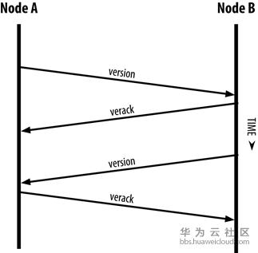
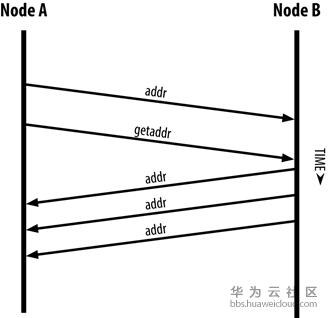
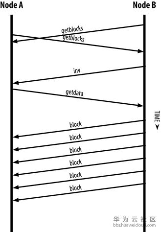
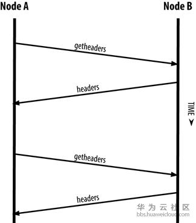

## 比特币节点通信
比特币节点接入比特币网络的步骤如下：

### 1.寻找有效节点
此步骤通常有两种方法

1. 使用“DNS种子”（DNS seeds），DNS种子提供比特币节点的IP地址列表，Bitcoin Core客户端提供五种不同的DNS种子，通常默认使用即可

2. 手动通过-seednode命令指定一个比特币节点的IP地址作为比特币种子节点

也就是说，要不就是使用默认dns提供节点，要不就是手动指定ip地址进行连接。

### 2.与发现的有效比特币节点进行初始“握手”，建立连接
此过程为了与节点进行连接，这样可以类比成TCP的三次握手。消息通信的过程如下：

节点发送一条包含基本认证内容的 **version消息** 开始“握手”通信过程 该消息包括如下内容：

 - nVersion：客户端的比特币P2P协议所采用的版本（例如：70002）。

 - nLocalServices：一组该节点支持的本地服务列表，当前仅支持NODE_NETWORK

 - nTime：当前时间

 - addrYou：当前节点可见的远程节点的IP地址（上例中NodeB IP）

 - addrMe：当前节点的IP地址（上例中NodeA IP）

 - subver：指示当前节点运行的软件类型的子版本号（例如：”/Satoshi:0.9.2.1/”）

 - BestHeight：当前节点区块链的区块高度（初始为0，即只包含创世区块）

### 3.新节点建立更多的连接，使节点在网络中被更多节点接收，保证连接更稳定

1. 发送一条包含自身IP地址的addr发送给已连接的节点，这些节点收到后将此转发给它们各自的连接节点，使网络中更多的节点接收到新节点

2. 发送一条getaddr消息，要求已连接节点返回其已知的节点IP地址列表，通过这种方式，节点可以找到更多可连接的节点。

3. 已建立连接的节点会定期发送信息维持连接，如果某个节点长达90分钟没有通信，会被认为已经断开，网络会开始寻找一个新的节点。

每个节点连接不超过1000个对等节点，超过数量的IP地址会被忽略，**连接过多的节点浪费网络资源，没有必要**。

用户可指定-connect选项来指定一个或多个IP地址，如果设置该选项，节点将只连接选项中的地址，不会自动发现并维护节点之间的连接。

启动完成后，节点会记住最近成功连接的节点，当重新启动后可以迅速与先前的节点重新建立连接。如果先前节点均无法连接，会重新从步骤1开始执行。

### 4.交换“区块清单”
（注：该步骤仅在全节点上会执行，且从与节点建立连接就开始进行）

全节点在连接到其他节点后，需要构建完整的区块链，如果是新节点，它仅包含静态植入客户端中的0号区块（创世区块）。

1. 通过version消息中的BestHeight字段可知双方节点的区块高度(这一步在第一步连接的时候获取)，然后节点之间交换一个getblocks消息，其中包含本地区块链顶部区块的Hash，这样节点间就可以判断谁的链更长。

2. **拥有更长链的节点识别出其他节点需要“补充”的区块后，开始分批发送区块（500个区块为一批）**，通过inv消息先将第一批的区块清单发送给对端节点（inv消息包含500个区块的Hash清单）。限制每次同步区块的数量，是为了减少新节点同步区块对网络造成的影响。

3. 缺少区块的节点发送getdata消息向所有已连接的节点请求全区块数据，“正在传输”的区块数量不能超过客户端MAX_BLOCKS_IN_TRANSIT_PER_PEER参数设置的值。

### 简易支付验证（Simplified Payment Verification(SPV)）节点

由前文可知，运行全节点需要消耗非常多的存储空间，并不是所有设备都有条件成为全节点。简单支付验证（SPV）即是为了再不存储完整区块链的情况下进行工作。

SPV节点只需要下载区块头，大小约只有全节点的1/1000。

对于全节点来说，验证交易非常简单，只需要沿着区块链按时间倒叙一直追溯到创世区块，建立一个完整的UTXO数据库，通过查询UTXO是否未被支付来验证交易的有效性即可。

对于SPV节点，通过向其他节点请求某笔交易的Merkle路径（Merkle树我们会在后续章节详细解释），如果路径正确无误，并且该交易之上已有6个或以上区块被确认，则证明该交易不是双重支付。

SPV节点使用getheaders消息替代getblocks消息，收到请求的节点将用一条headers消息发送2000个区块头给请求节点，不断循环直到区块头同步完毕。

### 交易池
 - **交易池(transcation pool)**：比特币网络节点用于存放已被网络知道，但还未记入区块链的交易，**存储在本地内存中**。

 - **孤立交易池(orphan pool)**：如果一个交易的输入与当前节点未知的交易关联（就是没有发现父交易）会被暂时存入孤立交易池。当节点收到该交易的关联交易（父交易），该交易会被移入交易池中。**孤立交易池存储在本地内存中**

 - **UXTO池(UTXO pool)**：存放区块链中所有未支付交易输出的集合，**可能存储在本地内存，也可能作为数据库表存储在存储设备中**

 **交易池与孤立交易池包含的是未确认的交易，而UTXO池包含的是已确认的交易。**

### 参考

精通比特币

[深入比特币原理（七）——比特币节点通信](https://bbs.huaweicloud.com/blogs/cfb8e58f1b6111e89fc57ca23e93a89f)
