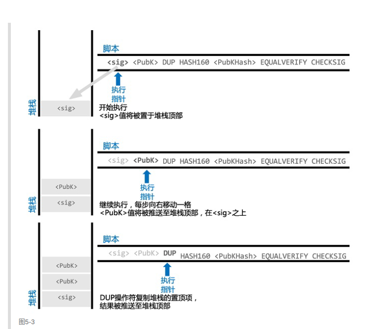
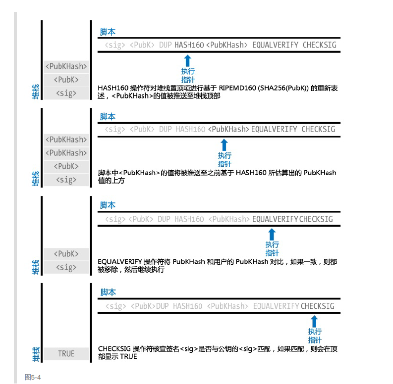

## bitcoin的锁定脚本与解锁脚本
如果观察bitcoin的源码，会发现在Transaction的数据结构中，输入和输出的对象里，都有个CScript对象，这个CScript就是脚本对象。

bitcoin通过使用锁定脚本和解锁脚本来验证交易的合法性。**一个UTXO输入，里面会有一个解锁脚本，一个UTXO输出则会有一个锁定脚本**。

所谓的解锁脚本和锁定脚本对象，**其实就是封装了一系列操作**，使得交易验证可以进行。**这些操作是基于堆栈进行的**

bitcoin交易中，不同的交易类型(方式)，使用的验证操作会不一样，所以脚本类型也会不同。大多数bitcoin网络处理的交易(比如A用户转账个B用户这种形式)是以一种称为P2PKH(Pay-to-Public-Key-Hash)的脚本为基础进行的

### P2PKH脚本
说了这么多，我们来看看具体解锁脚本和锁定脚本封装了什么吧。

在P2PKH交易类型中，解锁脚本就是单纯的<Sig>(由用户的私钥生成) <PubKey>[输出用户的公钥]组成的。更具体的说，在基于堆栈的操作下，解锁脚本就是往堆栈里push一个用户自己的私钥生成的Sig,再push一个代表了对方地址的public key。根据精通比特币笔记，我们已经知道了bitcoin地址是由公钥生成的了，所以public key是可以代表bitcoin地址的。

所以 **解锁脚本的操作就是往堆栈push两个值**

那么锁定脚本呢，锁定脚本相对复杂一点，

```
锁定脚本：OP_DUP OP_HASH160 <PubkeyHash> OP_EQUALVERIFY OP_CHECKSIG          
```

反正也是一系列操作，中间还会push一个公钥哈希值。

如此一来，我们就可以捋一捋一个交易创建和被验证的过程了(重点关注之后的用户B)。当A用户转账给B用户，A用户会创建一个交易，交易的输入有一个解锁脚本，**交易的输出有一个锁定脚本**。这个锁定脚本的格式就是 `OP_DUP OP_HASH160 <B的公钥的哈希值> OP_EQUALVERIFY OP_CHECKSIG`。由于B的公钥A也可以获取，所以A可以很轻松的创建出这个锁定脚本，并且封装好这个交易的结构。

假如之后，B要转账给C，那么B就要创建一个交易，这个交易的输入很可能会用到之前A转过来那笔交易的输出。此时**B的输入的解锁脚本**就是 `<B的私钥生成的Sig> <B的公钥>`

如此一来，就可以进行配对了，解锁脚本将会和之前的锁定脚本进行操作配对，由于B的私钥只有B有，所以只有B能成功解锁这个脚本并使用到这笔输出。

具体的脚本解锁操作过程如下：基本就是拼接了解锁脚本和锁定脚本而已



上图，先push一个sig，一个PubK。这两步是解锁脚本的操作，然后执行锁定脚本，先duplicate，复制一个PubKey，然后hash操作



哈希之后，判断一下解锁脚本和锁定脚本的hash等不等，等的话说明对应同一个用户(比特币地址)。然后PubKey将会和自己的私钥进行比对，如果CHECK成功，说明这笔输出确实是属于"自己"的，可以被“自己”使用。如果返回为FALSE,那当然就是验证失败了。

### 参考

精通比特币

[深入比特币原理（四）——锁定脚本(locking script)与解锁脚本(unlocking script)](https://bbs.huaweicloud.com/blogs/d4c97558190611e89fc57ca23e93a89f)
