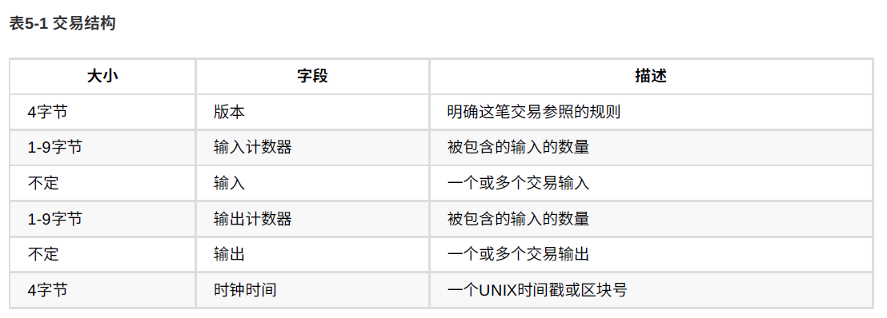
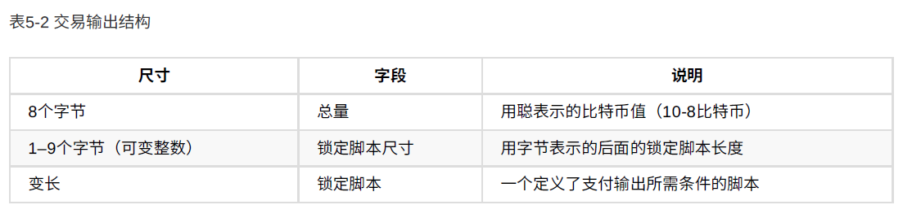
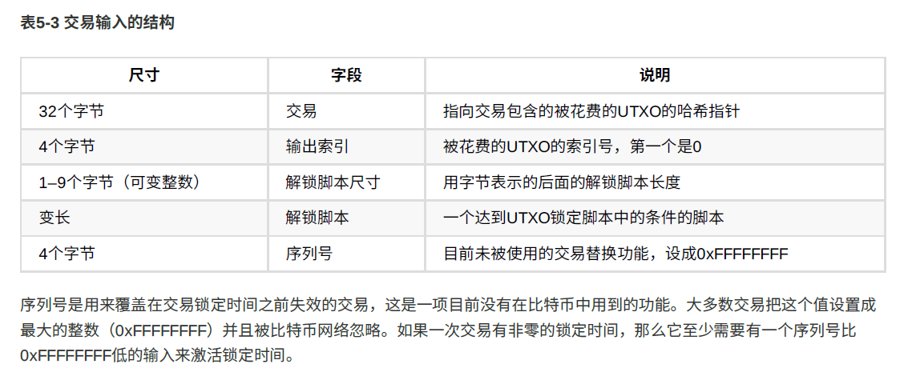

## 精通比特币
记录阅读精通比特币电子书过程中知识的笔记。

### 比特币地址
比特币地址是一个字符串，**由公钥经过哈希生成的比特币地址以数字1开头**。通常以收款方形式出现。

公钥通过哈希和Base58Check编码变换，得到比特币地址。

### 比特币钱包
钱包其实是私钥的容器。钱包中包含成对的公钥和私钥，这些私钥用来签名交易。

### 比特币交易过程
比特币钱包，本质上就是多个地址(私钥),和解锁资金密钥的简单集合。

比特币交易是使用复式记账法，账本中，**记录的不是账户的余额，而是账户的收入和支出**，也就是相当于这个账户的输入和输出。输入和输出不严格相等，输出可能小于输入，那其中的差额可能是作为矿工费。

显然，一笔交易的输入就是另一笔交易的输出。如此一来，当钱从一个地址转移到另一个地址，就会形成一条所有权链。

如上图所示，每一笔输入，都可以拆分成输出(消费或找零)，同时，每一笔收入都来自于上一笔交易的输出。

#### 交易的构建
钱包应用指导如何选取合适的输入输出来建立交易。用户只需要指定目的地址和金额即可。

进行交易时，完整的客户端有区块链所有交易，所以可以轻松找到用户未消费的输入，然后做输出计算准备。轻量级客户端只有用户的交易数据，只保存用户未消费的交易输出。

如果某个钱包客户端没有足够的未消费的交易输入，它就可以通过网络的RESTful API，远程调用请求来获取数据。

转账时，交易的输出会打上转入方的公钥，这样只有资金接受方才有私钥可以验证这笔交易。

#### 交易的生命周期
比特币的生命周期在它被创建那一刻开始，随后比特币交易会被一个或者多个签名加密，这些签名标志着对该交易指向的比特币资金使用许可。

交易会被广播到比特币网络中，并被验证，加入到区块链中。

比特币交易是以 **以往的一笔交易** 来作为资金来源，而不是一个特定的账户。一旦一笔比特币交易被创建，就会被资金的所有者们签名(数字签名，也就是对hash打上自己的私钥)。

#### 交易结构
一个比特币交易是一个含有输入值和输出值的数据结构。一笔比特币交易包含一些字段：

**比特币的基本单位是未经使用的一个交易输出，简称UTXO(Unspent Transaction Outputs)**。 比特币网络监测着以百万为单位的所有可用未花费的UTXO。当一个用户接受比特币时，金额被当做UTXO记录到区块链里。

**并不存在哪里记录着账户余额**，区块链中只有被所有者锁住的，分散的UTXO。**比特币钱包通过扫面整个区块链聚合所有该用户的UTXO来计算用户余额**

在交易的金额中，最小单位是 **聪,一亿分之一的比特币(10^-8)**. 如果一个UTXO币交易所需金额大，就会被 **找散**，就跟之前的交易图一样，一个输入转换成了多个输出。比如你本来拥有一个20btc的UTXO输入，交易了1btc之后，1btc作为输出给了接收人，19btc作为找零回到自己的钱包。

交易的输出分为两部门：
 - 比特币金额，单位为聪
 - 一个锁定脚本

 

支付输出所必须满足的条件，称为障碍，或者也可称为锁定脚本。锁定脚本会把输出锁在一个特定的比特币地址上，从而进行所有权转移。比如A转账0.015个btc给B，这个0.015的btc输出就会被锁在B的比特币账户上，这个输出也会被记录到区块链中称为UTXO的一部分。B下次决定用这个输出的时候，他就会用他自己的私钥解锁(这个UTXO在A给B的时候应该是打上了B的公钥)

交易输入的结构为：

 
