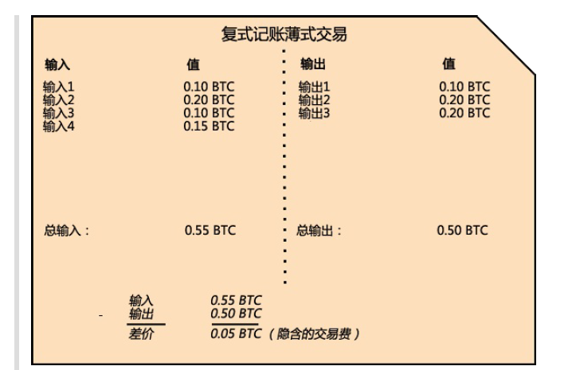

## 精通比特币
记录阅读精通比特币电子书过程中知识的笔记。

### 比特币交易过程
比特币钱包，本质上就是多个地址(私钥),和解锁资金密钥的简单集合。

比特币交易是使用复式记账法，账本中，**记录的不是账户的余额，而是账户的收入和支出**，也就是相当于这个账户的输入和输出。输入和输出不严格相等，输出可能小于输入，那其中的差额可能是作为矿工费。

显然，一笔交易的输入就是另一笔交易的输出。如此一来，当钱从一个地址转移到另一个地址，就会形成一条所有权链。

如上图所示，每一笔输入，都可以拆分成输出(消费或找零)，同时，每一笔收入都来自于上一笔交易的输出。

#### 交易的构建
钱包应用指导如何选取合适的输入输出来建立交易。用户只需要指定目的地址和金额即可。

进行交易时，完整的客户端有区块链所有交易，所以可以轻松找到用户未消费的输入，然后做输出计算准备。轻量级客户端只有用户的交易数据，只保存用户未消费的交易输出。

如果某个钱包客户端没有足够的未消费的交易输入，它就可以通过网络的RESTful API，远程调用请求来获取数据。

转账时，交易的输出会打上转入方的公钥，这样只有资金接受方才有私钥可以验证这笔交易。

### 比特币地址
比特币地址是一个字符串，**由公钥经过哈希生成的比特币地址以数字1开头**。通常以收款方形式出现。

公钥通过哈希和Base58Check编码变换，得到比特币地址。

### 比特币钱包
