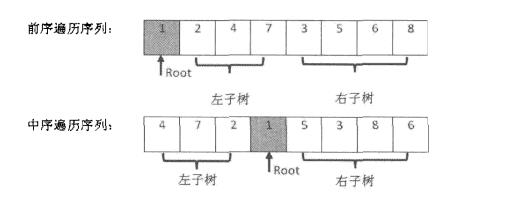
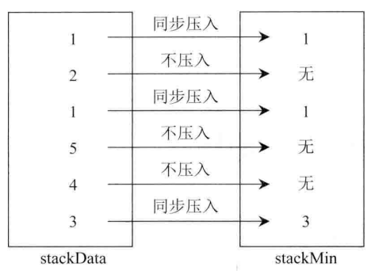

# 剑指offer

## 数组中重复的数字

### 题目描述

在一个长度为 n 的数组里的所有数字都在 0 到 n-1 的范围内。数组中某些数字是重复的，但不知道有几个数字是重复的。也不知道每个数字重复几次。请找出数组中任意一个重复的数字。例如，如果输入长度为 7 的数组 {2, 3, 1, 0, 2, 5, 3}，那么对应的输出是第一个重复的数字 2。

### 思路
注意数字范围是1-n,数组长度也为n。所以可以理解为一个数字一个坑位，发现座位已经有人正确就坐的时候，那说明重复了。这题显然用桶排序可以，最优时间复杂度是O(n)，但是这样空间也是O(n),所以并非最优解。

最优解就是原地交换，当发现交换无法进行下去的时候，说明数字重复。空间O(1).手写代码也要记得边界处理

example代码

``` java
public boolean duplicate(int[] numbers, int length, int[] duplication) {
    if(numbers == null || length <= 0) return false;
    for (int i = 0; i < length; i++) {
        while (numbers[i] != i && numbers[i] != numbers[numbers[i]]) {
            swap(numbers, i, numbers[i]);
        }
        if (numbers[i] != i && numbers[i] == numbers[numbers[i]]) {
            duplication[0] = numbers[i];
            return true;
        }
    }
    return false;
}

private void swap(int[] numbers, int i, int j) {
    int t = numbers[i]; numbers[i] = numbers[j]; numbers[j] = t;
}

```

mycode

``` c++
void mswap(int& a,int& b){
	int temp;
	temp = a;
	a = b;
	b = temp;
}

int isRep(int a[],int n){
	if(n==0 || a == nullptr){
		cout<<"no element";
	}
	for(int i=0;i<n;i++){
		if(a[i]!=i){
			if(a[a[i]] == a[i]) return a[i];
		}
		mswap(a[i],a[a[i]]);
	}

	cout<<"no replication";
	return -1;
}
```

## 二维数组中的查找

### 题目描述
在一个二维数组中，每一行都按照从左到右递增的顺序排序，每一列都按照从上到下递增的顺序排序。请完成一个函数，输入这样的一个二维数组和一个整数，判断数组中是否含有该整数。

``` c++
[
   [ 1,  5,  9],
   [10, 11, 13],
   [12, 13, 15]
]
```

### 解题思路
从右上角开始查找。因为矩阵中的一个数，它左边的数都比它来的小，下边的数都比它来的大。因此，从右上角开始查找，就可以根据 target 和当前元素的大小关系来改变行和列的下标，从而缩小查找区间。

``` java
public boolean Find(int target, int [][] array) {
    if (array == null || array.length == 0 || array[0].length == 0) return false;
    int m = array.length, n = array[0].length;
    int row = 0, col = n - 1;
    while (row < m && col >= 0) {
        if (target == array[row][col]) return true;
        else if (target < array[row][col]) col--;
        else row++;
    }
    return false;
}
```

## 替换空格
请实现一个函数，将一个字符串中的空格替换成“%20”。例如，当字符串为 We Are Happy. 则经过替换之后的字符串为 We%20Are%20Happy。


**事先计算好空格的数量，然后再从后往前移动**

``` java
public String replaceSpace(StringBuffer str) {
    int n = str.length();
    for (int i = 0; i < n; i++) {
        if (str.charAt(i) == ' ') {
            str.append("  "); // 尾部填充两个
        }
    }
    int idxOfOriginal = n - 1;
    int idxOfNew = str.length() - 1;
    while (idxOfOriginal >= 0 && idxOfNew > idxOfOriginal) {
        if (str.charAt(idxOfOriginal) == ' ') {
            str.setCharAt(idxOfNew--, '0');
            str.setCharAt(idxOfNew--, '2');
            str.setCharAt(idxOfNew--, '%');
        } else {
            str.setCharAt(idxOfNew--, str.charAt(idxOfOriginal));
        }
        idxOfOriginal--;
    }
    return str.toString();
}
```

### 从尾到头打印链表
如果允许改动链表，则遍历过程中进行链表反转，如果不允许，则用数组记录，最后反转数组，或用栈操作。

``` java
public ArrayList<Integer> printListFromTailToHead(ListNode listNode) {
    ListNode head = new ListNode(-1); // 头结点
    ListNode cur = listNode;
    while (cur != null) {
        ListNode next = cur.next;
        cur.next = head.next;
        head.next = cur;
        cur = next;
    }
    ArrayList<Integer> ret = new ArrayList<>();
    head = head.next;
    while (head != null) {
        ret.add(head.val);
        head = head.next;
    }
    return ret;
}
```

### 重建二叉树
根据二叉树的前序遍历和中序遍历的结果，重建出该二叉树。

**zwlj:比较经典，需要注意**



中序遍历找到根节点以后，左子树和右子树的长度都可以直接算出来了，如上图前序遍历的部分，所以不需要另外开数组记录方向。直接递归创建节点即是最佳实践。

``` java
public TreeNode reConstructBinaryTree(int[] pre, int[] in) {
    return reConstructBinaryTree(pre, 0, pre.length - 1, in, 0, in.length - 1);
}

private TreeNode reConstructBinaryTree(int[] pre, int preL, int preR, int[] in, int inL, int inR) {
    if (preL == preR) return new TreeNode(pre[preL]);
    if (preL > preR || inL > inR) return null;
    TreeNode root = new TreeNode(pre[preL]);
    int midIdx = inL;
    while (midIdx <= inR && in[midIdx] != root.val) midIdx++;
    int leftTreeSize = midIdx - inL;
    root.left = reConstructBinaryTree(pre, preL + 1, preL + leftTreeSize, in, inL, inL + leftTreeSize - 1);
    root.right = reConstructBinaryTree(pre, preL + leftTreeSize + 1, preR, in, inL + leftTreeSize + 1, inR);
    return root;
}
```

### 树的子结构
输入两棵二叉树A，B，判断B是不是A的子结构。（ps：我们约定空树不是任意一个树的子结构）

思路：递归对比当前的节点是不是B的根节点,如果符合就递归左右子树判段是否相同。注意B可能只是A中间的一段，所以如果发现B走完，A还没走完，说明B是A的子树。


``` c++
class Solution {
public:
    bool HasSubtree(TreeNode* pRoot1, TreeNode* pRoot2)
    {
        if(pRoot2 == NULL) return false;
        if(pRoot1 == NULL) return false;

        if(checkTree(pRoot1,pRoot2)) return true;

        bool leftSub = HasSubtree(pRoot1->left,pRoot2);
        if(leftSub) return true;
        bool rightSub = HasSubtree(pRoot1->right,pRoot2);
        if(rightSub) return true;

        return false;

    }

    bool checkTree(TreeNode* root1, TreeNode* root2){
        if(root2==NULL) return true;
        if(root1==NULL) return false;
        if(root1->val != root2->val) return false;

        return checkTree(root1->left,root2->left)&&checkTree(root1->right,root2->right);

    }

};
```


### 包含min函数的栈
定义栈的数据结构，请在该类型中实现一个能够得到栈最小元素的min函数

思路：要维护两个栈，一个普通的数据栈，一个min栈。普通栈做普通的栈功能用，数据压入时两边同步压栈。

push原则是，如果min栈为空，则压。否则如果新数小于等于min的栈顶，也压。大数则不做处理。最后惊奇的发现，pop数时，只要判断弹出的数是不是等于min栈顶，如果是则同步弹出即可维护。

Min栈很巧妙的维护了一段数里的局部小值，所以当一些大数弹出的时候，min不需操作也不受影响。



``` c++
class Solution {
public:
    stack<int> st,stmin;

    void push(int value) {
        st.push(value);
        if(stmin.empty()){
            stmin.push(value);
        }else{
            int v = stmin.top();
            if(value<=v) stmin.push(value);
        }
    }
    void pop() {
        int v = st.top();
        st.pop();
        if(v == stmin.top()){
            stmin.pop();
        }
    }
    int top() {
        return st.top();
    }
    int min() {
        return stmin.top();
    }
};
```


### 复杂链表的复制
输入一个复杂链表（每个节点中有节点值，以及两个指针，一个指向下一个节点，另一个特殊指针指向任意一个节点），返回结果为复制后复杂链表的head。（注意，输出结果中请不要返回参数中的节点引用，否则判题程序会直接返回空）

思路：要利用哈希，首先遍历一遍原链表，创建新链表（赋值label和next），用map关联对应结点；再遍历一遍，更新新链表的random指针。

``` c++
class Solution {
public:
    RandomListNode* Clone(RandomListNode* pHead)
    {
        if(pHead==NULL) return NULL;
 
        map<RandomListNode*,RandomListNode*> m;
        RandomListNode* pHead1 = pHead;
        RandomListNode* pHead2 = new RandomListNode(pHead1->label);
        RandomListNode* newHead = pHead2;
        m[pHead1] = pHead2;
        while(pHead1){
            if(pHead1->next) pHead2->next = new RandomListNode(pHead1->next->label);
            else pHead2->next = NULL;
            pHead1 = pHead1->next;
            pHead2 = pHead2->next;
            m[pHead1] = pHead2;
        }
 
        pHead1 = pHead;
        pHead2 = newHead;
        while(pHead1){
            pHead2->random = m[pHead1->random];
            pHead1 = pHead1->next;
            pHead2 = pHead2->next;
        }
        return newHead;
    }
};
```
