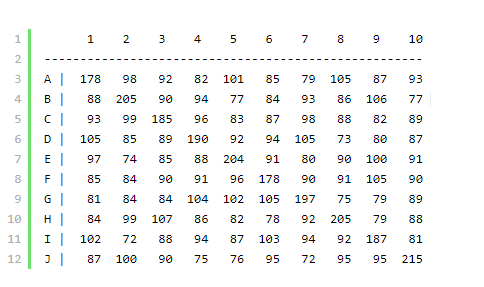

## 洗牌算法详解
**洗牌可以抽象为：给定一组排列，输出该排列的一个随机组合**

**暴力随机的算法都是错误的**，比如说：随机交换序列中的两张牌，交换n次（n为序列的长度）；或者遍历序列中的每个数，随机选择序列的某个数，把它和当前遍历到的数交换。暴力random是不可行的

为何暴力random不可以呢？其实我也不是很清楚，但这可以通过某些方法测得，如何测试洗牌算法呢？这其实就是测试一个概率问题：就是用我们的洗牌算法去洗牌一个数组若干次，如果每张牌在每一个位置出现的次数差不多，就说明随机性能好。

**根据随机测试，发现暴力random交换，在对角线上下的数据很离谱。**

比如洗牌1000次，洗10张牌，那每张牌在每个位置出现的次数要大约是1000次，结果：



正确的洗牌算法叫Fishe-Yate：

本质上就是不断随机取一个数放到新数组：

1. 从还没处理的数组（假如还剩k个）中，随机产生一个[0, k]之间的数字p（假设数组从0开始）；
2. 从剩下的k个数中把第p个数取出；
3. 重复步骤2和3直到数字全部取完；
4. 从步骤3取出的数字序列便是一个打乱了的数列。

最后这个办法有进一步改进，改进后叫Knuth-Durstenfeld Shuffle

**每次从未处理的数据中随机取出一个数字，然后把该数字放在数组的尾部**，即数组尾部存放的是已经处理过的数字。这是一个原地打乱顺序的算法，算法时间复杂度也从Fisher算法的O(n2)提升到了O(n)。算法python代码如下：

``` python
#Knuth-Durstenfeld Shuffle
def shuffle(lis):
    for i in range(len(lis) - 1, 0, -1):
        p = random.randrange(0, i + 1)
        lis[i], lis[p] = lis[p], lis[i]
    return lis

r = shuffle([1, 2, 2, 3, 3, 4, 5, 10])
print(r)
```
