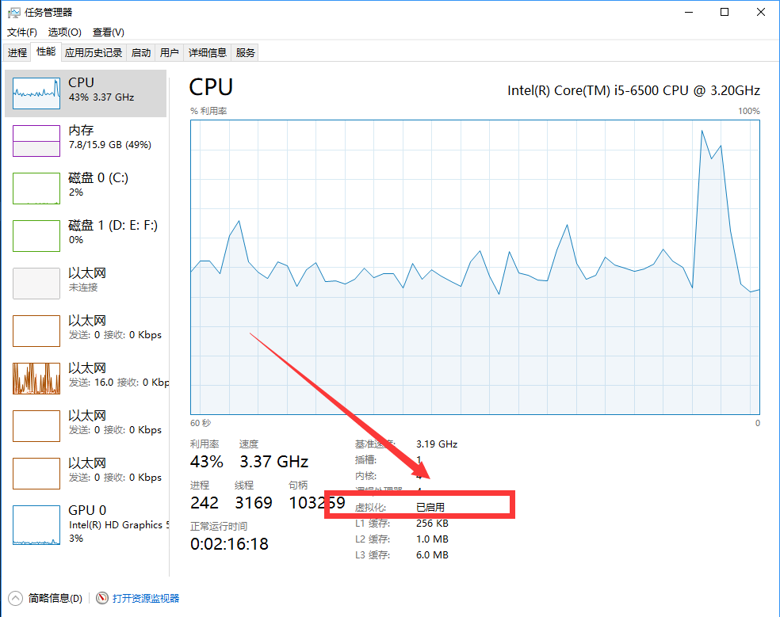
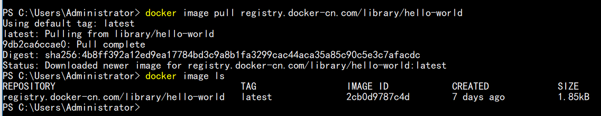
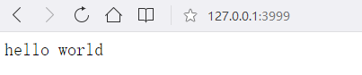
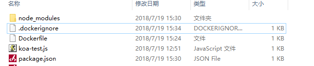
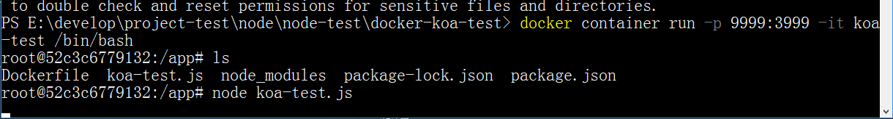

## docker基础
Docker 是一个开源的应用容器引擎，基于 Go 语言 并遵从Apache2.0协议开源。

**Docker 可以让开发者打包他们的应用以及依赖包到一个轻量级、可移植的容器中，然后发布到任何流行的 Linux 机器上，也可以实现虚拟化**。

### Docker核心概念
Docker有三个核心概念，**镜像，容器和仓库**。

#### Docker镜像
镜像就相当于一个模板。比如我们安装虚拟机的时候，镜像就经常指一个操作系统镜像。

镜像是Docker容器的基础，用户可以直接在网上下载别人准备好的应用镜像来直接使用。

#### Docker容器
相当于一个轻量级沙箱，Docker利用容器来运行和隔离应用。**容器是从镜像创建的应用运行实例**，可以将其启动，开始，停止，删除。

可以把容器看做是一个简易的Linux系统环境和运行在其中的应用程序打包而成的盒子。

#### Docker仓库
集中存放Docker镜像文件的场所。

Docker仓库可以分为公开仓库和私有仓库，目前最大的公开仓库是官方提供的 **Docker Hub**

### Docker安装
Docker是一个开源的商业产品，有社区版CE和企业版EE，一般个人开发用社区版就可以了。

以下以Win10下作为示例来安装Docker CE，参考文档
[Get Docker CE for Windows](https://docs.docker.com/docker-for-windows/install/)和[Docker教程](http://www.runoob.com/docker/docker-tutorial.html)

现在 Docker 有专门的 Win10 专业版系统的安装包，需要开启Hyper-V。


然后去官网下载exe文件按照提示安装就行了

**这里还要注意一点的是，BIOS的虚拟化硬件支持必须打开，所以没有打开的要去BIOS下设置**



打开后，任务管理器的虚拟化显示已启用。

#### 开始hellow world
Win下安装好以后，已经帮我们启动了docker服务，我们接下来可以通过以下命令(powershell下)来看我们本地有的镜像：

```
# 列出本机的所有 image 文件。
$ docker image ls

# 删除 image 文件
$ docker image rm [imageName]
```

#### 有关镜像image
之前我们已经解释了镜像的概念。

一般来说，为了节省时间，我们应该尽量使用别人制作好的 image 文件，而不是自己制作。即使要定制，也应该基于别人的 image 文件进行加工，而不是从零开始制作。

实际开发中，一个 image 文件往往通过继承另一个 image 文件，加上一些个性化设置而生成。举例来说，你可以在 Ubuntu 的 image 基础上，往里面加入 Apache 服务器，形成你的 image。

安装完成后，Docker 会自动启动。通知栏上会出现个小鲸鱼的图标，这表示 Docker 正在运行。

#### 国内镜像加速
根据[Docker 中国官方镜像加速](https://www.docker-cn.com/registry-mirror),我们来加速image的获取

可以直接用类似下面的命令来进行image的拉取,比如我想拉Ubuntu16.04

```
docker pull registry.docker-cn.com/library/ubuntu:16.04
```

当然也可以配置成默认加速，那样可以不用每次都手动添加。比如可以修改文件/etc/docker/daemon.json

```
{
  "registry-mirrors": ["https://registry.docker-cn.com"]
}
```

修改保存后重启 Docker 以使配置生效。

#### 拉取helloworld镜像

```
docker image pull registry.docker-cn.com/library/hello-world
```

然后docker image ls 可以看到image被拉下来了




执行docker run hello-world即可执行


注意，如果docker发现本地没有对应image的化，会自动去拉。

#### 删除image
删除image则用的是rmi命令

```
docker rmi hello-world
```

#### 查看容器
镜像运行的实例就是容器实例，关闭容器不会删除容器文件，只是容器停止运行。

```
# 列出本机正在运行的容器
$ docker container ls

# 列出本机所有容器，包括终止运行的容器
$ docker container ls --all
```


终止运行的容器文件，依然会占据硬盘空间，可以使用docker container rm命令删除。

```
docker container rm [containerID]
```

### 实操：制作Docker容器
我们先用node koa框架写一个hello world。

```
const Koa = require('koa');
const app = new Koa();

app.use(async (ctx) => {
   ctx.body = "hello world";
});

app.listen(3999);

```

直接用node命令运行上述js文件，然后访问127.0.0.1:3999可以看到hello world文字显示。



我们在项目文件夹下，放置一个.dockerignore文件，类似于.gitignore.表示，这几个路径要排除，不要打包进入 image 文件。

```
.git
node_modules
npm-debug.log
```

然后，在项目的根目录下，新建一个文本文件 Dockerfile

```
FROM node:8.4
COPY . /app
WORKDIR /app
RUN npm install
EXPOSE 3999
```

上面代码的意思是：

```
FROM node:8.4：该 image 文件继承官方的 node image，冒号表示标签，这里标签是8.4，即8.4版本的 node。
COPY . /app：将当前目录下的所有文件（除了.dockerignore排除的路径），都拷贝进入 image 文件的/app目录。
WORKDIR /app：指定接下来的工作路径为/app。
RUN npm install：在/app目录下，运行npm install命令安装依赖。注意，安装后所有的依赖，都将打包进入 image 文件。
EXPOSE 3999：将容器 3999 端口暴露出来， 允许外部连接这个端口。
```

写好Docker File以后，我们就可以通过docker image build命令来创建image文件了。这时先确保我们现在项目文件夹的文件结构：



可知我们现在项目已经有package.json,还有相关依赖node_modules，不过node_modules我们在ignore文件中已经排除掉了。接下来我们执行下面命令创建镜像。

```
$ docker image build -t koa-test .
# 或者
$ docker image build -t koa-test:0.0.1 .
```

上面代码中，-t参数用来指定 image 文件的名字.最后的那个点表示 Dockerfile 文件所在的路径，上例是当前路径，所以是一个点。

如果运行成功，就可以用docker image ls看到新生成的 image 文件koa-test了。

#### 生成容器
`docker container run`命令会从 image 文件生成容器。

```
$ docker container run -p 9999:3999 -it koa-test /bin/bash
# 或者
$ docker container run -p 9999:3999 -it koa-test:0.0.1 /bin/bash
```

上面命令的各个参数含义如下：

```
-p参数：容器的 3999 端口映射到本机的 9999 端口。
-it参数：容器的 Shell 映射到当前的 Shell，然后你在本机窗口输入的命令，就会传入容器。
koa-test:0.0.1：image 文件的名字（如果有标签，还需要提供标签，默认是 latest 标签）。
/bin/bash：容器启动以后，内部第一个执行的命令。这里是启动 Bash，保证用户可以使用 Shell。
```

注意这个-it参数，就是相当于让你后续可以跟容器交互的。成功运行之后，就会进入交互提示界面。这个时候用node命令运行文件



这时我们运行127.0.0.1:9999 即可看到hello world。

可以用docker container kill终止容器运行。

```
# 在本机的另一个终端窗口，查出容器的 ID
$ docker container ls

# 停止指定的容器运行
$ docker container kill [containerID]
```

容器停止运行之后，并不会消失，用下面的命令删除容器文件。

```
# 查出容器的 ID
$ docker container ls --all

# 删除指定的容器文件
$ docker container rm [containerID]
```

这下docker的hello world示例便运行完毕了，要了解docker的更多命令操作，可参见官方文档。

### 参考
[Get Docker CE for Windows](https://docs.docker.com/docker-for-windows/install/)

[Docker教程](http://www.runoob.com/docker/docker-tutorial.html)

[Docker入门教程--阮一峰](http://www.ruanyifeng.com/blog/2018/02/docker-tutorial.html)

《Docker技术入门与实战》(机械工业出版社)
