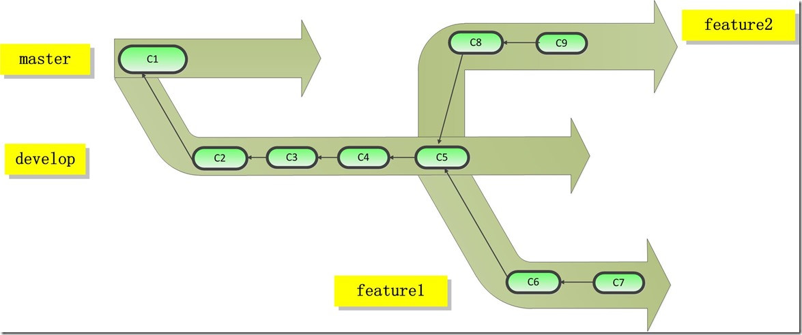

## git工作流程规范
项目接入git之后，多人协作开发，当然会有约定一些规范。

一般来说，按照约定，分支命名将分为5类，最好是按照约定的类别命名，分支类别为以下几种：

 - master（主干）：master 分支上的代码是稳定版，**即代码开发完成，经过测试，没有明显的bug，才能合并到master中**。请注意永远不要在 master 分支上直接开发和提交代码，以**确保 master 上的代码一直可用**。

 - develop（开发）：develop 分支用作平时 **开发的主分支**，并一直存在。如果修改代码，**尽量新建 feature 分支修改完再合并到 develop 分支**。如果要提交 develop 分支到远端服务器（github），需要使用 git push origin develop 传统方式提交。

 - feature（功能）：当需要新加一个功能时（或者在本地修改bug），需要基于develop新建一个 feature 分支。在新建的 feature 分支上进行开发，完成后合并到 develop 分支。如果新加的功能需多人共同完成，把新建的 feature 分支发布出去。

 - release（发布）：当开发进行到一定程度，可以发布时，建立一个 release 分支并指定版本号，并将新建的 release 发布出去。开发人员可以对 release 分支上的代码进行集中测试，和修改 bug 。**全部完成经过测试没有问题后，将 release 分支上的代码合并到 master 分支和自己的 develop 分支**。

 - hotfix（补丁）：若在 master 分支上发现 bug 需要紧急修复，在master分支新建一个 hotfix 分支并指定版本号，在新建的 hotfix 分支上修复完成，测试通过后，合并到 master 分支和本地的 develop 分支。

开发时的分支图如上图，一定要注意一点：

**master和develop分支都不能直接提交代码，只能合并其他分支的代码。**

### 工作流程
下面介绍，基于上面5种类型的规范工作流程。

#### 1.从develop新建feature分支
用git branch或者gui工具，从当前的dev分支创建出feature分支。当然，如果不用feature分支来开发，直接从master分支上创建dev分支进行开发也行吧。

#### 2. Merge Request
**merge request，在github上也叫pull request**

在feature分支将功能开发完成后，到git的网站上提交Merge Request申请，申请代码合并到develop分支.然后在git网站上做code review,接着把分支合并的develop环境。

develop环境上做回归测试，如果没问题，再merge request到master。

#### 3.版本发布
master分支上新建一个release分支，将release分支发布到生产环境(（如果修改了release分支的代码，记得再合并到master分支和develop分支）)。
