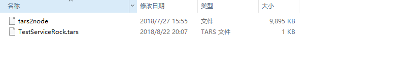
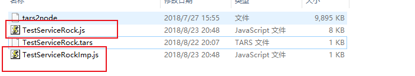
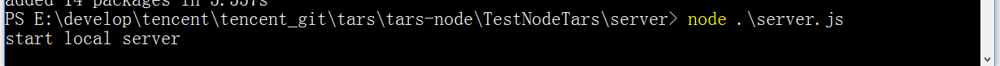
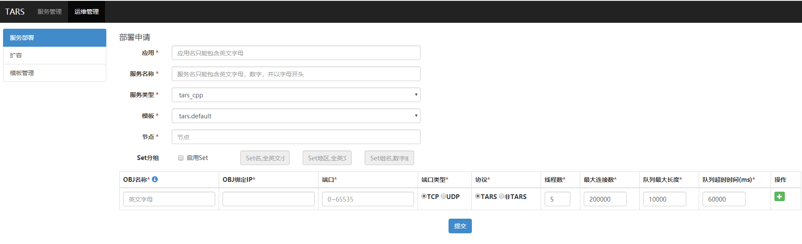
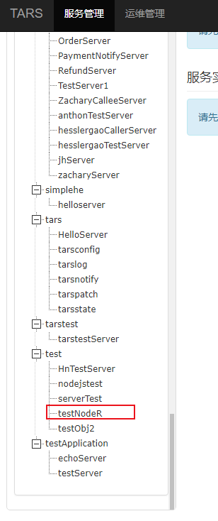
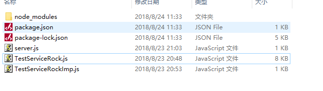
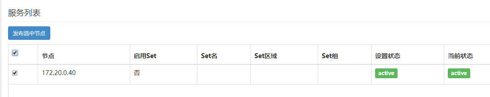

## tarsnode基础
在了解了tars基础以后，这里记录一下tars-node的简单开发流程。

在tars基础的笔记里，我们已经了解到了tars协议和tars语言。最后归纳出了基于tars的开发流程，先约定tars文件，再编写服务端，和客户端的代码。

### 基本概念
写tars服务的时候，有几个概念先要事先了解一下。这几个概念主要用于tars服务的命名，客户端调用tars服务的时候要根据这些命名来调用。

 - APP：应用名。标识一组服务的集合，**在整个系统中，应用名是唯一的。**
 - Server：服务名，提供服务进程的名称，一般后缀以Server结尾。
 - Servant：服务者，具体的服务接口实例。

在给写好的Tars服务命名的时候，我们用APP.Server.Servant来定义路由名称，这个名称叫做 **路由OBJ**。路由OBJ在系统中必须是唯一的，这样外部调用的时候才不会有冲突。


### 1.tars文件编写
前后端约定好接口以后，服务端开发人员制定tars文件。好比我们约定了以下tars文件：

```
//TestRockService.tars
module TestRock
{
    struct User_t
    {
        0 optional int id = 0;
        1 optional int score = 0;
        2 optional string name = "";
    };

    struct Result_t
    {
        0 optional int id = 0;
        1 optional int iLevel = 0;
    };

    interface RockService
    {
        int test();

        int hello(string testStr, out string output);

    };
};
```

tars文件定义了两个类型，和两个接口test和hello。接下来我们就要分别在服务端和客户端实现一些代码。

### 2.TUP协议封装
在tars基础笔记里提到了TUP协议，其实可以理解为不同的语言的工具对tars文件进行了一次封装，封装之后可以直接供上层调用。

所以我们在不同的语言下基于tars框架开发，只需要用不同的工具把tars文件解析一下，就可以生成供程序调用的接口代码。

好比我们现在选用的nodejs作为开发语言，所以我们要使用[tars2node工具](https://github.com/tars-node/tars2node)来解析tars文件。

tars2node在github上就能下载，得到的是一个linux上的可执行文件，使用这个可执行文件解析tars文件即可，比如

产生客户端接口代码

```
tars2node TestRockService.tars --client
```

或者服务端接口代码

```
tars2node TestRockService.tars --server
```

### 3.实现服务端(本地)
先不用考虑tars远程服务端的部署，我们现在 **从零开始** 本机搭建一个本地服务试试看。



如上图，服务端一开始我们只有两个文件，一个tars2node linux可执行文件，一个TestServiceRock.tars接口tars文件。

接下来我们用tars2node解析tars文件成js文件(要在linux环境下，比如WSL)：

```
tars2node TestServiceRock.tars --server
```

此时产生两个新文件



两个新文件都是根据tars接口文件的名字来命名的。TestServiceRock.js文件我们不用管，里面封装的是一些公用的代码，数据结构。我们server端只需要实现xxxImp.js文件就好，我们直接打开TestServiceRockImp文件：

``` js
// **********************************************************************
// Parsed By TarsParser(1.1.0), Generated By tars2node(20180713)
// TarsParser Maintained By <TARS> and tars2node Maintained By <superzheng>
// Generated from "TestServiceRock.tars" by Imp Mode
// **********************************************************************

/* eslint-disable */

"use strict";

var TestRock = require("./TestServiceRock.js").TestRock;
module.exports.TestRock = TestRock;

TestRock.RockServiceImp.prototype.initialize = function () {
    //TODO::
};

TestRock.RockServiceImp.prototype.test = function (current) {
    //TODO::
};

TestRock.RockServiceImp.prototype.hello = function (current, testStr, output) {
    //TODO::
};

```

发现已经定义好了一些接口给我们，需要我们去实现，比如我们tars接口文件里定义的test方法和hello方法。方法的第一个参数都为current,一个对象。

我们按照规则来实现这些方法：

``` js
// **********************************************************************
// Parsed By TarsParser(1.1.0), Generated By tars2node(20180713)
// TarsParser Maintained By <TARS> and tars2node Maintained By <superzheng>
// Generated from "TestServiceRock.tars" by Imp Mode
// **********************************************************************

/* eslint-disable */

"use strict";

var TestRock = require("./TestServiceRock.js").TestRock;
module.exports.TestRock = TestRock;

TestRock.RockServiceImp.prototype.initialize = function () {
    //TODO::
};

TestRock.RockServiceImp.prototype.test = function (current) {
    //TODO::
    current.sendResponse(8888);
};

TestRock.RockServiceImp.prototype.hello = function (current, testStr, output) {
    //TODO::
    console.log("output: " + testStr);

    output = "hello hey hey hey " + testStr;

    current.sendResponse(666,output);
};

```

**我们需要调用current对象的sendResponse来返回数据**，而且返回什么数据，都得根据我们tars中定义的来。sendResponse第一个参数是返回值，接下来的参数就是tars中定义的函数的out

好比test方法，tars文件中定义的是不接受任何参数，但是调用会返回一个int整形值。所以test方法实现中sendResponse一个整数8888.

同理，hello方法中，除了返回一个666整形，tars文件里还定义了一个out出参，我们必须把这个output也返回了。

实现完全部接口以后，我们还要写一个server.js文件作为项目入口。这个server.js的职责也很简单，就是启动一个类似http的server服务器进行远程调用的监听。我们的server.js这样写：

``` js
let Tars  = require("@tars/rpc");
let TestRock = require("./TestServiceRockImp").TestRock;

let svr;

let servantName = "test.testNodeR.rockService";


svr = Tars.server.createServer(TestRock.RockServiceImp);
svr.start({
        name     : "test.testNodeR.service",
        servant  : "test.testNodeR.testRone",
        endpoint : "tcp -h 127.0.0.1 -p 14002 -t 10000",
        protocol : "tars",
        maxconns : 200000
    });

console.log("start local server");

```

上图就是我们的简易server.js，显然上图中，我们require了@tars/rpc模块，引用这个模块之前，我们当然是需要`npm install @tars/rpc` 这个模块。

注意Server start时候传入的config对象，name随便定义。而Servant名字，对应的则是之前提到的 **路由OBJ** 这个概念。所以可以知道App为test，Server为testNodeR,Servant名字则为 testRone。endpoint属性则定义了service的进程socket地址，在本地127.0.0.1的14002端口启用。

server文件写好后，可以在命令行输入`node server.js` 来启动服务端




可以看到server已经启动

### 4.实现客户端
本地实现客户端的方式跟实现服务端相似。

使用`tars2node TestRockService.tars --client ` 解析tars文件。

和服务端类似，会原地产生一个TestServiceRockProxy文件。我们只需要引用这个文件就好了。

我们创建一个client.js


```
//STEP01 引入系统模块以及工具生成的代码
let Tars  = require("@tars/rpc").client;
let TestRock = require("./TestServiceRockProxy").TestRock;

//STEP02 初始化Tars客户端
//       该步骤非必选项，后续文档将介绍[tars].client.initialize函数在什么情况下需要调用以及它做了哪些工作
//       initialize函数只需调用一次，初始化之后全局可用
//       在演示程序中我们不需要使用过多的特性，所以先将其注释
//Tars.initialize("./config.conf");

//STEP03 生成服务端调用代理类实例
var prx = Tars.stringToProxy(TestRock.RockServiceProxy, "test.testNodeR.testRone@tcp -h 172.20.0.40 -t 60000 -p 11119");

//STEP04 客户端调用采用Promise机制进行回调，这里编写成功以及失败的回调函数
var success = function (result) {
    console.log("result.response.costtime:",    		result.response.costtime);
    console.log("result.response.return code:",      		result.response.return);

    if(result.response.arguments){
        console.log("result return:" + result.response.arguments.output);
    }

    //console.log(result);


}

var error = function (result) {
    console.log(result);
    console.log("result.response.costtime:",			result.response.costtime);
    console.log("result.response.error.code:",         	result.response.error.code);
    console.log("result.response.error.message:",       result.response.error.message);
}

//STEP05 初始化接口参数，开始调用RPC接口
let str = "Hello World2";


prx.hello(str).then(success,error).done();
prx.test().then(success,error).done();
```

步骤也已经在上面标注好。首先引入rpc库，然后引入对刚才生成的RockProxy文件。调用stringToProxy方法进行调用，第一个参数是tars文件中定义的interface的名字，第二个参数就是远程的socket地址，跟server端中定义的对应。

最后prx进行调用就可以了。

`node client.js` 可以看到结果。

### 5.服务端发布
我们要把服务端发布到tars管理平台，方便对服务进行统一管理。



打开tars管理web页面，我们首先要在运维管理标签下发布我们的服务。对应我们刚才的例子，我们已知我们的OBJ路由是`test.testNodeR.testRone`,因此我们应用名就要写test,服务名写testNodeR，服务选tarsnode，模板默认即可，节点是IP地址，我们随便选一台可用的服务器ip地址填上。OBJ则填servant名字testRone，端口选10000以上的避免冲突。点击提交，那么服务就发布了。



然后在服务管理标签里，就看到对应的APP名称下，我们的Server已经存在了。

#### 服务端代码的修改
发布到服务端的server代码，由于要接受tars node 平台的一些自动配置必须从环境读取配置文件。

那么入口文件的代码就要改成这个样子：

``` js
let Tars  = require("@tars/rpc");
let TestRock = require("./TestServiceRockImp").TestRock;

let svr;

let servantName = "test.testNodeR.testRone";

console.log("before start!");

if(process.env.TARS_CONFIG){
    svr = new Tars.server();
    svr.initialize(process.env.TARS_CONFIG, function (server){
        server.addServant(TestRock.RockServiceImp, servantName);

        console.log("tars server started from Process");
    });
    svr.start();
    console.log("start server from process");

}else {
    svr = Tars.server.createServer(TestRock.RockServiceImp);
    svr.start({
        name     : "test.testNodeR.service",
        servant  : "test.testNodeR.testRone",
        endpoint : "tcp -h 127.0.0.1 -p 14002 -t 10000",
        protocol : "tars",
        maxconns : 200000
    });

    console.log("start local server");
}
```

#### 打包服务端
打包我们的服务端文件，需要一个名为@tars/deploy的命令行工具。我们需要npm -g全局安装。然后在目录里执行打包命令，

上述例子中，我们的服务端文件夹最后是这样的：



node_modules可以删掉，避免重复打包。注意package.json的入口文件要是server.js.最后我们执行

`tars-deploy testNodeR`

**这里要注意了，tars-deploy命令后面跟的是Server的名字。这里不能乱写，一定要和发布时写的Server名字相对应。否则将不能发布成功**

最后得到一个tgz文件。

#### 上传tgz文件
最后服务管理标签的对应服务处进行发布



点击发布选中节点，发布tgz包。便部署成功，客户端可以根据节点ip和进程进行调用。


#### 管理Servant
一个服务下是可以有多个Servant实例的,有多个Servant实例的好处就是收到请求的时候可以自动根据路由分发。

可以add不同的Servant来应对具体的请求

### 参考
[tars github](https://github.com/Tencent/Tars/blob/master/README.zh.md)

[tars2node](https://github.com/tars-node/tars2node)
