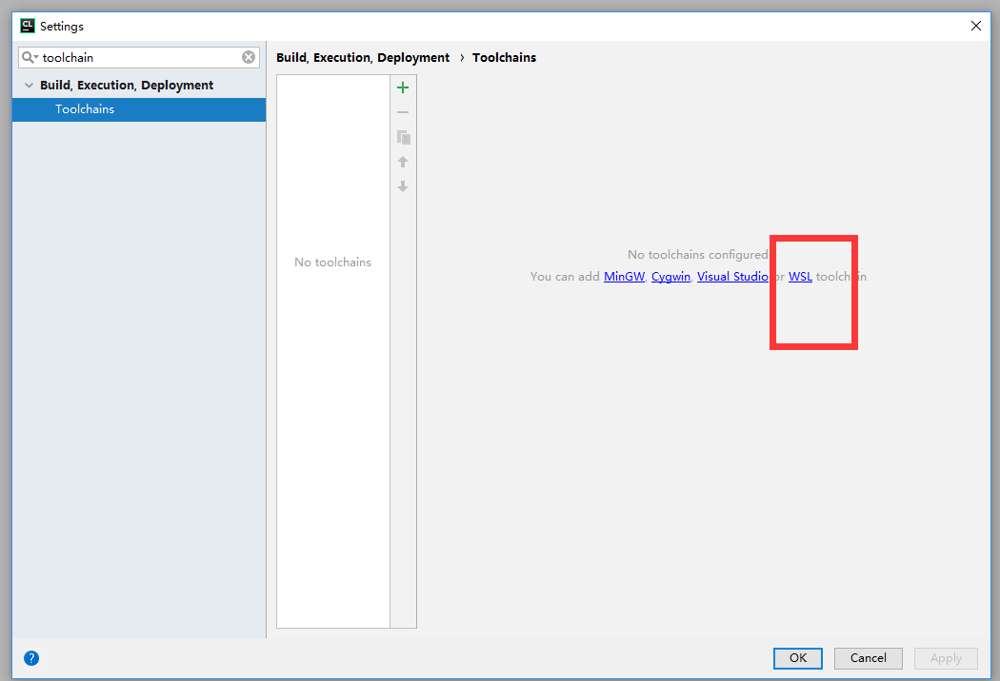

## Clion下使用wsl做编译环境
在windows下开发linux C++项目，结合Clion和wsl是很好的做法。这样我们既可以在windows下编程，又可以利用wsl在本地编译。

现在来讲讲如何配置Clion，在配置Clion之前，首先我们要装WSL，这里就不再赘述。**wsl装好以后一定要启用一个用户，不能直接用root，之后无法ssh**。

在完成wsl的安装以后，我们打开wsl的配置：




选择WSL之后会有如下显示


现在还不能通过ssh来连接wsl，需要在wsl上再做一些设置。我们可以参考clion官方给出的配置文档：<a>https://confluence.jetbrains.com/display/CLION/WSL+dev+environment+configuration</a>

如果wsl的系统版本是ubuntu,那就直接运行下面的命令：

```
wget https://raw.githubusercontent.com/JetBrains/clion-wsl/master/ubuntu_setup_env.sh && bash ubuntu_setup_env.sh
```

运行完以后会安装所需要的包并执行，最后把ssh的功能给安装好，wsl还会启用2222 端口。


启用以后我们就可以用xshell等软件，直接ssh到localhost的2222端口上：


确认ssh能建立以后还没完，因为ssh默认连接会遇到提示Are you sure you want to continue connecting? 要确认yes后才会继续.所以我们还能再配置一下wsl

```
sudo vi /etc/ssh/sshd_config
#找到下面StrictHostKeyChecking然后将前面注释#去除后面改为no如下
StrictHostKeyChecking no
#保存文件后重启ssh服务
sudo service ssh --full-restart # 或者sudo /etc/initd.d/sshd restart
```

配置完成以后可以尝试在Clion上ssh设置了


**根据官方说明调整因为wsl文件系统区别会大小写，而window不区别问题**；需要添加idea.case.sensitive.fs=true 属性，可以调整这个参数；


调整好以后，编译hello world。成功！
