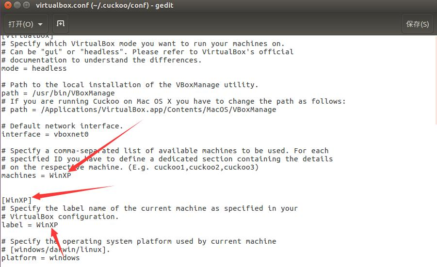
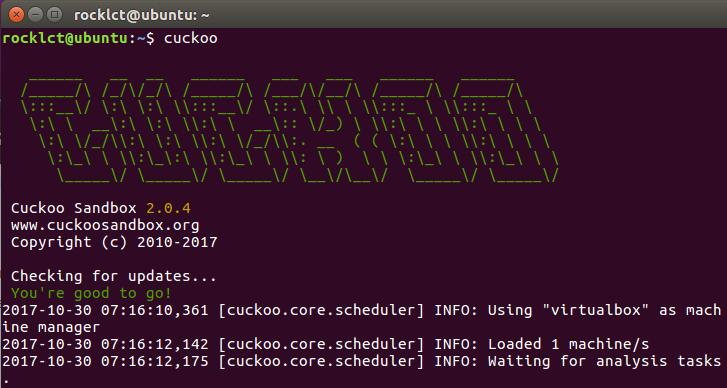

## Cuckoo Sandbox杜鹃沙盒
Cockoo Sandbox是开源安全沙箱，基于GPLv3。目的是恶意软件（malware analysis）分析。使用的时候将待分析文件丢到沙箱内，分析结束后输出报告。和传统AV软件的静态分析相比，Cuckoo动态检测。扔到沙箱的可执行文件会被执行，文档会被打开，运行中检测。

Cuckoo sandbox可以实现windows，OS X，Linux，Android。

### 原理
原理就是host机器开虚拟机，在虚拟机外部启动cuckoo box,开启端口监听虚拟机内部的情况，虚拟机内部也要运行cuckoo box客户端程序，从而可以运行malware并把报告传送出来。

### 安装与配置
唔，真的比较复杂,下面是一个可以参考的博客

<a>http://wangzhixian.org/%E6%85%A2%E6%9D%A1%E6%96%AF%E7%90%86%E6%92%B8Cuckoo%20SandBox/1.%E6%90%AD%E5%BB%BA%E4%B8%80%E4%B8%AA%E8%83%BD%E8%B7%91%E8%B5%B7%E6%9D%A5%E7%9A%84%E7%8E%AF%E5%A2%83/article.html</a>

首先是根据官网一路安装依赖。

配置的话，首先配置网络，推荐是使用host-only的方式，host-only相当于直接在虚拟机host机上连了条网线，然后还要配置host的vmnet0口和虚拟机ip在同一网段。这样就能ping通了。然而，想让虚拟机访问网络，还需要设置一些iptable流量转发(ipatables可见linux相关笔记)，这些可以根据官网来设置。

安装好cuckoo和guest配置之后，要进行一些configuration。

首先guest必须运行一个python文件，`agent.py`.

然后在host机的CWD目录下的config文件中也要做好相应的配置，

第一次使用，重点就是要配置好默认的virtualbox配置：CWD/conf/virtualbox.conf



如图所示，要注意跟你创建的虚拟机名字相对应。

然后host机运行cuckoo命令，就可以看到cuckoo server被打开了。




### 使用
要用cuckoo box分析，先要创建一个cuckoo box的实例，直接运行cuckoo命令，就可以生成了。每个实例一次可以分析一个案例，每个实例在创建的时候，会**创建一个工作目录CWD**。貌似默认在~/.cuckoo

每个CWD工作目录里，就是这个实例的配置文件。

我们还可以下载杜鹃社区(cuckoo community),里面有一些签名模板帮助我们分析，我们用下面的命令来安装杜鹃社区的签名到我们的CWD

```
cuckoo community
```
