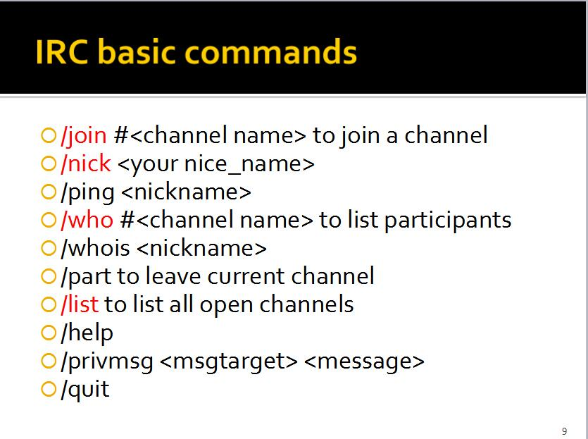
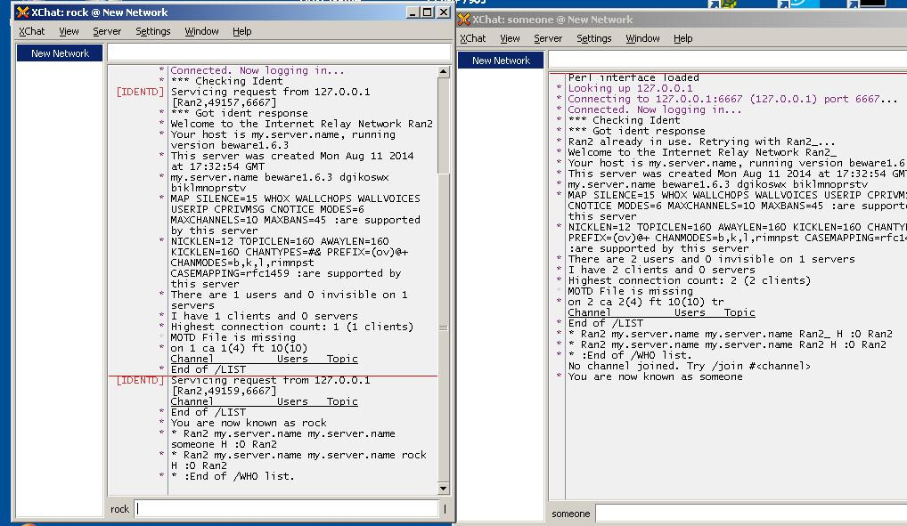

## IRC （互联网中继聊天）
IRC是Internet Relay Chat 的英文缩写，中文一般称为互联网中继聊天。它是由芬兰人Jarkko Oikarinen于1988年首创的一种网络聊天协议。经过十年的发展，目前世界上有超过60个国家提供了IRC的服务。IRC的工作原理非常简单，您只要在自己的PC上运行客户端软件，然后通过因特网以IRC协议连接到一台IRC服务器上即可。它的特点是速度非常之快，聊天时几乎没有延迟的现象，并且只占用很小的带宽资源。所有用户可以在一个被称为\\"Channel\\"（频道）的地方就某一话题进行交谈或密谈。每个IRC的使用者都有一个Nickname（昵称）。

### IRC简单命令了解

在irc客户端中，我们可以进入一些channel，然后在同一个channel里的用户可以相互聊天。

我们本机启动irc服务端，然后启用两个irc客户端，指向127.0.0.1/6667,即可以访问到服务端，并进行一些指令

大概这就可以了解irc了。
