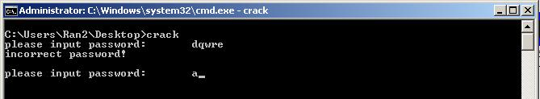
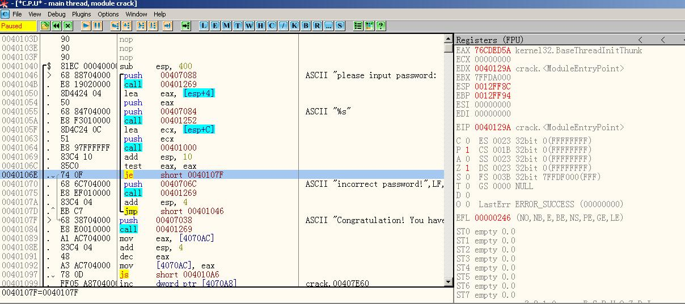

## OllyDbg
OLLYDBG是一个新的**动态追踪工具**，将IDA与SoftICE结合起来的思想，Ring 3级调试器，非常容易上手，己代替SoftICE成为当今最为流行的调试解密工具了。同时还支持插件扩展功能，是目前最强大的调试工具。

### 启动
我们直接在OllyDbg启动要分析的exe文件，注意一下入口点，OllyDbg启动的exe不保证能找对真正的入口点，所以需要使用工具，比如IDA Pro去找到真正的Strat点，然后再OllyDbg双击那个位置(用crtl g来跳转)来方便启动。

使用OllyDbg时，我们要面向String去解决问题。用右键Search for->all refered text string，来找那些我们在静态分析时找出的可疑变量。

### 使用Ollydbg来patch程序
这是一个非常实用的技巧，我们可以根据这个技巧来绕过程序段，从而绕过验证。

拿teacher给出的一个例子举例，我们有以一个程序叫crack.exe,执行之后让你输入密码，输入错误就报错

如上图所示，然而我们有方法通过ollydbg绕过这一个密码验证，从源代码的角度来说，我们只要想办法patch这一块地方就好了。

所以根据一般论方法，我们把这个程序拖入ollydbg，然后find string找到提示信息“incorrect password！”

这里我们想进行patch，原理就是手动加入一个jmp语句，jmp到输出正确信息的位置。

我们在je那个位置按a，输入jmp 004017F，这样je语句就会被改变从而直接jmp到正确的位置，从而绕过信息。

然后我们需要保存新修改的文件，右键选择copy to executeable，all modifications。然后copy all，出来一个新窗口，右键save file，保存新生成的可执行文件。这个文件就是绕过验证的文件了，无论我们输入什么密码，都绕过了验证，输出正确信息。
