## 实验流程

任务:分析iauzzy.exe文件

### 静态分析
使用静态工具分析iauzzy.exe文件。

#### 用FileAlyzer分析
FileAlyzer是一个**文件分析程序**，用FileAlyzer用鼠标右键单击您想要分析的文件就可以像观看正常物品一样简单的分析查看文件

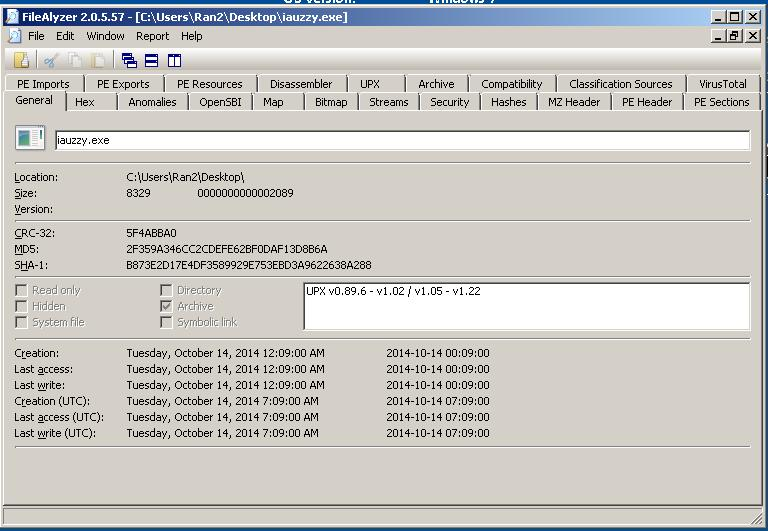


#### PEiD查看文件加壳状况

直接把文件拖入PEiD中查看文件加壳情况

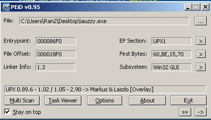

看到是用UPX加壳的。

#### Stud_PE分析PE文件结构

同理，使用文件拖入

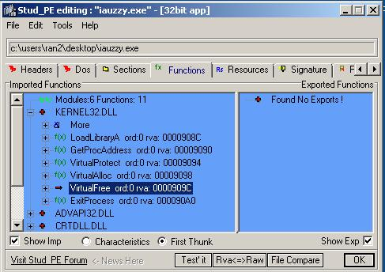

可以看到一些疑似的文件结构等。

#### PeStudio分析PE文件结构


这里可以看到


所以疑似这个文件compile在 Wed Apr 18 03:39:04 2001

#### BinText和Strings分析字符串


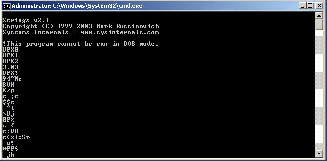


ckbot v1.0有些可疑


### 行为分析前配置REMnux

我们要启动另外一个虚拟机，REMnux虚拟机。

**REMnux的IP为:192.168.1.1**

作为分析机的网关(gateway)，并且为分析机做dns解析。

**分析机的ip为:192.168.1.100**

我们需要配置REMnux的dns服务

在REMnux中，cd进/etc/inetsim

然后sudo vi /inetsim.conf,进行几个改动
，首先将 start_service dns那一行的注释去掉。然后修改dns_default_ip 为192.168.1.1


然后保存，然后启动inetsim服务即可


### 行为分析(动态分析)

#### autoruns事前准备
启动autoruns 并制作快照用以以后对比


#### 启动procexp

启动**procexp**来监控进程

process标签上右键选择select column

选上receive bytes 和 send bytes

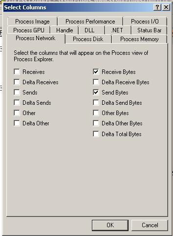

这样显示的进程列就会多两个收发字节流的标签。

#### 启动process monitor

然后打开**process monitor**。同样用作监视进程，也在标签上右键选择select columns，选择Thread ID，以便看清进程里的线程。

#### 启动wireshark

打开wireshark，捕捉本地接口。

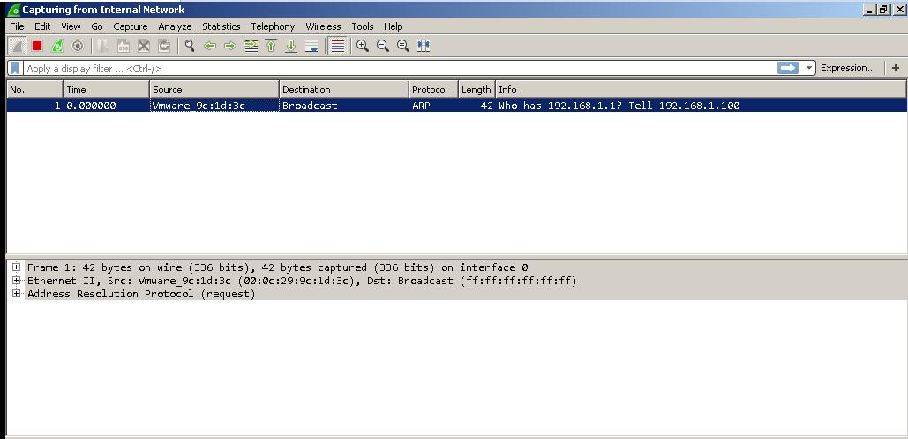

并且同时process monitor开始capture进程动态

#### 执行fakenet
跟wireshark一样，执行fakenet可以用来监控网络流量。

#### 启动CaptureBAT

启动CaptureBAT做监控


虚拟机桌面的capturebat直接拖入cmd可以运行。

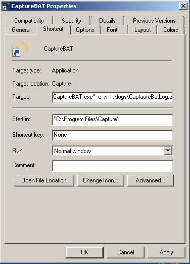

在capturebat的桌面快捷方式属性页面，可以看到，执行这个快捷方式就是默认执行了C:\\Program Files\\Capture\\CaptureBAT.exe,并且添加了参数-c -n -l，且指定了logs的位置。

可以用找到captureBAT.exe的位置，然后执行-h指令，看各个命令的作用


简而言之，-c将更改过得文件再复制一份，-n监控网络流量并记录，-l把系统事件都记录下来。

所以，回到图1中的cmd，我们知道log默认保存在了.\\logs\\CaptureBatLog.txt里。


#### 运行iauzzy并观察

这时候运行iauzzy.exe


可以看到进程中出现了一个qqt.exe

进程颜色是紫色，在color configuration可见这个进程是一个packed image

**process exploer**中对qqt.exe右键查看属性，可以看到很多有用的信息。

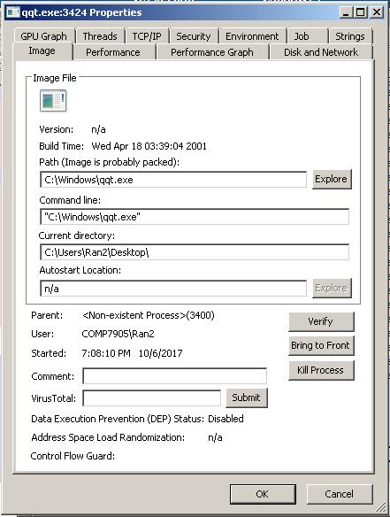

strings标签下还可以看到很多unpacked到memory中的内容。

在**process exploer**中设置view中看lower pane。拉到下面可以看到很多对应的thread。

在view的lower pane里选择DLLS，可以看到进程调用的dlls。


去qqt.exe的properties标签里的thread页也可以看到相关线程信息。

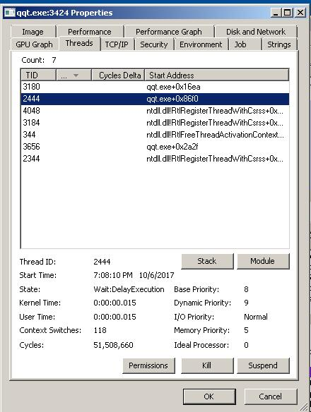

#### 观察网络流量

运行iauzzy以后，我们就可以在fakenet和wireshark里捕捉到流量包了。

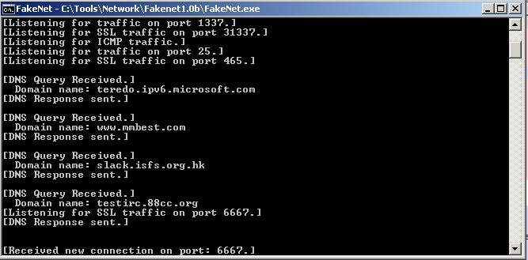

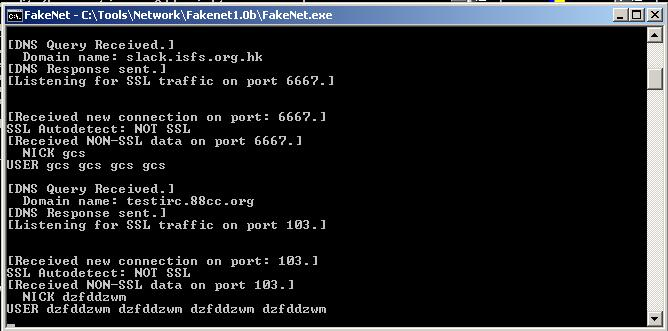


可以看到fakenet收到3条dns解析。

分别是：
 - www.nmbest.com
 - slack.isfs.org.hk
 - testirc.88cc.org

并且分析上图信息，可以知道恶意软件尝试连接slack.isfs.org.hk的6667端口，然后fakenet打开了6667端口来尝试接受数据。最后收到了非ssl数据

```
Nick gcs
USER gcs gcs gcs gcs
```

同理可知，程序尝试连接testirc.88cc.org的103端口。并发送了非ssl数据

```
NICK dzfddzwm
USER dzfddzwm dzfddzwm dzfddzwm dzfddzwm
```

分析wireshark也可以分析出类似信息.


可以看到有http请求发出，发给Host: www.mmbest.com

然后再http header里还设置了tag referer里，说明自己是从哪个页面过来的。referer如下图


我们停止抓包，然后save wireshark的log(capp格式)

#### 监控状态
运行恶意程序以后，我们可以在process monitor中save，把状态save成csv形式的log文件。

我们在filter里面，填写ProcessName is iauzzy.exe,或者qqt.exe.可以看到相关进程的所有动态。


同时我们重启autoruns并且可以save新状态的启动项状态。可以在file那里选择compare来对比前后的状态


可以看到启动项里明显多了一个打开c:\\windows\\qqt.exe

#### procdot制图

我们前面保存了process monitor的csv格式的log(需要在process monitor中选中显示thread列)，也保存了wireshark capp格式的log。

我们因此可以将两个log丢进procdot中制图。


如图，软件操作时，导入两个log，然后laucher那里选中iauzzy，就可以看到iauzzy的相关执行流程。点refresh，图就会绘制出现。可以勾上no path和compressed使图形更友好。

我们还可以选中qqt.exe，来看看qqt.exe的执行流程


