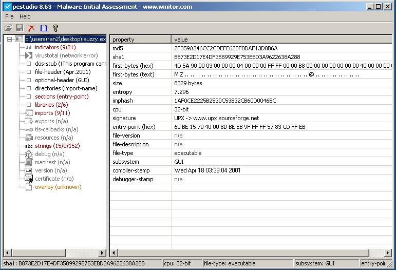
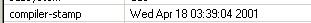
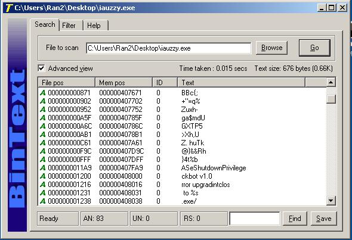
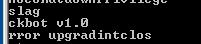
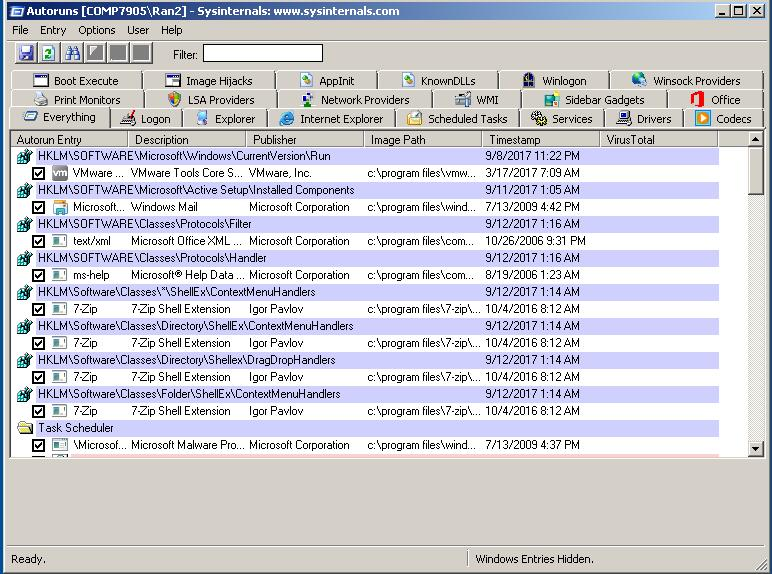
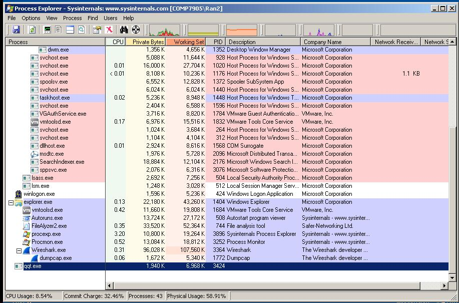
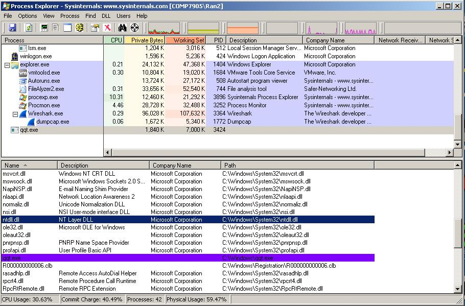

## 实验流程

任务:分析iauzzy.exe文件

### 静态分析
使用静态工具分析iauzzy.exe文件。

#### 用FileAlyzer分析
FileAlyzer是一个**文件分析程序**，用FileAlyzer用鼠标右键单击您想要分析的文件就可以像观看正常物品一样简单的分析查看文件

#### PEiD查看文件加壳状况

直接把文件拖入PEiD中查看文件加壳情况

看到是用UPX加壳的。

#### Stud_PE分析PE文件结构

同理，使用文件拖入

可以看到一些疑似的文件结构等。

#### PeStudio分析PE文件结构

这里可以看到

所以疑似这个文件compile在 Wed Apr 18 03:39:04 2001

#### BinText和Strings分析字符串

ckbot v1.0有些可疑

### 行为分析(动态分析)

启动autoruns 并制作快照用以以后对比

启动**procexp**来监控进程

process标签上右键选择select column

选上receive bytes 和 send bytes

这样显示的进程列就会多两个收发字节流的标签。

然后打开**process monitor**。同样用作监视进程，也在标签上右键选择select columns，选择Thread ID，以便看清进程里的线程。

打开wireshark，捕捉本地接口。

并且同时process monitor开始capture进程动态

这时候运行iauzzy.exe

可以看到进程中出现了一个qqt.exe

进程颜色是紫色，在color configuration可见这个进程是一个packed image

**process exploer**中对qqt.exe右键查看属性，可以看到很多有用的信息。

strings标签下还可以看到很多unpacked到memory中的内容。

在**process exploer**中设置view中看lower pane。拉到下面可以看到很多对应的thread。

在view的lower pane里选择DLLS，可以看到进程调用的dlls。

去qqt.exe的properties标签里的thread页也可以看到相关线程信息。

dns 53
