## lab2实验流程

这次来完成初步的code analysis，malware还是使用上次lab1的iauzzy.exe。

根据上次实验的结果，我们已经知道了iauzzy创造了一个跟自己一模一样的qqt.exe在c盘的windows目录下，并且分析出这个qqt访问了3个域名尝试进行一些通信，其中访问了一个域名，连接了其中6667端口。

可以猜测(其实不是猜哈哈)qqt使用了irc协议来和服务器通信。这就是我们lab2进行的基础。

本节实验，我们就是要用反汇编来对qqt进行分析。

### 实验设置

我们先设置一些基本的网络设置

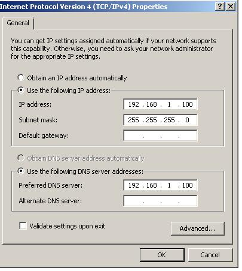

我们可以把dns和gateway都设置成192.168.1.100自身，这样流量都会走向自己。

其实这些不设置也应该可以。

由于我们知道qqt是使用了IRC协议进行聊天，所以我们也要安装IRC的客户端和服务端，分别是以下

#### 改host文件
我们知道了malware会用irc向几个域名发起通信，我们想要模拟这个irc服务器，所以有必要让这些域名指向自身。这需要改变host文件了。

我们用管理员的方式打开notepad，打开如下路径中的hosts文件

`C:\Windows\System32\drivers\etc`

并进行如下修改

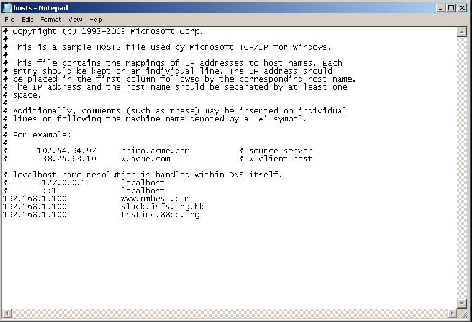

添加三条本机ip记录，使malware域名指向自己。

在虚拟机中都准备好以后可以拍快照

### 去壳iauzzy

根据lab1,我们已经知道了iauzzy是进行了加壳的，那么我们必须要对它去壳才能分析里面的代码，否则IDA Pro无法检测出iauzzy真正的入口点。

#### 关于IDA pro检测入口点
IDA pro很强大，它会自动检测程序的加壳，并且尝试去解壳(unpack),然而并不保证能解压正确。

只有经过正确的解压，IDA pro才能推测出程序运行的真正入口点，否则，IDA pro只能进行大致的推算，很可能检测出的程序入口点会出现在程序中的任意一段位置。

所以务必对程序进行去壳(unpack)之后，再进行code analysis。

#### 去壳
用peid可以很快的发现，程序经过了UPX加壳。所以同理我们也使用upx解压。直接将exe文件拖入虚拟机桌面upx即可。

可以用FileAnalysis来看解压前后的情况，发现体积发生了改变。

解压前

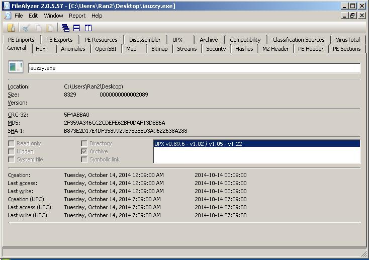

解压后

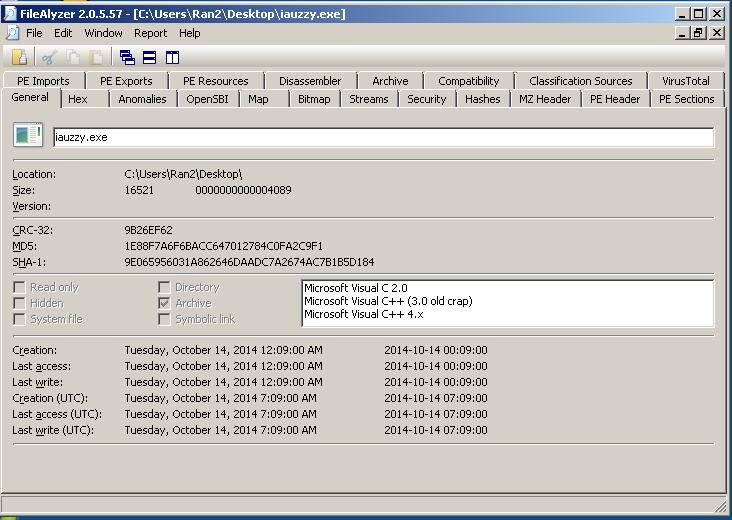

可以发现体积增加了一倍左右

解压前，我们能用bintext看到一些字符串，但是有些**字符串看上去毫无意义**，而解压后，我们就能看到很多有意义的字符串了。

### IDA Pro静态分析代码
将解压后的malware拖入IDA Pro里做静态分析

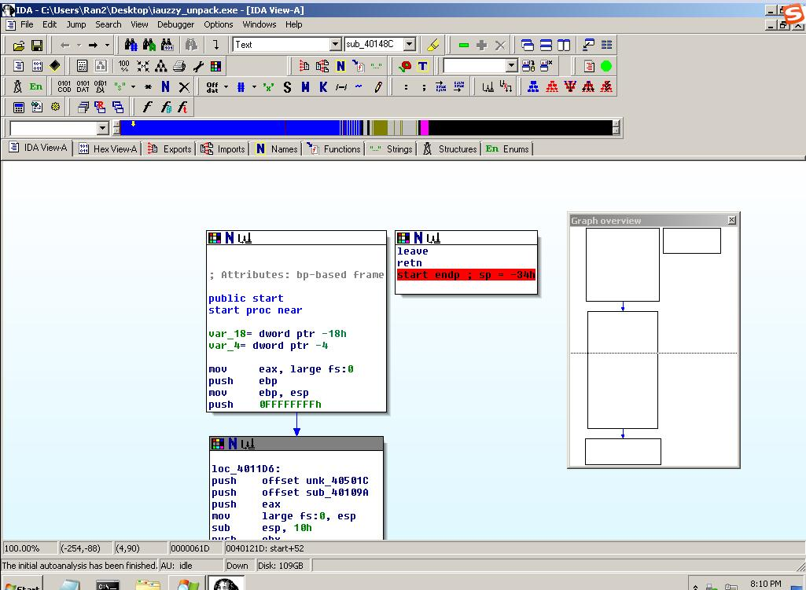

可以看到汇编代码结构的开始部分

经过基本的分析，我们可以得出一些结论。

#### 分析出函数_dropper_

首先，根据IDA分析原则，重点关注call调用和string。很容易可以发现第二部分，有一个函数调用sub_40148C,双击跳入。

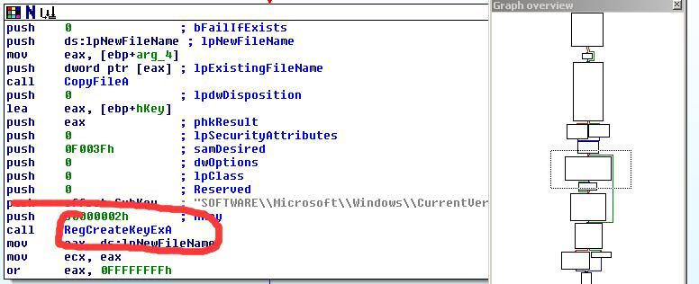

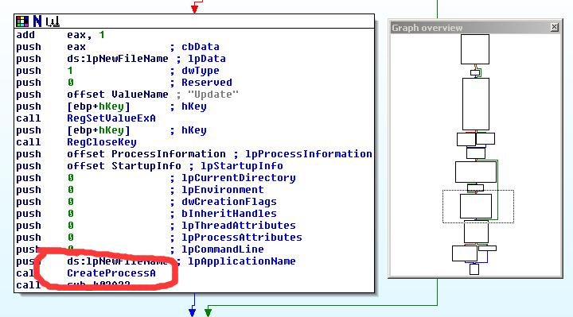

关注函数调用和字符串，我们结合lab1，发现了这里就有更改注册表，和create新线程的行为。最后他还执行了leave和return，相当于结束了自己。结合lab1，这里就是iauzzy结束自己，并且创建新qqt的过程。

我们可以将这个函数改名为dropper。

#### 分析出函数browser
我们根据IDA的分析原则，length越大的函数越有可能重要。由于第一个函数过于复杂，我们暂且跳过，第二个已经被分析出来是dropper，所以我们分析第三个。

开头部分就见到了可疑字符串

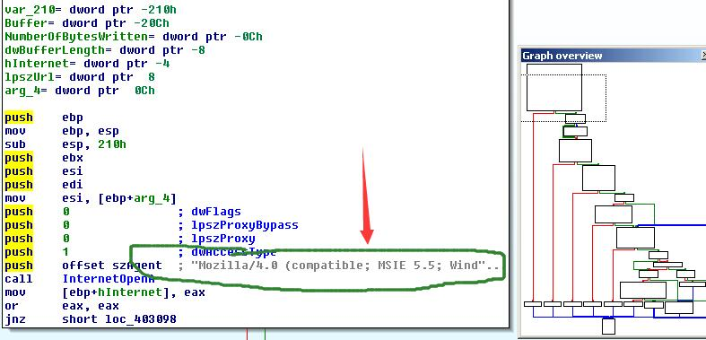

还看到了call function，InternetOpen

还有create file，后续还有writefile。

我们根据这些函数调用，猜测它可能是从网上去下载了什么东西，写成了文件。所以我们给这个函数起名 \_browser\_

#### 随意分析出了一个函数
我们接着show出browser的被调用图to。

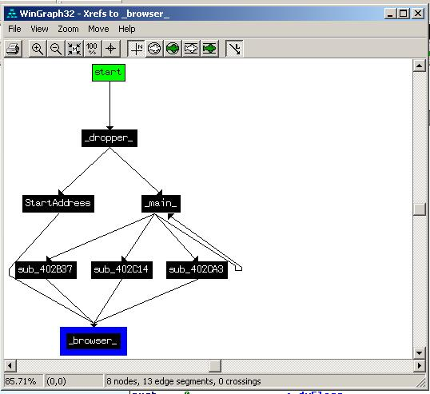

然后我们可以看到main中间调用了三个函数，最后才汇聚到browser。我们用g跳去地址402837的位置

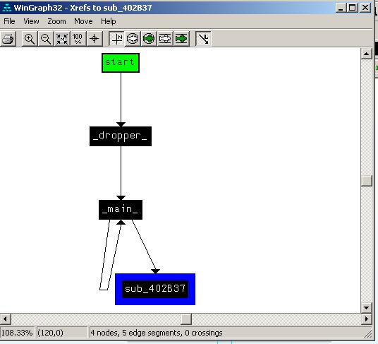

同时根据里面的string，我们亦可猜测他是一个检测visit信息的函数，所以改名为chkVisit

#### 分析最大的函数
在进行OllyDbg之前，先继续尝试分析一下这个最大的函数(显然为main函数，可以改名)

里面有巨多的if分支，并且进行了大量的字符串对比，对比的字符串有一些，“!@login”之类的。这些信息对我们之后的动态分析会很有用

#### 本格分析

实验报告中要求我们分析出函数4012A3的功能。那么首先，根据4012A3的refsto观察全貌。

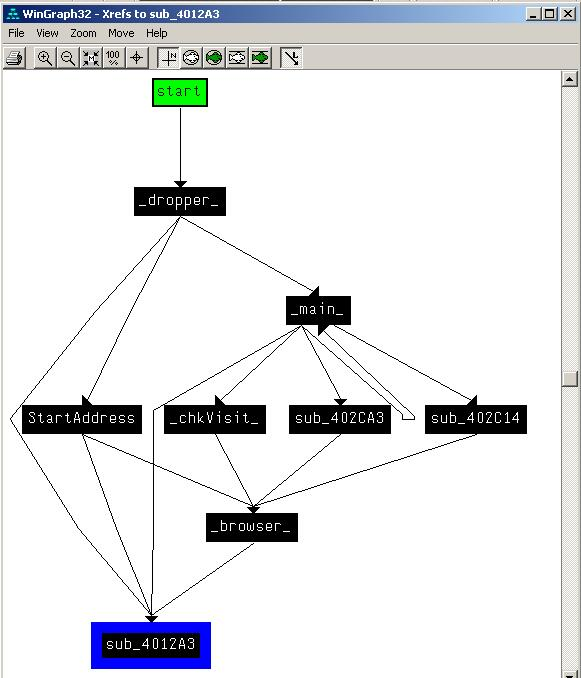

我们可以知道_dropper_ browser,\_main\_，startAddress，都直接调用了4012A3。除此之外，除了一个大循环，我们也未能再搞清楚函数的作用。

想要摸清这个函数的作用，我们必须搞清楚上下文，从上下文入手。

我们从dropper开始看，上下文，看到两个分支里都调用了sub_4012A3，并没有看出什么端倪。

接着我们打算从_main_入手。

跳到4012A3的位置，发现后续调用了一个402DD2的函数

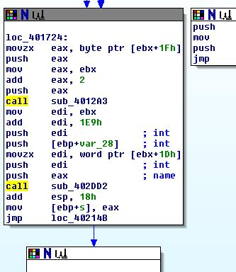

我们跳进402DD2，发现里面的有非常多的gethost等String，基本可以断定，跟irc_connection有关，我们可以把402DD2改名为irc_connection.最关键的是，这个函数调用的上一句，push eax name。咦，这个name是什么呢？

我们带着疑问同样查看了main，还有browser里的调用，发现都是在进行网络connection之前，调用了这个方法，并且把返回值设置成一个叫做lpszHeaders的东西。上csdn一查，发现这是在设置http头部。

那么irc也是一种tcp connection，应该也是在设置头部吧。所以我们大胆猜测，4012A3其实是在设置httpHeader。所以改名为createHeader吧。

我们最后也分析了一下402CA3和402C14，最后完成了这一部分的构图。

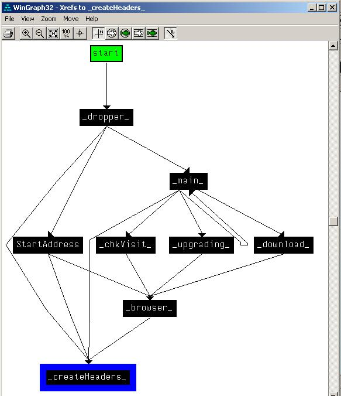
