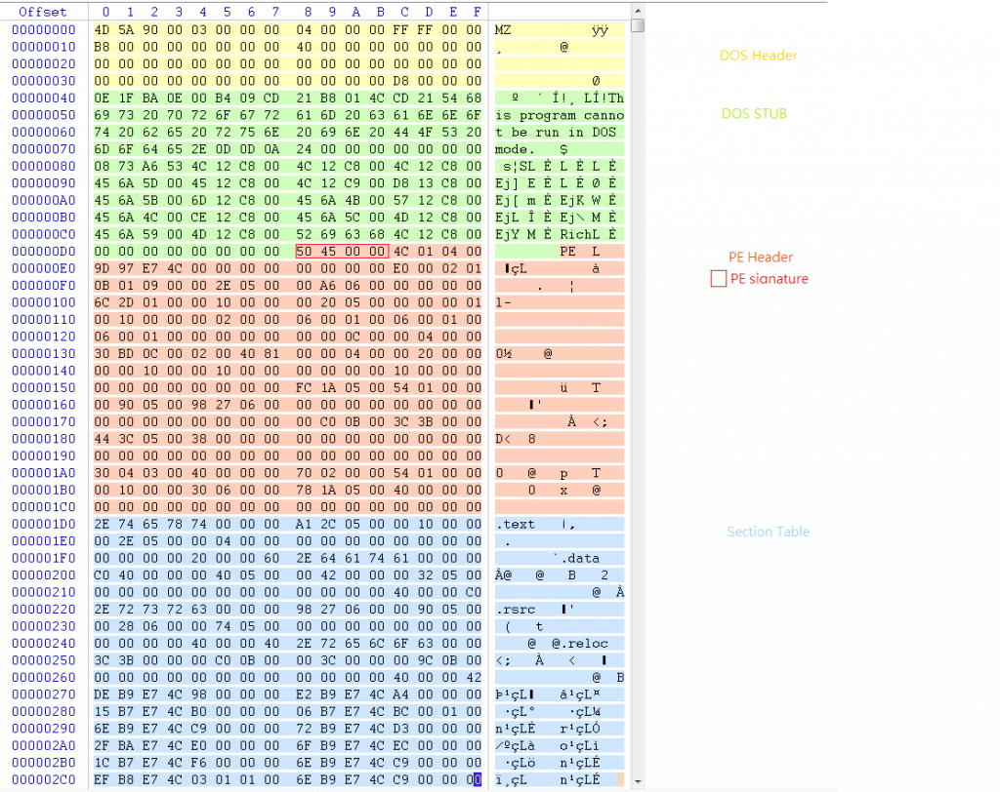
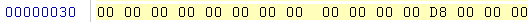
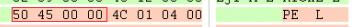
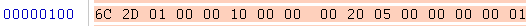
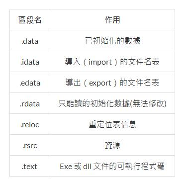

## PE文件
PE文件的全称是**Portable Executable**，意为可移植的可执行的文件，常见的**EXE、DLL、OCX、SYS、COM都是PE文件**，PE文件是微软Windows操作系统上的**程序文件**（可能是间接被执行，如DLL

zwlj:也就是说exe,dll这等可被执行(直接或者间接)的文件，就是pe文件。

pe文件内部，以**小端模式**读取。

### pe文件格式

pe格式简图

当然更具体的可以去网上参阅PE File format

也就是说，当我们拿到一个exe文件去分析它，这个pe文件的构成都是遵循这样的结构。

比如拿windows的计算器exe程序作为例子。分析程序的二进制序列

上面按照颜色，已经把区域划分好了，黄色区域是Dos header，绿色是Stub，蓝色是section等。

以下简要分析各个部分

#### DOS MZ Header
開頭必定為＂MZ＂，也就是十六进制4D 5A，這是 DOS EXE 的 Signature。而這東西讓 PE file 在 DOS 模式下也可執行，所佔大小為 **40h bytes**。

所以当一个文件的后缀名可能是pdf，或者什么word，如果分析到它开头是MZ，那么它大概率是一个伪装的EXE文件。

#### DOS Stub

但也不是什麼都能在 DOS 底下執行，若是程式在 DOS 下無法執行便會跳出這邊的錯誤訊息：＂This Program cannot be run in DOS mode＂。

所以这个stub封装错误信息。

#### PE Header
為了找到 PE 的開頭位置，我們可從 DOS Header 0x3C 的位置找到一個 Double word（又稱 dword，大小為 4 個 bytes）。

插一个常识，Byte是一个字节，一个Word是两个字节，自然double word就是四字节

而這個 dword 大小表示了整個 DOS MZ Header 的 size，也就是 D8 00 00 00。

注意！這裡實際位置是 0x000000D8!**这里必須以 Byte 為單位顛倒過來看才行!**

這種**反向讀取方式稱之為 Little－endian order,也就是我们所说的小端模式**，在 PE 文件中皆採用此種讀取方式。

所以根据MZ header的大小，和stub的大小位置，我们可以轻易算出pe header的开始位置。

注意了，到了 PE 位置所看到的必定是 50 45,这就是Signature,显示出来就是**PE**

PE Header 裡包含了許許多多的訊息，其中**最重要之一**就是距離 PE 位置（0xD8）後 0x28 的 dword,也就是PE头位置往后数,0x28的位置。這裡是這隻程式執行時的入口點**Entry point**

所以十六进制计算 D8+28=0x100，相应位置为下图

上图6C开始便是入口点，但是要注意，这里开始往后12个bytes后的一个dword，也就是上图最后四个字节 00 00 00 01，这是Image Base！
之前找到的入口点，也就是0x100只是**相對虛擬位置Relative virtual address, RVA**，要加上ImageBase才是**真正的位置Virtual address, VA**！

#### RVA解析

VA指的是进程虚拟内存的绝对地址,RVA(Relative Virtual Address,相对虚拟地址)指从某个基准位置(ImageBase)开始的相对地址。VA 与 RVA 满足下面的换算关系.

`RVA  +  ImageBase  =  VA`

zwlj:首先要理解，windows系统加载pe文件时，抽象了一块虚拟空间(地址从0到某一位置结束)进程，然后我们把**各个**pe文件(比如dll)加载到这个虚拟空间的某一块地方，比如说，我们把这个pe文件装入虚拟地址400000h处,那么这个**PE文件的Image Base就是400000h**!.

ImageBase即基地址就是PE映象文件被装入内存的地址，并且可能会**随着一次又一次的调用而变化**。

而RVA就是用来推算真正的程序入口点的，这个RVA值不会随意改变。比如我们值了ImageBase，即程序装载到的地址是400000h，而RVA是0x1560，那根据公式RVA+ImageBase，可得有效的执行开始处将位于0x401560地址处。同理，假若它(ImageBase)被装入的地址为0x100000，那么执行开始处就位于0x101560地址处。

这时再回过头来看上面的pe file文件例子就知道了，上面的例子里，我们分析出pe文件的entry point

这个entrypoint里，记载这RVA和ImageBase信息，当然ImageBase会经常变啦。我们用后4字节的ImageBase加上RVA，根据小端即是012DC6+100000，算出来的即是virtual address,即虚拟地址VA，程序真正在虚拟内存中的入口点。

#### Section Header
如果 PE file 之中有 4 個區段（section），Section Table 就會有 4 個成員，每個成員包含對應區段的屬性、內存大小、**偏移量** 等訊息

#### Section

PE file 裡的內容，被劃分成各個區段，每個區段的名子以 ” . ” 當作開頭，以下是常見的區段名和作用：

#### 总结

當 PE file 被執行時，PE 裝載器先檢查 DOS MZ Header 中的 PE Header 偏移量，若找到則跳到 PE Header 所在位置。接著檢查 PE header 是否有效，若有則跳到 Section Table 頭部，讀取訊息並利用文件映射（file mapping）的方法將這些區段映射到記憶體中。
