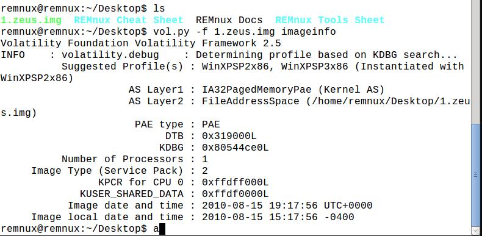
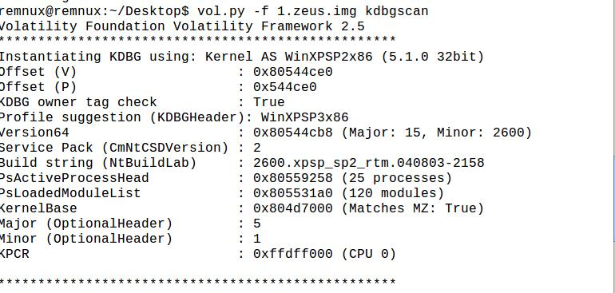
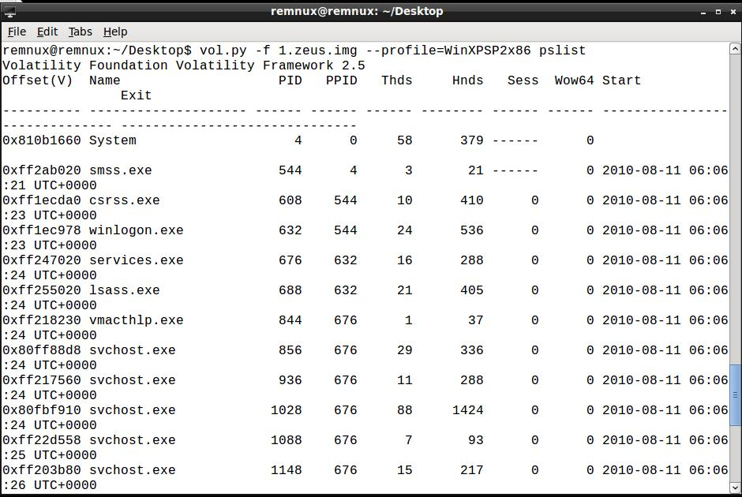
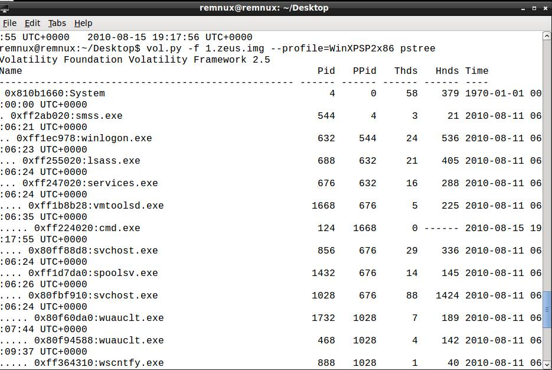
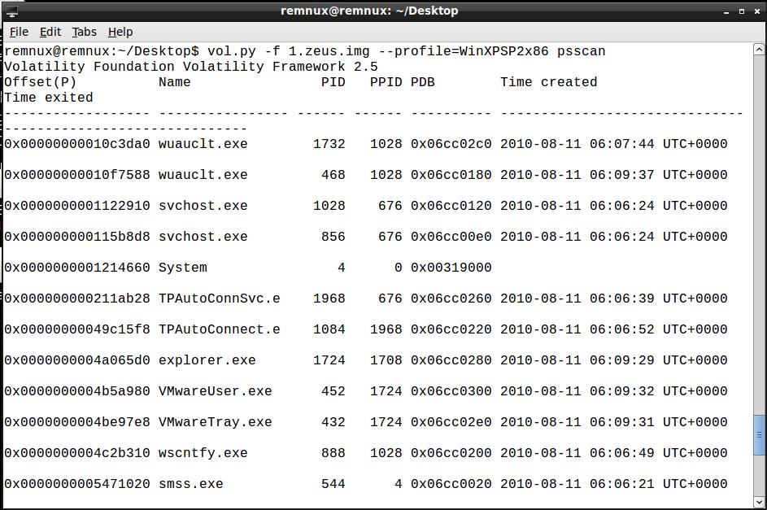
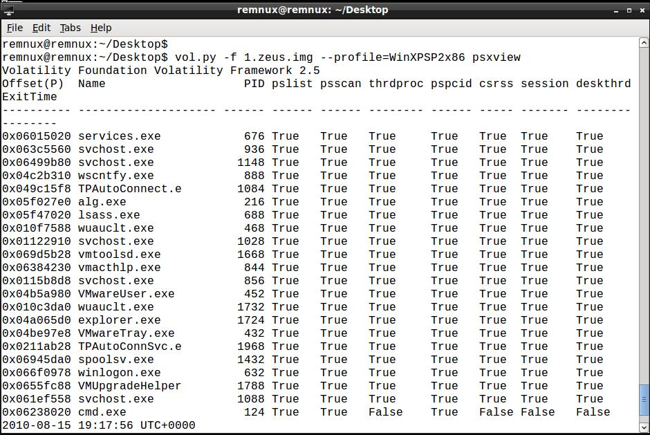
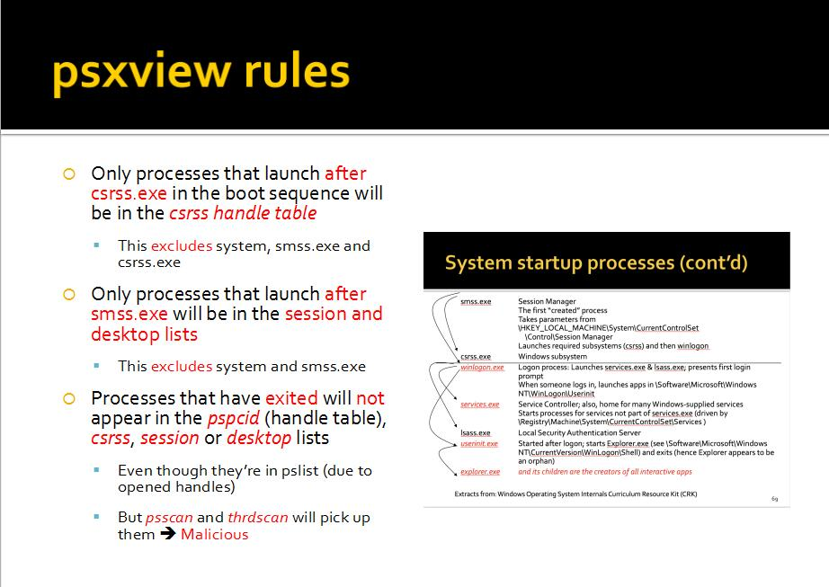

## 内存取证分析
内存取证技术的发展在一定程度上弥补了传统的离线取证技术的不足，通过**内存镜像的分析**，调阅当前正在内存中**运行的进程**、 **所有载入模块和DLL库以及运行中的设备驱动程序**发现各种潜在问题，如设备驱动中是否附着恶意驱动设置底层钩子程序、DLL库是否劫持等。

### intel访问控制
Intel的CPU将特权级别分为4个级别：RING0,RING1,RING2,RING3。**Windows只使用其中的两个级别RING0和RING3**，**RING0只给操作系统用，RING3谁都能用**。如果普通应用程序企图执行RING0指令，则Windows会显示“非法指令”错误信息。尽管有CPU的特权级别作保护

### win数据结构

在Windows系统中，**每个进程都用一个EProcess（ExecutiveProcess）结构来表示(very 重)**，它包含进程的**可执行文件全路径**、**启动进程的命令行**、**当前工作目录**、**进程堆指针**、**进程标准句柄以及指向进程相关的其他属性和数据结构的指针**。

由于数据结构就是字节序列，序列中有特殊的含义和目的，所以需要调查人员对其进行分析。**EProcess结构中最重要的一个成员是指向进程环境块（PEB）的指针**。进程环境块中包含大量的信息(见win数据结构笔记)

### volatility使用

我们使用一些方法dump了内存镜像之后，我们就可以用volatility进行分析了。

我在一个REMnux虚拟机里安装了volatility框架，然后执行`imageinfo`命令可以得到这个镜像的相关信息

如图所示，可以看到zeus.img这个内存镜像，系统是WinXPSP2x86。

这里要注意一个KDBG，这个imageinfo就是从KDBG里读取信息的。什么事KDBG呢？

*The KDBG is a structure maintained by the Windows kernel for debugging purposes. It contains a list of the running processes and loaded kernel modules. It also contains some version information that allows you to determine if a memory dump came from a Windows XP system versus Windows 7, what Service Pack was installed, and the memory model (32-bit vs 64-bit).*

总之就是win维护的一个数据结构，可以用来查看到一系列运行得进程和加载的模块，还有一些os的基本信息。

**不过注意这个命令只适用于win系统**
#### KDBGSCAN(win only)
使用KDBGSCAN这个命令可以查看刚才所说的KDBG结构

imageinfo插件猜测profile值的功能是基于kdbgscan这个插件的功能来实现的.而kdbgscan这个插件是通过查找分析内核调试器数据块(_KDDEBUGGER_DATA64)的特征来猜测profile值的.

**只有根据这个win内核中的_KDDEBUGGER_DATA64结构读取并猜测出profile值(相当于操作系统型号)，才能在之后正确读取这个镜像的信息。**

拿到profile之后，后面的命令我们就可以指定profile了。

#### pslist

如上图，我们指定了profile，并且执行了pslist命令，可以看到此时内存中加载的进程。**已经terminated的进程不会出现。**

但是pslist是通过遍历进程的双向链表来找出所有的进程的，因此可能会有的进程通过重设前后指针来脱离出这个循环链表，从而躲过搜查。

#### pstree
pstree其实也是利用了pslist的插件，只不过是讲进程用树状的形态显示了，这样更好看清父子关系

不过依旧无法找出隐藏的进程。

#### psscan
psscan是通过查找内存中所有存在的EPROCESS结构来找到全部进程的，这样就能找出隐藏的进程了，不过也有可能会找到**已经terminated的进程**。因为有些进程被终止之后，但是内存中可能还是会残留有EPROCESS结构。

#### psxview
这个命令就厉害了，这个方法用来交叉对比四面八方的信息，来找出真正的malware进程。是最好的方法区找出隐藏进程

如图，可见除了之间介绍的命令，之外，还有

 - thrdproc(thread process),用来看进程里还有没有**执行线程**(是否还在running)，没有说明基本上是被终止
 - csrss(参见win笔记，是一个记录结构，在csrss.exe启动后启动的进程都会被记录)
 - pspcid，这是一个handle table，也就是个句柄调用链表，

#### psxview规则
有了psxview的视图，我们就要根据一些规则去找到malware进程。

 - csrss之后的进程，都会出现在csrss的handle table里。
 - smss进程启动之后的进程，才会在session和desktop list里(包括smss和system)
 - 被终止的进程不会出现在csrss里，pspcid里，也不会出现在session和desktop中。
