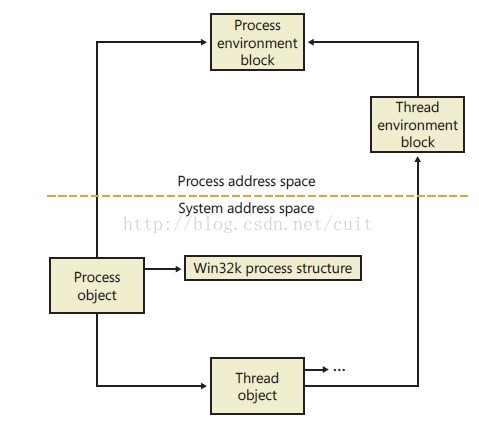
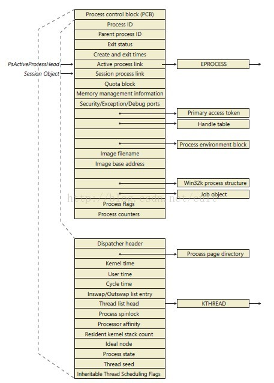

## windows进程数据结构
每个Windows进程都表现为一个executive进程（**EPROCESS**）结构，除了包括很多进程相关的属性外，还包括一些指针。比如，每个进程都有一个或多个线程，每个线程都是executive线程（**ETHREAD**）结构。

**EPROCESS 和大多数与其相关的数据结构存在于系统的地址空间(内核模式Kernel mode)中**，有一个例外是进程的环境块**PEB**（process environment block ），**存在于进程的地址空间中（用户模式User mode）**。

zwlj:这里注意，上面的PEB不是PCB，不要搞混，PEB在用户区，PCB(process control block进程控制块)在内核区。

每个执行Win32程序的进程，Win32子系统进程（Csrss.exe）维护一个叫做CSR_PROCESS的并行的结构。最后，内核模式部分的Win32子系统（Win32k.sys）维护每个进程的数据结构，W32PROCESS。W32PROCESS结构在线程第一次调用Windows USER函数或GDI函数时创建。

下图是进程和线程数据结构的简化图表：

也就是说，EPROCESS和ETHREAD数据结构会在内存的kernel mode中，而PEB和TEB，进程和线程控制块，由于进程可能会被用户修改，所以放在User Mode当中。

### EPROCESS

下图是EPROCESS 的结构.

简要的来看几个部分

#### PCB
首先第一个域PCB，也就是所谓的进程控制块，是EPOROCESS的一个子结构，封装了更多有关进程的深层信息，还有进程作为container里面的thread的信息。

而且，**PCB域即KPROCESS结构体**，它们是同一种东西，只是两种叫法而已，也就是上图中的下半部分就是pcb或者说KPROCESS结构体了。

因为Pcb域是EPROCESS结构的第一个成员，所以在系统内部，一个进程的KPROCESS对象的地址和EPROCESS对象的地址是相同的。windows中的这种结构体的嵌套思想，应该予以领会。

#### ActiveProcessLinks
这个域也比较重要，ActiveProcessLinks域是一个双链表节点(注意是双链表中的一个节点)，在windows系统中，所有的活动进程都连接在一起，构成了一个链表。

表头是全局变量PsActiveProcessHead。内部变量**PsActiveProcessHead**是一个LIST_ENTRY结构，它是一个**双链表的表头**，在windows的进程双链表中指定了系统进
程列表的第一个成员(回想数据结构中双链表需要一个和链表项相同的表头结构来当作入口点)。
这里注意一下:

**PID=4的System**的ActiveProcessLinks其实也就是PsActiveProcessHead。即系
统进程**System**的LIST_ENTRY结构充当这个进程双链表的表头。

### CSR_PROCESS
之前提到CSR_PROCESS是Csrss.exe维护的一个进程记录一样的东西，在它CSR_PROCESS启动后的进程都会被这里记录。但是由于csrss.exe在系统进程之后启动，所以这里不会有系统进程的记录。

如图，每个在csrss.exe之后执行的进程都会维护一个这样的CSR_PROCESS数据结构，由csrss.exe管理。
