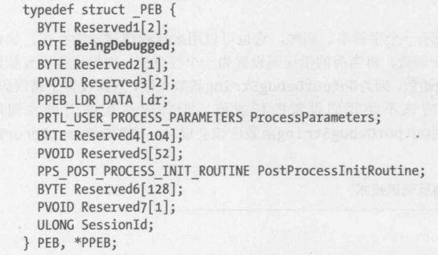

## 反调试技术详解
<A>http://blog.csdn.net/liujiayu2/article/details/72956591</a>

反调试技术，恶意代码用它识别是否被调试，或者让调试器失效。恶意代码编写者意识到分析人员经常使用调试器来观察恶意代码的操作，因此他们使用反调试技术尽可能地延长恶意代码的分析时间。为了阻止调试器的分析，当恶意代码意识到自己被调试时，它们可能改变正常的执行路径或者修改自身程序让自己崩溃，从而增加调试时间和复杂度。很多种反调试技术可以达到反调试效果。这里介绍当前常用的几种反调试技术，同时也会介绍一些逃避反调试的技巧。

### 通过探测windows调试器
恶意代码会使用**多种技术**探测调试器调试它的痕迹，其中包括使用Windows API、手动检测调试器人工痕迹的内存结构，查询调试器遗留在系统中的痕迹等。调试器探测是恶意代码最常用的反调试技术。

#### 使用windows API
使用Windows API函数检测调试器是否存在是最简单的反调试技术。Windows操作系统中提供了这样一些API，应用程序可以通过调用这些API，来检测自己是否正在被调试。这些API中，其中很小部分函数没有在微软官方文档显示。通常，防止恶意代码使用API进行反调试的最简单的办法是在恶意代码运行期间修改恶意代码，使其不能调用探测调试器的API函数，或者修改这些API函数的返回值，确保恶意代码执行合适的路径。与这些方法相比，较复杂的做法是**挂钩这些函数，如使用rootkit技术**。

zwlj:也就是自己写封装一些windows官方的函数来判断自己是否被debug。

##### 1.1 IsDebuggerPresent
IsDebuggerPresent查询进程环境块(PEB)中的IsDebugged标志。如果进程没有运行在调试器环境中，函数返回0；如果调试附加了进程，函数返回一个非零值。

``` c++
BOOL CheckDebug()
{
    return IsDebuggerPresent();
}
```

##### 1.2 CheckRemoteDebuggerPresent
CheckRemoteDebuggerPresent同IsDebuggerPresent几乎一致。它不仅可以探测系统其他进程是否被调试，通过传递自身进程句柄还可以探测自身是否被调试。

``` c++
BOOL CheckDebug()
{
    BOOL ret;
    CheckRemoteDebuggerPresent(GetCurrentProcess(), &ret);
    return ret;
}
```


#### 1.3NtQueryInformationProcess
这个函数是Ntdll.dll中一个原生态API，它用来提取一个给定进程的信息。它的第一个参数是进程句柄，第二个参数告诉我们它需要提取进程信息的类型。为第二个参数指定特定值并调用该函数，相关信息就会设置到第三个参数。第二个参数是一个枚举类型，其中与反调试有关的成员有ProcessDebugPort(0x7)、ProcessDebugObjectHandle(0x1E)和ProcessDebugFlags(0x1F)。例如将该参数置为ProcessDebugPort，如果进程正在被调试，则返回调试端口，否则返回0。

#### 1.4GetLastError
编写应用程序时，经常需要涉及到错误处理问题。许多函数调用只用TRUE和FALSE来表明函数的运行结果。一旦出现错误，MSDN中往往会指出请用GetLastError()函数来获得错误原因。**恶意代码可以使用异常来破坏或者探测调试器**。调试器捕获异常后，并不会立即将处理权返回被调试进程处理，大多数利用异常的反调试技术往往据此来检测调试器。


zwlj：具体方法可以看top来源链接，原理也是利用了debug会设置一些错误信息的方法来判断。

##### 1.5 ZwSetInformationThread
ZwSetInformationThread拥有两个参数，第一个参数用来接收当前线程的句柄，第二个参数表示线程信息类型，若其值设置为ThreadHideFromDebugger(0x11)，使用语句ZwSetInformationThread(GetCurrentThread(), ThreadHideFromDebugger, NULL, 0);调用该函数后，调试进程就会被分离出来。该函数不会对正常运行的程序产生任何影响，但若运行的是调试器程序，因为该函数隐藏了当前线程，调试器无法再收到该线程的调试事件，最终停止调试。还有一个函数DebugActiveProcessStop用来分离调试器和被调试进程，从而停止调试。两个API容易混淆，需要牢记它们的区别。

#### 2 手动检测数据结构
虽然使用Windows API是探测调试器存在的最简单办法，但**手动检查数据结构是恶意代码编写者最常使用的办法**。这是因为很多时候通过Windows API实现的反调试技术无效，例如这些API函数被rootkit挂钩，并返回错误信息。因此，恶意代码编写者经常手动执行与这些API功能相同的操作。在手动检测中，**PEB结构中的一些标志暴露了调试器存在的信息**。这里，我们关注检测调试器存在常用的一些标志。

##### 2.1检测BeingDebugged属性
Windows操作系统维护着每个正在运行的进程的PEB结构，它包含与这个进程相关的所有用户态参数。这些参数包括进程环境数据，环境数据包括环境变量、加载的模块列表、内存地址，以及调试器状态。



``` c++
BOOL CheckDebug()
{
    int result = 0;
    __asm
    {
        mov eax, fs:[30h]
        mov al, BYTE PTR [eax + 2]
        mov result, al
    }
    return result != 0;
}
```

##### 2.2检测ProcessHeap属性
Reserved数组中一个未公开的位置叫作ProcessHeap，它被设置为加载器为进程分配的第一个堆的位置。ProcessHeap位于PEB结构的0x18处。第一个堆头部有一个属性字段，它告诉内核这个堆是否在调试器中创建。这些属性叫作ForceFlags和Flags。在Windows XP系统中，ForceFlags属性位于堆头部偏移量0x10处；在Windows 7系统中，对于32位的应用程序来说ForceFlags属性位于堆头部偏移量0x44处。
