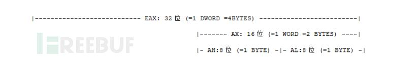

## 逆向汇编基础

### 寄存器
如今Win+Intel CPU组成的计算机通常有9个32位寄存器 (w/o 标志寄存器)。它们是

 - EAX： 累加器(accumulate)
 - EBX： 基址寄存器(basic)
 - ECX： 计数器(count)
 - EDX： 数据寄存器(data)
 - ESI： 源变址寄存器(source)
 - EDI： 目的变址寄存器(destination)
 - EBP： 扩展基址指针寄存器(basic pointer)
 - ESP： 栈指针寄存器(stack pointer)
 - EIP： 指令指针寄存器(instruction pointer)

通常来说寄存器大小都是32位 (四个字节) 。它们可以储存值为从0-FFFFFFFF (无符号)的数据。起初大部分寄存器的名字都暗示了它们的功能，比如ECX=计数，但是现在你可以使用任意寄存器进行计数。

并且，通常一个寄存器可以这样看：



由图可知，EAX是这个32位寄存器的名字，EAX的低16位部分被称作AX，AX又分为高8位的AH和低8位的AL两个独立寄存器。

#### 标志寄存器
标志寄存器代表某种状态。在32位CPU中有**32个不同的标志寄存器**，不过不用担心，我们只关心其中的3个：ZF、OF、CF。在逆向工程中，你**了解标志寄存器就能知道程序在这一步是否会跳转**，标志寄存器就是一个标志，**只能是0或者1**，它们决定了是否要执行某个指令。

##### Z-Flag(零标志)
ZF是破解中用得最多的寄存器(通常情况下占了90%)，它可以设成0或者1。若上一个运算结果为0，则其值为1，否则其值为0。

##### The O-Flag(溢出标志)
OF寄存器在逆向工程中大概占了4%，当上一步操作**改变了**某寄存器的**最高有效位时**，OF寄存器会被设置成1。例如：EAX的值为7FFFFFFFF，如果你此时再给EAX加1，OF寄存器就会被设置成1，因为此时EAX寄存器的最高有效位改变了(你可以使用电脑自带计算器将这个16进制转化成2进制看看)。还有当**上一步操作产生溢出时**(即算术运算超出了有符号数的表示范围)，OF寄存器也会被设置成1。

##### The C-Flag(进位标志)
进位寄存器的使用大概占了1%，如果产生了溢出，就会被设置成1。例，假如某寄存器值为FFFFFFFF，再加上1就会产生溢出，你可以用电脑自带的计算器尝试。

### intel基础汇编指令

请注意，所有的值通常是以16进制形式储存的

Win+Intel的电脑上大部分采用”小端法”

关键字**ptr**的意思是:用什么样的数据格式去读取接下来的数据，这个跟代码中的类型定义有点像。

比如

```
add dword ptr [404000],eax
```

上面汇编指令的意思，就是将内存\[404000\]的位置以**双字doubleword**的方式来读取，并且把eax(同样是个双字寄存器)加到这个内存地址上。注意双字其实就是4个字节。

有一些关键指令比如add，and,call(调用),dec(自减),inc(自加),无需多言。

#### CMP (比较)
语法: CMP 目标数, 原数

CMP指令比较两个值并且标记CF、OF、ZF：

```
CMP     EAX, EBX              ;; 比较eax和ebx是否相等，如果相等就设置ZF为1
CMP     EAX,[404000]          ;; 比较eax和偏移量为[404000]的值是否相等
CMP     [404000],EAX          ;; 比较[404000]是否与eax相等
```

#### DIV (除)
语法: DIV 除数

DIV指令用来将EAX除以除数(无符号除法)，**被除数通常是EAX**，结果也**储存在EAX中**，而被除数对除数取的模存在除数中。

例：

```
mov eax,64                      ;; EAX = 64h = 100
mov ecx,9                       ;; ECX = 9
div ecx                         ;; EAX除以ECX
```

在除法之后 EAX = 100/9 = 0B(十进制：11) 并且 ECX = 100 MOD 9 = 1

div指令可以标记CF、OF、ZF

#### INT
语法: int 目标数

INT 的目标数必须是产生一个整数(例如：int 21h)，类似于call调用函数，INT指令是调用程序对硬件控制，不同的值对应着不同的功能。

具体参照硬件说明书。

#### JUMPS
这些都是最重要的跳转指令和触发条件(重要用\*标记，最重要用\*\*标记)：

```
指令                条件                    条件
JA*          -    如果大于就跳转(无符号)      - CF=0 and ZF=0
JAE          -    如果大于或等于就跳转(无符号)- CF=0
JB*          -    如果小于就跳转(无符号)   - CF=1
JBE          -    如果小于或等于就跳转(无符号)- CF=1 or ZF=1
JC           -    如果CF被标记就了跳转       - CF=1
JCXZ         -    如果CX等于0就跳转      - CX=0
JE**         -    如果相等就跳转        - ZF=1
JECXZ        -    如果ECX等于0就跳转       - ECX=0
JG*          -    如果大于就跳转(有符号)   - ZF=0 and SF=OF (SF = Sign Flag)
JGE*         -    如果大于或等于就跳转(有符号) - SF=OF
JL*          -    如果小于就跳转(有符号)    - SF != OF (!= is not)
JLE*         -    如果小于或等于就跳转(有符号 - ZF=1 and OF != OF
JMP**        -    跳转             - 强制跳转
JNA          -    如果不大于就跳转(无符号)   - CF=1 or ZF=1
JNAE         -    如果不大于等于就跳转(无符号) - CF=1
JNB          -    如果不小于就跳转(无符号)   - CF=0
JNBE         -    如果不小于等于就跳转(无符号) - CF=0 and ZF=0
JNC          -    如果CF未被标记就跳转     - CF=0
JNE**        -    如果不等于就跳转       - ZF=0
JNG          -    如果不大于就跳转(有符号)   - ZF=1 or SF!=OF
JNGE         -    如果不大于等于就跳转(有符号) - SF!=OF
JNL          -    如果不小于就跳转(有符号)   - SF=OF
JNLE         -    如果不小于等于就跳转(有符号) - ZF=0 and SF=OF
JNO          -    如果OF未被标记就跳转     - OF=0
JNP          -    如果PF未被标记就跳转     - PF=0
JNS          -    如果SF未被标记就跳转      - SF=0
JNZ          -    如果不等于0就跳转      - ZF=0
JO           -    如果OF被标记就跳转     - OF=1
JP           -    如果PF被标记就跳转     - PF=1
JPE          -    如果是偶数就跳转       - PF=1
JPO          -    如果是奇数就跳转       - PF=0
JS           -    如果SF被标记就跳转     - SF=1
JZ           -    如果等于0就跳转      - ZF=1
```

筛选出来便是,
 - JA(above)
 - JB(below)
 - JE(equal)
 - jg(有符号greater)
 - JGE(greater equal)
 - JL(有符号less)
 - JLE
 - JMP(强制跳转jump)
 - JNE(note equal)

#### MOV
这是一个很简单的指令，MOV指令将源数赋值给目的数，并且源数值保持不变

这里有一些MOV的变形：

MOVS/MOVSB/MOVSW/MOVSD EDI, ESI：这些变形能将ESI指向的内容传送到EDI指向的内容中去

MOVSX：MOVSX指令将单字或者单字节扩展为双字或者双字节传送，原符号不变

MOVZX：MOVZX扩展单字节或单字为双字节或双字并且用0填充剩余部分(通俗来说就是将源数取出置于目的数，其他位用0填充)

#### LEA (有效地址传送)
语法：LEA 目的数、源数

LEA可以看成和MOV差不多的指令LEA ，它本身的功能并没有被太广泛的使用，反而广泛运用在快速乘法中：

lea eax，dword ptr \[4*ecx+ebx\]

将eax赋值为 4*ecx+ebx

#### MUL(乘法)
语法：MUL 数值

这个指令同IMUL一样，不过MUL可以乘无符号数。

#### POP,PUSH
语法：POP 目的地址

POP指令将栈顶第一个字传送到目的地址。 每次POP后，**ESP(栈指针寄存器)** 都会增加以指向新栈顶

语法：PUSH 值

PUSH是POP的相反操作，它将一个值压入栈并且减小栈顶指针值以指向新栈顶。

#### REP/REPE/REPZ/REPNE/REPNZ
语法: REP/REPE/REPZ/REPNE/REPNZ ins

重复上面的指令：直到CX=0。ins必须是一个操作符，比如CMPS、INS、LODS、MOVS、OUTS、SCAS 或 STOS

#### RET (返回)

语法：RET

RET digit

RET指令的功能是从一个代码区域中退出到调用CALL的指令处。

RET digit在返回前会清理栈
