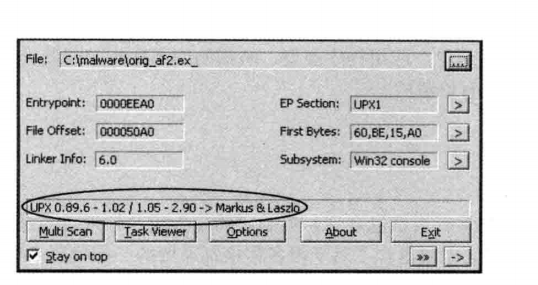

## 静态分析技术

分析恶意软件，第一步就是先用所谓的静态分析技术来分析它。静态分析是指分析程序指令与结构来确定功能的过程。此时**程序是非运行状态**。

### 反病毒引擎扫描(第一步)

拿到可疑程序，第一步就是拿多个反病毒软件扫描它，看是否有引擎能识别它。

但由于是检测代码段，所以病毒编写者容易通过修改代码躲避检测。

**VirusTotal是个很出名的网站，用来进行上传检测，要好好利用。**

### 检测MD5哈希值
用MD5或者SHA-1算法计算恶意软件哈希值，从而检索在线网站看其是否被识别。

缺点是，同样恶意软件变数大，难以一概而论。

### 查找字符串
恶意软件里可能可以看到很多有用的字符串，比如可以检测出，程序可能调用了哪些系统库函数，以及访问了哪个url等。

### PEiD检测加壳
恶意软件很可能被加壳(见笔记)，所以我们需要利用一些软件来分析加壳。

用PEid,我们可以检测出文件有没有被加壳。比如下图可以知道，文件被UPX加壳工具加壳了，要用对应的脱壳程序进行分析。

