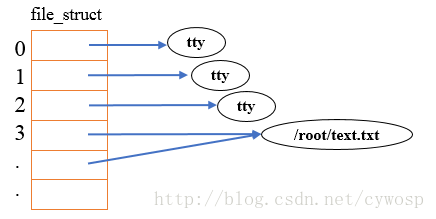

## 文件描述符
在Linux系统中一切皆可以看成是文件，文件又可分为：普通文件、目录文件、链接文件和设备文件。文件描述符（file descriptor）是内核为了高效管理已被打开的文件所创建的索引，其是一个非负整数（通常是小整数），用于指代被打开的文件。

在程序设计中，一些涉及底层的程序编写往往会围绕着文件描述符展开。但是文件描述符这一概念往往只适用于UNIX、Linux这样的操作系统。

**所以本质上文件描述符就是个一个整数，类似于数组下标，用来指代进程操作了哪一个文件**

程序(进程)刚刚启动的时候，0是标准输入，1是标准输出，2是标准错误。如果此时去打开一个新的文件，它的文件描述符会是3。

**系统为每一个进程维护了一个文件描述符表**，该表的值都是从0开始的，所以在不同的进程中你会看到相同的文件描述符，这种情况下相同文件描述符有可能指向同一个文件，也有可能指向不同的文件。

内核维护了3个数据结构：
1. 进程级的文件描述符表
2. 系统级的打开文件描述符表
3. 文件系统的i-node表

上图就大致简介的表达出了三张表的关系。首先每个进程里都会维护一个文件描述符fd表。除此之后内核还会维护一个系统级别的**打开文件描述符表**。每个进程根据文件描述符(类似数组索引)，找到文件指针再到系统级别的表里查表，最后才再去到文件系统里的i-node表。
