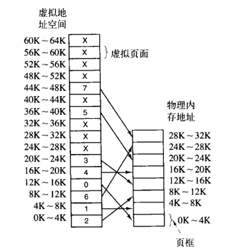

### 存储器抽象
没有存储器抽象的话，说明程序可以随意访问存储器物理地址，这样无法让两个程序同时运行，同时可能破坏操作系统，引起灾难性后果。

为了保护操作系统和同时执行各种程序，我们抽象出**地址空间**，这个概念。

 - 地址空间为程序创造了一种抽象的内存，每个进程地址空间独立于其他进程的地址空间，且每个进程的地址空间可以被映射到物理内存的不同部分。
 - 基址寄存器和界限寄存器用来重定位。

## 交换技术
进程过多，内存超载时，必须采取一些技术手段。比如最通用的交换技术。

交换技术就是把一个进程完整调入内存，使该进程运行一段时间，然后把它存回磁盘

但是由于要整块转入，交换技术在内存中会产生多个空闲区。必须进行空闲内存管理才能更有效率的利用内存。

#### 内存管理技术
有两种方法管理内存使用情况**基于位图**和**基于链表**

##### 基于位图存储管理
即是把内存划分成若干字节的分配单元，然后用01标记，之后把连续的空闲分配单元分配给进程。这种方法会导致有一定数量的分配单元没被用完而导致内存浪费。并且寻找连续的0(空闲)单位也会耗时。

##### 基于链表的存储管理
维护两个链表，空闲内存块链表，已分配内存块链表。

根据空闲内存块链表搜寻，就可以很方便的分配内存。但也因此有几种内存分配方法。

 - 首次适配算法 ，一找到合适的内存块就分配。
 - 下次适配，找第二个
 - 最佳适配，扫一遍，找可容纳中最小的内存块(不仅慢而且碎片多)
 - 最差适配，找最大，性能也一般。

## 虚拟内存技术
基本思想是，允许程序分割为不同片段；每个程序都有自己的地址空间，这个空间被分割为多个块，每一块称作**一页**或者**页面** ，每一页都是连续的。这些页会被映射到物理内存，但并不是所有页都必须在内存当中才能运行程序。确实页的时候，操作系统会负责装载缺页到内存。

### 分页
每个程序产生的地址空间，是**虚拟地址空间**

对这些虚拟地址空间划分成称为**页面**的若干单元，在物理内存里对应的单元称为**页框**。

内存和磁盘之间的交换就是在这这些虚拟页面和页框之间进行。

在请求分页系统中，每当所要访问的页面不在内存时，便产生一个**缺页中断**，请求操作系统将所缺的页调入内存。此时应将缺页的进程阻塞（调页完成唤醒)，如果内存中有空闲块，则分配一个块，将要调入的页装入该块，并修改页表中相应页表项，若此时内存中没有空闲块，则要淘汰某页（若被淘汰页在内存期间被修改过，则要将其写回外存)。

### 页表
程序的虚拟地址被分为**虚拟页号**和**偏移量**。每个虚拟页号都对应着一个页表项，然后查表之后可以得到对应的页框号和物理内存地址。

**某虚拟地址/页面大小=对应的页号....页内偏移量**

 - 保护位指定模式，只读或者可读可写。
 - 修改位，标记一个页面是否经过修改。如果被修改过(脏的),就必须把它覆写回磁盘反之则丢弃。同时这一位也用以辅助页面分配算法。
 - 访问位，标记访问次数，这样可以用来辅助页面分配算法。
 - 在/不在 是否已经在内存中。
