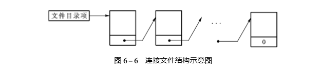
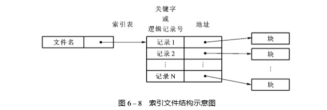

### 文件存取
文件的存取方式是由文件的性质和用户使用文件的情况决定。

#### 顺序存取
进程在这些系统中可以从头顺序读取文件全部字节或记录

#### 随机存取
不按照顺序，而是按照关键字来存取记录

**磁带是顺序存取。磁盘是随机存取。**

### 文件结构

#### 文件的逻辑结构
这是从用户观点出发所观察到的文件组织形式，是用户可以直接处理的数据及其结构，独立于文件的物理特性，又称为文件组织。

文件的逻辑结构有**流式文件**和**记录式文件** 

 - *流式文件*指文件内的数据不再组成记录，只是依次的一串信息集合，也可以看成是无结构的或只有一个记录的记录式文件。
 - *流式文件*指文件内的数据不再组成记录，只是依次的一串信息集合，也可以看成是无结构的或只有一个记录 的记录式文件。记录式文件往往由高级语言或数据库管理系统提供。 

####  文件的物理结构
又称为文件的存储结构，是指文件在外存上的存储组织形式，不仅与存储介质有关，还与外存分配方式有关。用户看到的是逻辑文件，处理的是逻辑记录

##### 顺序文件
将一个文件中逻辑上连续的信息存放到存储介质的依次相邻的块中便形成顺序结构， 这类文件叫顺序文件，又称连续文件。显然，这是一种逻辑记录顺序和物理记录顺序完全一致的文件，通常，记录按出现的次序被读出或修改。 *如果要更新文件，必须复制整个文件，更新，然后在放到另外一块顺序存储器上*。

##### 连接文件 
连接结构的特点是使用连接字，又叫指针来表示文件中各个记录之间的关系

文件信息存放在外存的若干个物理块中，第一块文件信息的物理地址由文件目录 给出，而每一块的连接字指出了文件的下一个物理块位置。

##### 直接文件 
使用连接文件很容易把数据记录组织起来，但是查找某个记录需遍历链接结构，使得效率很低。另外一种技术，称为**散列法**或杂凑法（!"#! 法）可以提高效率
在直接存取存储设 备上，利用 !"#! 法把记录的关键字与其地址之间建立某种对应关系，以便实现快速存取的 文件叫直接文件或散列文件。

##### 索引文件
索引结构是实现非连续存储的另一种方法，适用于数据记录保存在随机存取存储设备 上的文件。

一层一层索引

 如图所示，系统为每个文件建立了一张索引表，其中，每个表目包含一个记 录的键（或逻辑记录号）及其记录数据的存储地址，存储地址可以是记录的物理地址，也可是 记录的符号地址，这种类型的文件称索引文件。通常，索引表的地址可由文件目录指出，查 阅索引表先找到的是相应记录键（或逻辑记录号），然后，获得数据存储地址。
