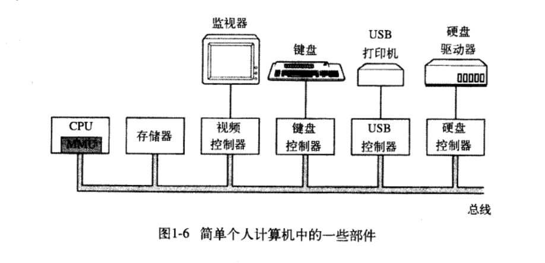
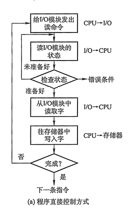

## IO控制方式
设备管理的主要任务之一是控制设备和内存或处理机之间的数据传送，外围设备(输入输出设备和设备管理器)和内存之间的输入/输出控制方式有四种。

也就是说，将数据从输入输出设备传输到内存的控制方式有4种。

在介绍之前，我们明确一下什么是设备控制器
### 设备控制器
设备控制器是计算机中的一个实体，其主要职责是控制一个或多个I/O设备，以实现I/O设备和计算机之间的数据交换。它是CPU与I/O设备之间的接口，它接收从CPU发来的命令，并去控制I/O设备工作，以使CPU从繁杂的设备控制事务中解脱出来。

控制器的任务是把串行的位流转换成字节块

zwlj:简而言之，想要获得外设提供的数据(硬盘，鼠标之类)，外设会先把数据送到设备控制器下组装(先传输到设备控制器的数据寄存器当中)，然后再通过IO控制方式，传输到内存当中。

上图便是IO控制器的整体结构，数据会从先存放到IO控制器的数据寄存器当中，然后才再后续传输到内存或者CPU寄存器当中。

### 程序直接控制方式
这种方式也称为 **循环测试 I/O方式（轮询方式）**

这个最原始的方式的特点是I/O过程中，CPU全程不空闲。CPU向I/O控制器发送指令，要求读取一个字节，IO控制器取一个字节，存入自身的数据寄存器中，存入完毕后通知CPU。然后CPU把这个字节存入内存。在这个过程中，CPU的大部分时间都在等待操作完成。值得注意的是，这种控制方式必须以字节为单位。

简而言之就是CPU轮询等待，等待数据从外围设备传输到IO设备管理器的数据寄存器中。CPU不停询问IO设备忙还是不忙，忙就继续发指令询问，直到设备空闲(就绪),才读到CPU寄存器，再从CPU寄存器到内存。

**这种方式使CPU花费很多时间在I/O是否完成的循环测试中，造成极大的浪费！CPU的利用率相当低**

### 中断驱动方式
中断驱动方式的思想是，允许I/O设备主动打断CPU的运行并请求服务，从而“解放”CPU，使得其向I/O控制器发送读命令后可以继续做其他有用的工作。

从I/O控制器的角度来看，I/O控制器从CPU接收一个读命令，然后从外围设备读数据。一旦数据读入到该I/O控制器的数据寄存器，便通过控制线给CPU发出一个中断信号，表示数据已准备好，然后等待CPU请求该数据。I/O控制器收到CPU发出的取数据请求后，将数据放到数据总线上，传到CPU的寄存器中。至此，本次I/O操作完成，I/O控制器又可幵始下一次I/O操作。

从CPU的角度来看，CPU发出读命令，然后保存当前运行程序的上下文（现场，包括程序计数器及处理机寄存器），转去执行其他程序。在每个指令周期的末尾，CPU检查中断。当有来自I/O控制器的中断时，CPU保存当前正在运行程序的上下文，转去执行中断处理程序处理该中断。这时，CPU从I/O控制器读一个字的数据传送到寄存器，并存入主存。接着， CPU恢复发出I/O命令的程序（或其他程序）的上下文，然后继续运行。

**中断驱动方式比程序直接控制方式有效，但由于数据中的每个字在存储器与I/O控制器之间的传输都必须经过CPU(CPU的寄存器),而且每传达一个单位信息，都要发生一次中断，这就导致了中断驱动方式仍然会消耗较多的CPU时间。**

上面这段话里，值得注意得就是，**中断I/O以字节为单位IO的**，每字节的传输都要产生(IO控制器就绪)都要一次中断，所以这就导致中断多，CPU效率低。

### 直接内存存取（DMA）方式
在中断驱动方式中，I/O设备与内存之间的数据交换必须要经过CPU中的寄存器，所以速度还是受限，而DMA（直接存储器存取）方式的基本思想是在I/O设备和内存之间开辟直接的数据交换通路，彻底“解放” CPU。DMA方式的特点是：
 - 基本单位是数据块(不是字节了)。
 - 所传送的数据，是从设备直接送入内存的，或者相反。
 - 仅在传送一个或多个数据块的开始和结束时，才需CPU干预，整块数据的传送是在 DMA控制器的控制下完成的。

下图DMA控制器的组成

为了实现在主机与控制器之间成块数据的直接交换，必须在DMA控制器中设置如下四类寄存器：

1. 命令/状态寄存器(CR)：用于接收从CPU发来的I/O命令或有关控制信息，或设备的状态。
2. 内存地址寄存器(MAR)：在输入时，它存放把数据从设备传送到内存的起始目标地址；在输出时，它存放由内存到设备的内存源地址。
3. 数据寄存器(DR)：用于暂存从设备到内存，或从内存到设备的数据。
4. 数据计数器(DC)：存放本次CPU要读或写的字（节）数。

DMA方式的工作过程是：CPU读写数据时，它给I/O控制器发出一条命令，启动DMA控制器，然后继续其他工作。之后CPU就把控制操作委托给DMA控制器，由该控制器负责处理。DMA控制器直接与存储器交互，传送整个数据块，每次传送一个字，这个过程不需要CPU参与。当传送完成后，DMA控制器发送一个中断信号给处理器。因此只有在传送开始和结束时才需要CPU的参与。

DMA控制方式与中断驱动方式的主要区别是中断驱动方式在每个(字节)数据需要传输时中断CPU，而DMA控制方式则是在所要求传送的一批数据全部传送结束时才中断CPU；此外，中断驱动方式数据传送是在中断处理时由CPU控制完成的，而DMA控制方式则是在DMA 控制器的控制下完成的。

**优点，CPU利用率进一步提高。**

**缺点，数据传送方向，字节数，内存地址还需要CPU控制，且每一台设备需要一台DMA控制，设备多时也不经济。**

### 通道控制方式
通道是一个用来控制外部设备工作的硬件机制，相当于一个功能简单的处理机。**通道是独立于CPU的、专门负责数据的输入输出传输工作的处理器**，它对外部设备实统一管理，代替CPU对I/O操作进行控制，从而使I/O操作可以与CPU并行工作。通道是实现计算机和传输并行的基础，以提高整个系统的效率。

*I/O通道是一种特殊的处理机。它具有执行I/O指令的能力，并通过执行通道(I/O)程序来控制I/O操作。但I/O通道又与一般的处理机不同，主要表现在以下两个方面：一是其指令类型单一，这是由于通道硬件比较简单，其所能执行的命令，主要局限于与I/O操作有关的指令；再就是通道没有自己的内存，通道所执行的通道程序是放在主机的内存中的，换言之，是通道与CPU共享内存。------------百度百科*

I/O通道方式是DMA方式的发展，它可以进一步减少CPU的干预，即把对一个数据块的读（或写）为单位的干预，减少为对一组数据块的读（或写）及有关的控制和管理为单位的干预。同时，又可以实现CPU、通道和I/O设备三者的并行操作，从而更有效地提高整个系统的资源利用率。

例如，当CPU要完成一组相关的读（或写）操作及有关控制时，只需向I/O通道发送一条I/O指令，以给出其所要执行的通道程序的首地址和要访问的I/O设备，通道接到该指令后，通过执行通道程序便可完成CPU指定的I/O任务，数据传送结束时向CPU发中断请求。

I/O通道与一般处理机的区别是：通道指令的类型单一，没有自己的内存，**通道所执行的通道程序是放在主机的内存中的，也就是说通道与CPU共享内存**。

I/O通道与DMA方式的区别是：DMA方式需要CPU来控制传输的数据块大小、传输的内存位置，而通道方式中这些信息是由通道控制的。另外，每个DMA控制器对应一台设备与内存传递数据，而一个通道可以控制多台设备与内存的数据交换。
