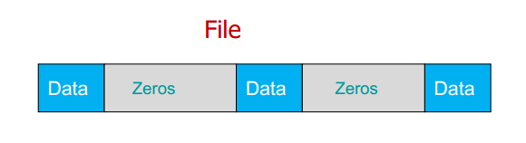

## Linux文件空洞
在UNIX文件操作中，文件位移量可以大于文件的当前长度
在这种情况下，对该文件的下一次写将延长该文件，并在文件中构成一个空洞。**位于文件中但没有写过的字节
都被设为0**。

如果 offset 比文件的当前长度更大，下一个写操作就会把文件“撑大（extend）”在文件里创造“空洞（hole）”。**没有被实际写入文件的所有字节由重复的 0 表示**。空洞是否占用硬盘空间是由文件系统（file system）决定的

在Linux系统之中，文件结束符EOF根本不是一个字符，而是当系统读取到文件结尾，所返回的一个信号值（也就是-1），至于系统怎么知道文件的结尾，资料上说是通过比较文件的长度。

空洞的存在意味着一个文件名义上的大小可能要比其占用的磁盘存储总量要大（有时大出许多）。向文件空洞中写入字节，内核需要为其分配存储单元，即使文件大小不变，系统的可用磁盘空间也将减少。这种情况并不常见，但也需要了解。

**空洞文件就是有空洞的文件**,在日常的常识中,我们使用的文件存放在硬盘分区上的时候,有多大的内容就会占用多大的空间,比如这个文本文件里面写有1000个asc字符,那么就会占用磁盘上1000B的存储空间,为了便于管理文件,文件系统都是按块大小来分配给文件的,假如这个文件系统一个块是4096的话,那么这个文件就会占用一个块的,无论实际的内容是1B还是4000B.如果我们有一个4MB的文件,那么它会在分区中占用:4MB/4096B=1000个块.

接下来看看空洞命令：

`#dd if=/dev/urandom of=testfile2 bs=4096 seek=999 count=1`

这个命令复制了1个块的内容,前面的999个块都跳过了.
我们ls -l一下,发现文件的大小还是4096000,用du -h testfile2查看,**占用的块大小是4K**
我们发现,虽然文件是4M,但是实际在磁盘上只占用了4K的大小,这就是空洞文件的神奇之处.

### 场景
实际中的空洞文件会在哪里用到呢?常见的场景有两个:

 - 一是在下载电影的时候,发现刚开始下载,文件的大小就已经到几百M了.
 -
 - 二是在**创建虚拟机的磁盘镜像的时候**,你创建了一个100G的磁盘镜像,但是其实装起来系统之后,开始也不过只占用了3,4G的磁盘空间,如果一开始把100G都分配出去的话,无疑是很大的浪费.

### 稀疏文件
稀疏文件与其他普通文件基本相同，区别在于文件中的部分数据是全0，且这部分数据不占用磁盘
空间。
