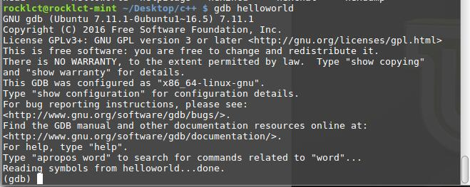

## Linux重要工具命令

<a>http://linuxtools-rst.readthedocs.io/zh_CN/latest/tool/gdb.html</a>


### gdb调试
GDB是一个由GNU开源组织发布的、UNIX/LINUX操作系统下的、基于命令行的、功能强大的程序调试工具。 对于一名Linux下工作的c++程序员，gdb是必不可少的工具；

对C/C++程序的调试，需要在编译前就加上-g选项:

```
$g++ -g hello.cpp -o hello
```

调试可执行文件:

```
$gdb <program>
```


调试服务文件：

```
$gdb <program> <PID>
$gdb hello 11127
```



如上，执行gdb运行可执行文件以后，进入到gdb命令行。

#### 交互命令
启动gdb后，进入到交互模式，通过以下命令完成对程序的调试；注意高频使用的命令一般都会有缩写，熟练使用这些缩写命令能提高调试的效率；

 - run：简记为 r ，其作用是运行程序，当遇到断点后，程序会在断点处停止运行，等待用户输入下一步的命令。
 - continue （简写c ）：继续执行，到下一个断点处（或运行结束）
 - next：（简写 n），单步跟踪程序，当遇到函数调用时，也不进入此函数体；此命令同 step 的主要区别是，step 遇到用户自定义的函数，将步进到函数中去运行，而 next 则直接调用函数，不会进入到函数体内。
 - step （简写s）：单步调试如果有函数调用，则进入函数；与命令n不同，n是不进入调用的函数的
 - until：当你厌倦了在一个循环体内单步跟踪时，这个命令可以运行程序直到退出循环体。
 - until+行号： 运行至某行，不仅仅用来跳出循环
 - finish： 运行程序，直到当前函数完成返回，并打印函数返回时的堆栈地址和返回值及参数值等信息。
 - call 函数(参数)：调用程序中可见的函数，并传递“参数”，如：call gdb_test(55)
 - quit：简记为 q ，退出gdb

gdb可结合IDE具体使用，更多细节可以查阅文档。


### ldd查看程序依赖库
作用：用来查看程式运行所需的共享库,常用来解决程式因缺少某个库文件而不能运行的一些问题。

示例：查看test程序运行所依赖的库:

```
/opt/app/todeav1/test$ldd test
libstdc++.so.6 => /usr/lib64/libstdc++.so.6 (0x00000039a7e00000)
libm.so.6 => /lib64/libm.so.6 (0x0000003996400000)
libgcc_s.so.1 => /lib64/libgcc_s.so.1 (0x00000039a5600000)
libc.so.6 => /lib64/libc.so.6 (0x0000003995800000)
/lib64/ld-linux-x86-64.so.2 (0x0000003995400000)
```

 - 第一列：程序需要依赖什么库
 - 第二列: 系统提供的与程序需要的库所对应的库
 - 第三列：库加载的开始地址

通过对比第一列和第二列，我们可以分析程序需要依赖的库和系统实际提供的，是否相匹配.通过观察第三列，我们可以知道在当前的库中的符号在对应的进程的地址空间中的开始位置

如果依赖的某个库找不到，通过这个命令可以迅速定位问题所在；

###  lsof 一切皆文件
lsof（list open files）是一个查看当前系统文件的工具。在linux环境下，**任何事物都以文件的形式存在，通过文件不仅仅可以访问常规数据，还可以访问网络连接和硬件。如传输控制协议 (TCP) 和用户数据报协议 (UDP) 套接字等**，系统在后台都为该应用程序分配了一个文件描述符，该文件描述符提供了大量关于这个应用程序本身的信息。

命令参数

```
-a 列出打开文件存在的进程
-c<进程名> 列出指定进程所打开的文件
-g 列出GID号进程详情
-d<文件号> 列出占用该文件号的进程
+d<目录> 列出目录下被打开的文件
+D<目录> 递归列出目录下被打开的文件
-n<目录> 列出使用NFS的文件
-i<条件> 列出符合条件的进程。（4、6、协议、:端口、 @ip ）
-p<进程号> 列出指定进程号所打开的文件
-u 列出UID号进程详情
-h 显示帮助信息
-v 显示版本信息
```

lsof命令执行

```
$lsof| more
COMMAND     PID      USER   FD      TYPE             DEVICE SIZE/OFF       NODE NAME
init          1      root  cwd       DIR              253,0     4096          2 /
init          1      root  rtd       DIR              253,0     4096          2 /
init          1      root  txt       REG              253,0   150352    1310795 /sbin/init
init          1      root  mem       REG              253,0    65928    5505054 /lib64/libnss_files-2.12.so
init          1      root  mem       REG              253,0  1918016    5521405 /lib64/libc-2.12.so
init          1      root  mem       REG              253,0    93224    5521440 /lib64/libgcc_s-4.4.6-20120305.so.1
init          1      root  mem       REG              253,0    47064    5521407 /lib64/librt-2.12.so
init          1      root  mem       REG              253,0   145720    5521406 /lib64/libpthread-2.12.so
...
```

lsof输出各列信息的意义如下：

 - COMMAND：进程的名称
 - PID：进程标识符
 - PPID：父进程标识符（需要指定-R参数）
 - USER：进程所有者
 - PGID：进程所属组
 - **FD：文件描述符，应用程序通过文件描述符识别该文件。如cwd、txt等**:

```
（1）cwd：表示current work dirctory，即：应用程序的当前工作目录，这是该应用程序启动的目录，除非它本身对这个目录进行更改
（2）txt ：该类型的文件是程序代码，如应用程序二进制文件本身或共享库，如上列表中显示的 /sbin/init 程序
（3）lnn：library references (AIX);
（4）er：FD information error (see NAME column);
（5）jld：jail directory (FreeBSD);
（6）ltx：shared library text (code and data);
（7）mxx ：hex memory-mapped type number xx.
（8）m86：DOS Merge mapped file;
（9）mem：memory-mapped file;
（10）mmap：memory-mapped device;
（11）pd：parent directory;
（12）rtd：root directory;
（13）tr：kernel trace file (OpenBSD);
（14）v86  VP/ix mapped file;
（15）0：表示标准输入
（16）1：表示标准输出
（17）2：表示标准错误
一般在标准输出、标准错误、标准输入后还跟着文件状态模式：r、w、u等
（1）u：表示该文件被打开并处于读取/写入模式
（2）r：表示该文件被打开并处于只读模式
（3）w：表示该文件被打开并处于
（4）空格：表示该文件的状态模式为unknow，且没有锁定
（5）-：表示该文件的状态模式为unknow，且被锁定
同时在文件状态模式后面，还跟着相关的锁
（1）N：for a Solaris NFS lock of unknown type;
（2）r：for read lock on part of the file;
（3）R：for a read lock on the entire file;
（4）w：for a write lock on part of the file;（文件的部分写锁）
（5）W：for a write lock on the entire file;（整个文件的写锁）
（6）u：for a read and write lock of any length;
（7）U：for a lock of unknown type;
（8）x：for an SCO OpenServer Xenix lock on part      of the file;
（9）X：for an SCO OpenServer Xenix lock on the      entire file;
（10）space：if there is no lock.
```

#### 查找某个文件相关的进程

```
$lsof /bin/bash
COMMAND     PID USER  FD   TYPE DEVICE SIZE/OFF    NODE NAME
mysqld_sa  2169 root txt    REG  253,0   938736 4587562 /bin/bash
ksmtuned   2334 root txt    REG  253,0   938736 4587562 /bin/bash
bash      20121 root txt    REG  253,0   938736 4587562 /bin/bash
```

#### 列出某个程序进程所打开的文件信息

```
$lsof -c mysql
```

#### 列出谁在使用某个端口

```
$lsof -i :3306
```


#### 列出所有tcp 网络连接信息

```
$lsof -i tcp

$lsof -n -i tcp
COMMAND     PID  USER   FD   TYPE  DEVICE SIZE/OFF NODE NAME
svnserve  11552 weber    3u  IPv4 3799399      0t0  TCP *:svn (LISTEN)
redis-ser 25501 weber    4u  IPv4  113150      0t0  TCP 127.0.0.1:6379 (LISTEN)
```
