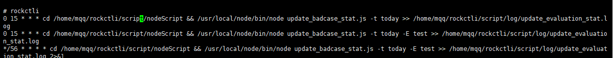

## crontab
通过crontab 命令，我们可以在固定的间隔时间执行指定的系统指令或 shell script脚本。时间间隔的单位可以是分钟、小时、日、月、周及以上的任意组合。这个命令非常适合周期性的日志分析或数据备份等工作。

在linux操作系统安装完成的时候，这个服务工具便会被自动安装，操作系统会自动启动一个叫crond的守护进程。这个进程每分钟会定时检查任务，如果有要执行的任务，就会自动执行。

在linux下，我们通过以下命令来操作定时任务：

```
//编辑定时任务
crontab -e

//列出现在的定时任务
crontab -l
```

敲入`crontab -e`之后，我们就能看到并且编辑现有的一些定时计划任务了



我们在编辑定时任务的时候，可以看到有许多条目，每个条目一行代表一个定时任务。

定时任务条目的格式为：

```
f1 f2 f3 f4 f5 program
```

也就是说，每个条目有5个字段+具体命令。

各字段含义为：

 - 其中 f1 是表示分钟，f2 表示小时，f3 表示一个月份中的第几日，f4 表示月份，f5 表示一个星期中的第几天。program 表示要执行的程序。
 - 当 f1 为 \* 时表示每分钟都要执行 program，f2 为 * 时表示每小时都要执行程序，其馀类推
 - 当 f1 为 a-b 时表示从第 a 分钟到第 b 分钟这段时间内要执行，f2 为 a-b 时表示从第 a 到第 b 小时都要执行，其馀类推
 - 当 f1 为 \*/n 时表示**每 n 分钟个时间间隔执行一次**，f2 为 \*/n 表示每 n 小时个时间间隔执行一次，其馀类推
 - 当 f1 为 a, b, c,... 时表示第 a, b, c,... 分钟要执行，f2 为 a, b, c,... 时表示第 a, b, c...个小时要执行，其馀类推

这样就不难看懂下面一些实例了：

```
// 每月每天每小时的第 0 分钟执行一次 /bin/ls
0 * * * * /bin/ls

// 在 12 月内, 每天的早上 6 点到 12 点，每隔 3 个小时 0 分钟执行一次 /usr/bin/backup
0 6-12/3 * 12 * /usr/bin/backup

0 */2 * * * /sbin/service httpd restart  // 意思是每两个小时重启一次apache

50 7 * * * /sbin/service sshd start  // 意思是每天7：50开启ssh服务

```

执行任务的时候经常希望能把输出打到log里，所以在命令后面可以加上 `program >> xxx.log 2>&1` ,最后表示把错误输出重定向到标准输出。
