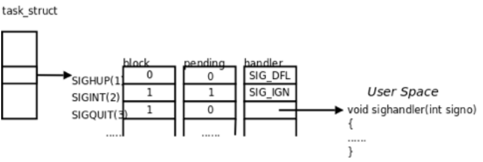
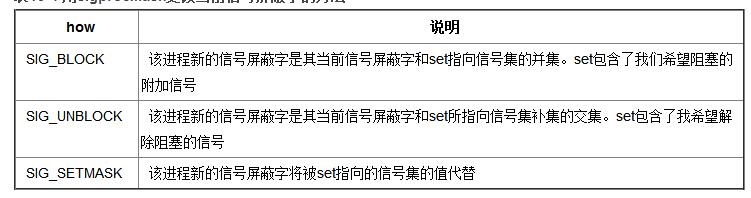

## Linux信号使用
在操作系统的IPC进程间通信笔记中，我们已经有了初步了解。
信号是UNIX和Linux系统响应某些条件而产生的一个事件，接收到该信号的进程会相应地采取一些行动。通常信号是由一个错误产生的。但它们还可以作为进程间通信或修改行为的一种方式，明确地由一个进程发送给另一个进程。一个信号的产生叫生成，接收到一个信号叫捕获。

信号的名称是在头文件signal.h中定义的，信号都以SIG开头，常用的信号并不多，常用的信号如下(IPC笔记中亦有)：


### Signal执行的流程
1. 用户输入命令,在Shell下启动一个前台进程。

2. 用户按下Ctrl-C,这个键盘输入产生一个硬件中断。

3. 如果CPU当前正在执行这个进程的代码,则该进程的用户空间代码暂停执行,CPU从用户态 切换到内核态处理硬件中断。

4. 终端驱动程序将Ctrl-C解释成一个SIGINT信号,**记在该进程的PCB中**(也可以说发送了一 个SIGINT信号给该进程)。

5. 当某个时刻要从内核返回到该进程的用户空间代码继续执行之前,需先处理PCB中记录的信号,发现有一个SIGINT信号待处理,用这个信号的默认处理动作是终止进程,所以直接终止进程而不再返回它的用户空间代码执行。


### signal函数
程序可用使用signal函数来处理指定的信号，主要通过忽略和恢复其默认行为来工作。signal函数的原型如下：

``` c
#include <signal.h>
void (*signal(int sig, void (*func)(int)))(int);
```

这是一个相当复杂的声明，耐心点看可以知道**signal是一个带有sig和func两个参数的函数**,func是一个类型为void (*)(int)的函数指针。整个函数的定义返回一个与func相同类型的指针,指向先前指定信号处理函数的函数指针

zwlj：这里判断类型的时候，不要看到前面的void就认为是个返回空的函数，注意到最后还有个`(int)`,就明白，整个函数最后返回的是一个函数指针，类型是`(int) -> void`,也就是说最后返回一个接受一个int参数，返回值为空这样一个函数的函数指针。

所以最后可知，signal是个函数指针，接受两个参数，一个int，一个函数指针(也是`(int)->void`)，返回也是一个函数指针`(int)->void`。

我们通过调用signal来改变程序的行为，相当于注册一个信号的处理函数。

``` c
#include <signal.h>
#include <stdio.h>
#include <unistd.h>

void ouch(int sig)
{
    printf("\nOUCH! - I got signal %d\n", sig);
    //恢复终端中断信号SIGINT的默认行为
    (void) signal(SIGINT, SIG_DFL);
}

int main()
{
    //改变终端中断信号SIGINT的默认行为，使之执行ouch函数
    //而不是终止程序的执行
    (void) signal(SIGINT, ouch);
    while(1)
    {
        printf("Hello World!\n");
        sleep(1);
    }
    return 0;
}
```

如上代码，main函数中调用了signal，第一个参数SIGINT是终止信号，如果此时我们发送一个终止信号，它就会调用ouch函数。

### 阻塞信号
实际执⾏信号的处理动作称为 **信号递达(Delivery)**,信号从产⽣到递达之间的状态,**称为信号未决(Pending)**。

进程可以选择 **阻塞(Block )** 某个信号。被阻塞的信号产⽣时将保持在未决状态, **直到进程解除对此信号的阻塞** ,才 执⾏递达的动作。

zwlj：阻塞信号也就是屏蔽信号，进程可以决定哪些信号被屏蔽(接受到了之后先放着不处理)。注意,阻塞和忽略是不同的只要信号被阻塞就不会递达,⽽忽略是在递达之后 可选的⼀种处理动作。信号在内核中的表⽰可以看作是这样的:

下面我们就可以理解，信号处理在kernel内存中的机制：



task_struct可以理解为PCB一个结构，block，pending，handler表，表示的是不同信号量的状态。比如block第一行是0，代表当前行代表的信号SIGUP不被阻塞(屏蔽)。，pending为0则是不处于未决状态，也就是此信号并没有发生。

如此推得，第二行SIGINT，进程处于阻塞状态(被屏蔽了)，并且处于未决状态(未处理)，处理函数是SIG_IGN.第三行SIGQUIT,处于阻塞状态，信号未到达，处理函数是用户自定义的函数。

### 信号集

常规信号在递达之前产⽣多次只计⼀次,⽽实时信号在递达之前产⽣多次可以依次放在⼀个队列⾥。因此,未决和阻塞标志可以⽤相同的数据类型sigset_t来存储,sigset_t称为信号集,这个类型可以表⽰每个信号的“有效”或“⽆效”状态

``` c
#include <signal.h>
int sigemptyset(sigset_t *set);
int sigfillset(sigset_t *set);
int sigaddset(sigset_t *set, int signo);
int sigdelset(sigset_t *set, int signo);
int sigismember(const sigset_t *set, int signo);
```

#### sigprocmask

调⽤函数sigprocmask可以读取或更改进程的信号屏蔽字(阻塞信号集)。返回值:若成功则为0,若出错则为-1

``` c
#include <signal.h>

int sigprocmask(int how, const sigset_t *set, sigset_t *oset);
```

首先，若oset是非空指针，那么进程的当前信号屏蔽字通过oset返回。
其次，若set是一个非空指针，则参数how指示如何修改当前信号屏蔽字。

下表说明了how可选用的值。注意，不能阻塞SIGKILL和SIGSTOP信号。


