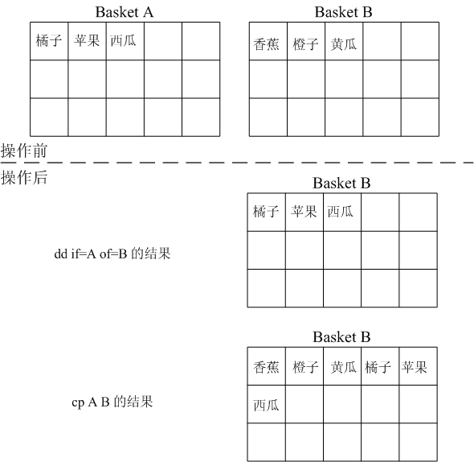
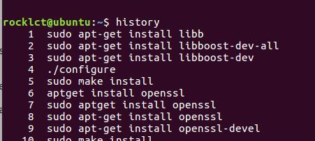
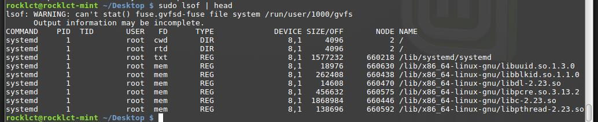

## 常用命令

### df and du
查看磁盘空间利用大小:

-h: human缩写，以易读的方式显示结果（即带单位：比如M/G，如果不加这个参数，显示的数字以B为单位）

```
$df -h
/opt/app/todeav/config#df -h
Filesystem            Size  Used Avail Use% Mounted on
/dev/mapper/VolGroup00-LogVol00
2.0G  711M  1.2G  38% /
/dev/mapper/vg1-lv2    20G  3.8G   15G  21% /opt/applog
/dev/mapper/vg1-lv1    20G   13G  5.6G  70% /opt/app
```

查看当前目录所占空间大小:

```
$du -sh
653M
```

-h 人性化显示
-s 递归整个目录的大小


### find/locate
搜寻文件或目录:

查找目标文件夹中是否有obj文件:

```
$find ./ -name '*.o'
```

find是实时查找，如果需要更快的查询，可试试locate；locate会为文件系统建立索引数据库，如果有文件更新，需要定期执行更新命令来更新索引库

### lsblk
lsblk命令用于**列出所有可用块设备**的信息，而且还能显示他们之间的依赖关系，但是它不会列出RAM盘的信息。

块设备有硬盘，闪存盘，cd-ROM等等。

### dd
用指定大小的块拷贝一个文件，并在拷贝的同时进行指定的转换。

dd是对块进行操作的，cp是对文件操作的。

```
dd if=/dev/hda of=/dev/hdc bs=4 count=1024
```

bs每次複製的塊大小
count要複製的次數

這樣第二塊硬盤的數據佈局和第一塊是完全一樣的（扇區級別，每個扇區上的數據和第一塊硬盤都是一樣的）



### uname

uname = Unix Name

uname命令用于**打印当前系统相关信息**（内核版本号、硬件架构、主机名称和操作系统类型等）。

### history
history命令用于**显示指定数目的指令命令**，读取历史命令文件中的目录到历史命令缓冲区和将历史命令缓冲区中的目录写入命令文件。



### chown
chown命令改变某个文件或目录的所有者和所属的组，该命令可以向某个用户授权，使该用户变成指定文件的所有者或者改变文件所属的组。用户可以是用户或者是用户D，用户组可以是组名或组id。文件名可以使由空格分开的文件列表，在文件名中可以包含通配符。

只有文件主和超级用户才可以便用该命令。

### ps
查看进程，使用ps -ef可以查看到全部进程。

### lsof
lsof（list open files）是一个列出**当前系统打开文件(句柄，文件描述符)的工具**。在linux环境下，任何事物都以文件的形式存在，通过文件不仅仅可以访问常规数据，还可以访问网络连接和硬件。所以如传输控制协议 (TCP) 和用户数据报协议 (UDP) 套接字等，系统在后台都为该应用程序分配了一个文件描述符，无论这个文件的本质如何，该文件描述符为应用程序与基础操作系统之间的交互提供了通用接口。因为应用程序打开文件的描述符列表提供了大量关于这个应用程序本身的信息，因此通过lsof工具能够查看这个列表对系统监测以及排错将是很有帮助的。




```
COMMAND：进程的名称
PID：进程标识符
USER：进程所有者
FD：文件描述符，应用程序通过文件描述符识别该文件。如cwd、txt等
```

查看端口占用的进程状态：

```
lsof -i:3306
```


列出某个程序进程所打开的文件信息

```
lsof -c mysql
```

-c 选项将会列出所有以mysql这个进程开头的程序的文件，其实你也可以写成 lsof | grep mysql, 但是第一种方法明显比第二种方法要少打几个字符了

### kill
杀死指定PID的进程 (PID为Process ID)

```
$kill PID

$ps -fe| grep colin115|grep HOST |awk '{print $2}' | xargs kill -9;
//将用户colin115下所有进程名中包含HOST的进程终止:
```

用kill -9,-9 参数来强制杀死进程.所以也经常见到`kill -9 pid`

### free

查看内存使用量(系统可用内存)

```
free -m
```


