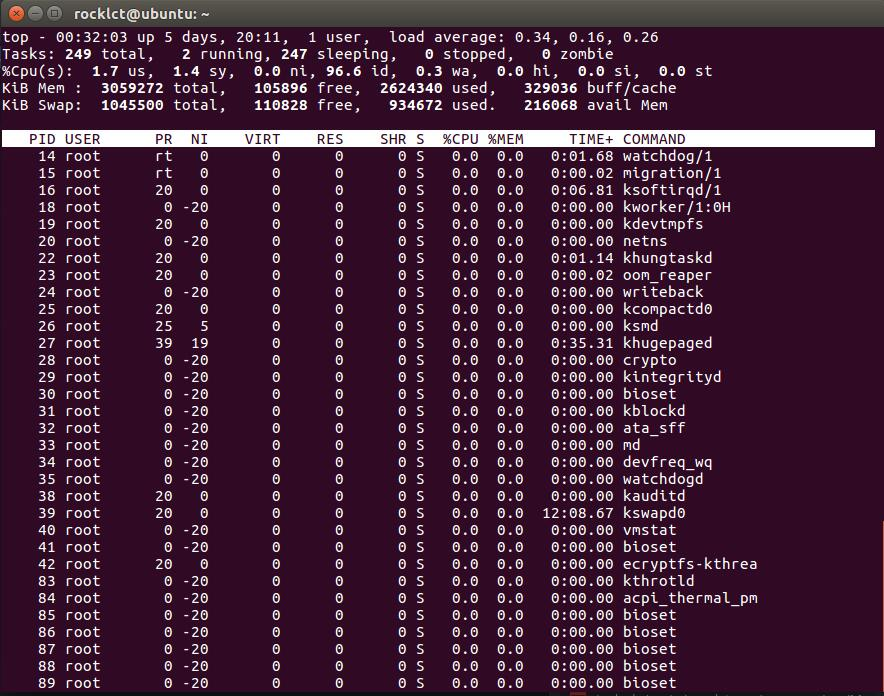

## 平均负载
在Linux系统中，uptime、w、top等命令都会有系统平均负载load average的输出，那么什么是系统平均负载呢？

Load Average是CPU的Load，它所包含的信息不是CPU的使用率状况，而是在**一段时间内CPU正在处理以及等待CPU处理的进程数之和的统计信息**，也就是**CPU使用队列的长度的统计信息**。

系统平均负载被定义为在特定时间间隔内运行队列中的平均进程树。如果一个进程满足以下条件则其就会位于运行队列中：

- 它没有在等待I/O操作的结果

- 它没有主动进入等待状态(也就是没有调用'wait')

- 没有被停止(例如：等待终止)

简而言之，就是活动进程数/总进程数。

我们可以用`cat /proc/loadavg`命令查看

### uptime
我们可以用命令uptime命令查看系统负荷。

这行信息的后半部分，显示"load average"，它的意思是"系统的平均负荷"，里面有三个数字，我们可以从中判断系统负荷是大还是小。

它们的意思分别是1分钟、5分钟、15分钟内系统的平均负荷。

"load average"的值越低，比如等于0.2或0.3，就说明电脑的工作量越小，系统负荷比较轻。

如果CPU每分钟最多处理100个进程，那么系统负荷0.2，意味着CPU在这1分钟里只处理20个进程；系统负荷1.0，意味着CPU在这1分钟里正好处理100个进程；系统负荷1.7，意味着除了CPU正在处理的100个进程以外，还有70个进程正排队等着CPU处理。

一般认为负荷超过0.7，则需要适当排除原因，做预防。

多核cpu的情况则略有不同，单核cpu，则完全处理的系统负荷是1的话，两个cpu则是2.

### top命令
显示运行中的Linux进程：

