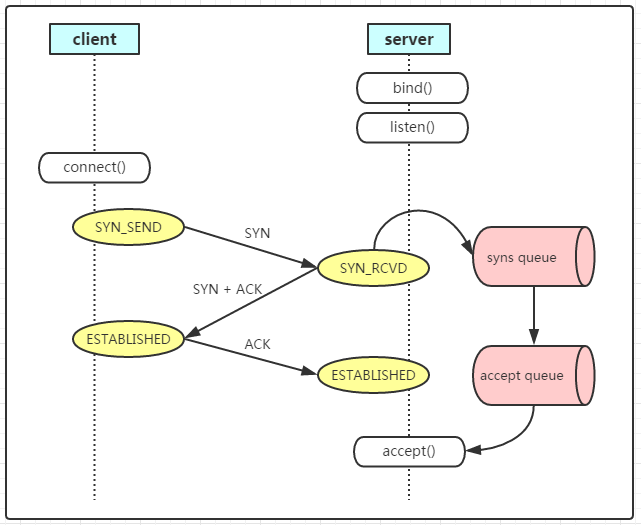

# 网络编程基础

## 基本接口
Linux下，有一些基本的网络编程接口。

 - socket(), 创建Socket描述符，以供其他接口调用。
 - bind(): 通过socket接口创建的Socket描述符只存在于其协议簇空间，bind用来将一组固定的地址绑定到Socket描述符上。
 - listen():监听某个socket接口。
 - accept() 服务器方面，由内核产生一个Socket描述符用来，用来和TCP对端进行连接。
 - recv():接受对端发送的数据，从接收缓冲区复制数据。
 - connect() 创建与TCP服务器之间的Socket连接
 - send() 向对端发送数据，操作系统内核会将用户数据复制到**TCP套接字的发送缓冲区**，然后发送出去。


标准流程下，我们先使用socket创建文件描述符，bind绑定到具体ip地址和端口，然后调用listen。**这里要注意，listen并不是阻塞的，listen会创建一个监听队列以存放待处理的客户连接**。调用成功返回0，失败返回-1.

在listen成功后，我们只是为socket创建了一个监听队列，一旦有连接就绪我们就会放入这个队列，我们还要手动accept。

accept()函数功能是，从处于 established 状态的连接队列头部取出一个已经完成的连接，如果这个队列没有已经完成的连接，accept()函数就会阻塞，直到取出队列中已完成的用户连接为止。**accept会返回一个新的socket(文件描述符)给你用于接受数据**


### socket

```
int  socket(int protofamily, int type, int protocol);//返回sockfd
```

 socket函数对应于普通文件的打开操作。普通文件的打开操作返回一个文件描述字，而socket()用于创建一个socket描述符（socket descriptor），它唯一标识一个socket。这个socket描述字跟文件描述字一样，后续的操作都有用到它，把它作为参数，通过它来进行一些读写操作。

 创建socket的时候，也可以指定不同的参数创建不同的socket描述符，socket函数的三个参数分别为：

  - **protofamily**：即协议域(domain)，又称为协议族（family）。常用的协议族有，AF_INET(IPV4)、AF_INET6(IPV6)、AF_LOCAL（或称AF_UNIX，Unix域socket）、AF_ROUTE等等。**协议族决定了socket的地址类型**，在通信中必须采用对应的地址，如AF_INET决定了要用ipv4地址（32位的）与端口号（16位的）的组合、AF_UNIX决定了要用一个绝对路径名作为地址。
 - **type**：指定socket类型。常用的socket类型有，SOCK_STREAM、SOCK_DGRAM、SOCK_RAW、SOCK_PACKET、SOCK_SEQPACKET等等（socket的类型有哪些？）。
 - **protocol**：故名思意，就是指定协议。常用的协议有，IPPROTO_TCP、IPPTOTO_UDP、IPPROTO_SCTP、IPPROTO_TIPC等，它们分别对应TCP传输协议、UDP传输协议、STCP传输协议、TIPC传输协议。

对于type，通常我们只需关心SOCK_STREAM、SOCK_DGRAM这两个类型也就够了，**SOCK_STREAM表示TCP类型的socket，SOCK_DGRAM表示UDP类型的socket**。

对于第三个参数protocol，通常使用中只需记住这个参数设为0就够了。**当protocol为0时，会自动选择type类型对应的默认协议**。

**return：套接口描述字。如果出现错误，它返回-1，并设置errno为相应的值**

当我们调用socket创建一个socket时，返回的socket描述字它存在于协议族（address family，AF_XXX）空间中，但没有一个具体的地址。**如果想要给它赋值一个地址，就必须调用bind()函数，否则就当调用connect()、listen()时系统会自动随机分配一个端口**。

### bind
正如上面所说bind()函数**把一个地址族中的特定地址赋给socket**。例如对应AF_INET、AF_INET6就是把一个ipv4或ipv6地址和端口号组合赋给socket。

```
int bind(int sockfd, const struct sockaddr *addr, socklen_t addrlen);
```

函数的三个参数分别为：

 - sockfd：即socket描述字，它是通过socket()函数创建了，唯一标识一个socket。bind()函数就是将给这个描述字绑定一个名字。
 - addr：一个const struct sockaddr *指针，指向要绑定给sockfd的协议地址。这个地址结构根据地址创建socket时的地址协议族的不同而不同
 - addrlen：对应的是地址的长度。

ipv4的sock struct为

```
struct sockaddr_in {
    sa_family_t    sin_family; /* address family: AF_INET */
    in_port_t      sin_port;   /* port in network byte order */
    struct in_addr sin_addr;   /* internet address */
};

/* Internet address. */
struct in_addr {
    uint32_t       s_addr;     /* address in network byte order */
};
```

通常服务器在启动的时候都会绑定一个众所周知的地址（如ip地址+端口号），用于提供服务，客户就可以通过它来接连服务器；而客户端就不用指定，有系统自动分配一个端口号和自身的ip地址组合。这就是为什么通常服务器端在listen之前会调用bind()，而客户端就不会调用，而是在connect()时由系统随机生成一个。

**TCP网络中要求数据传输时是大端字节序，所以：在将一个地址绑定到socket的时候，请先将主机字节序转换成为网络字节序，而不要假定主机字节序跟网络字节序一样使用的是Big-Endian。**

### listen() connect()
如果作为一个服务器，在调用socket()、bind()之后就会调用listen()来监听这个socket，如果客户端这时调用connect()发出连接请求，服务器端就会接收到这个请求。

```
int listen(int sockfd, int backlog);
int connect(int sockfd, const struct sockaddr *addr, socklen_t addrlen);
```

listen函数的第一个参数即为要监听的socket描述字，**第二个参数backlog为相应socket可以排队的最大连接个数**。socket()函数创建的socket默认是一个主动类型的，**listen函数将socket变为被动类型的**，等待客户的连接请求。成功返回0，失败返回-1

connect函数的第一个参数即为客户端的socket描述字，第二参数为服务器的socket地址，第三个参数为socket地址的长度。客户端通过调用connect函数来建立与TCP服务器的连接。

#### backlog
listen中，第二个参数制定了**内核为此套接口排队的最大连接个数**。实际上在linux内核2.2版本以后，backlog参数控制的是**已经握手成功的还在accept queue的大小**。

首先在linux里可以简单的认为有2个队列，**一个就是在握手过程中的队列，而另一个就是握手成功的队列**

这就牵扯到TCP连接的流程了，


如上图，**服务器端在调用listen之后，内核会建立两个队列，SYN队列(握手中的队列)和ACCEPT队列(握手成功的队列)，其中ACCPET队列的长度由backlog指定**。

当客户端调用connect,会像服务器发送一个SYN请求，服务器收到后把(请求)它放入SYN队列当中并且回复一个ACK+SYN分组，客户端收到后再发回一个ACK，服务端收到后就会把之前对应的请求从SYN队列取出然后放进ACCEPT队列中。

从这个过程可以看到，在connect函数中发生了两次握手。



**2.2版本的linux之后，backlog设定的就是Aceept队列的大小。并且这个大小不会超过/proc/sys/net/core/somaxconn(默认值128)**

当客户端发起connect而导致发送syn分组给服务器端握手，如果这时两个队列都是满的，tcp就忽略此分组，并且不发RST,这将导致客户端TCP重发SYN(超时)，服务器端忽略syn而不发RST响应的原因是**如果发RST ，客户端connect将立即返回错误，强制客户端进程处理这种情况，而不是让tcp的正常重传机制来处理**。实际上所有源自Berkeley的实现都是忽略新的SYN分节。

还有，backlog为0 时在linux上表明允许不受限制的连接数。

### accept
TCP客户端依次调用socket()、connect()之后就想TCP服务器发送了一个连接请求。TCP服务器监听到这个请求之后，就会调用accept()函数取接收请求，这样连接就建立好了。之后就可以开始网络I/O操作了，即类同于普通文件的读写I/O操作。

```
int accept(int sockfd, struct sockaddr *addr, socklen_t *addrlen);
```

accept函数的第一个参数为服务器的socket描述字，第二个参数为指向struct sockaddr *的指针，用于返回客户端的协议地址，第三个参数为协议地址的长度。如果accpet成功，那么其返回值是由内核自动生成的一个全新的描述字，代表与返回客户的TCP连接。

### read()、write()等函数


#### write

```
ssize_t write(int fd, const void *buf, size_t count);
```

服务端与客户端建立了通信接下来就可以实现网络通信了，可以调用网络I/O进行读写操作了，即实现了网络中不同进程之间的通信！

 - fd:要写入的的socket文件描述符
 - buf：将要被写入的缓冲区数据
 - count：被写入的数据长度

**return：返回值大于0，表示写了部分数据或者是全部的数据，这样用一个while循环不断的写入数据，但是循环过程中的buf参数和count参数是我们自己来更新的，也就是说，网络编程中写函数是不负责将全部数据写完之后再返回的，说不定中途就返回了！返回值小于0表示出错。**

 - \>0 ： 正常情况下返回写入的字节数，阻塞的write调用将检测写缓冲区的大小，当写缓冲大于write低水位时，就写入成功返回。
 - =0 ： 当write写入的描述符正确，且写入字符个数count == 0，时，write可能返回0，errno为0，也表示write调用成功
 - \<0 ： 表示write写入失败，可以通过errno查看原因


#### read


```
ssize_t read(int fd, void *buf, size_t count);
```

如果系统事件源有了一个读取信号事件发生，那么我们可以调用read方法读取网络I/O中的数据。

**return：当读取成功时，read返回实际读取到的字节数，这样我们可以用一个while循环不断的读取数据，但是循环过程中的buf参数和count参数是我们自己来更新的，也就是说，网络编程中写函数是不负责将全部数据读取完之后再返回的。如果返回值是0，表示已经读取到文件的结束了，小于0表示是读取错误。**

 - \>0 ： 正常情况下返回读入的字节数，read 读取数据时有水位控制，当可读数据大于水位时，就返回。
 - =0 ： 当关闭socket连接时且缓冲区中没数据可读时，返回0；当文件操作时，读取到文件尾EOF，也返回0
 - \<0 ：当read 失败时，可能由于中断引起，可以通过errno 查看原因

### send
不论是客户还是服务器应用程序都用send函数来向TCP连接的另一端发送数据。客户程序一般用send函数向服务器发送请求，而服务器则通常用send函数来向客户程序发送应答。

```
 int send( SOCKET s,const char FAR *buf,int len,int flags );
```

 - 该函数的第一个参数指定发送端套接字描述符；
 - 第二个参数指明一个存放应用程序要发送数据的缓冲区
 - 第三个参数指明实际要发送的数据的字节数；
 - 第四个参数一般置0。

如果send函数copy数据成功，就返回实际copy的字节数，如果send在copy数据时出现错误，那么send就返回SOCKET_ERROR；如果send在等待协议传送数据时网络断开的话，那么send函数也返回SOCKET_ERROR。

当调用该函数时，send先比较待发送数据的长度len和套接字socket的发送缓冲的长度.

 - 如果len大于socket的发送缓冲区的长度，该函数返回SOCKET_ERROR；

 - 如果len小于或者等于socket的发送缓冲区的长度，那么send先检查协议,是否正在发送sockey的发送缓冲中的数据，如果是就等待协议把数据发送完

 - 如果协议还没有开始发送socket的发送缓冲中的数据或者,socket的发送缓冲中没有数据
   - 那么**send就比较socket的发送缓冲区的剩余空间和len，看看剩余位置够不够发**，如果len大于剩余空间大小send就一直等待协议把s的发送缓冲中的数据发送完(等到位置够)

   - 如果len小于剩余 空间大小send就仅仅把buf中的数据copy到剩余空间里（注意并不是send把socket的发送缓冲中的数据传到连接的另一端的，而是协议传的，send仅仅是把buf中的数据copy到s的发送缓冲区的剩余空间里）。

如果send函数copy数据成功，就返回实际copy的字节数，如果send在copy数据时出现错误，那么send就返回SOCKET_ERROR；如果send在等待协议传送数据时网络断开的话，那么send函数也返回SOCKET_ERROR。

**要注意send函数把buf中的数据成功copy到s的发送缓冲的剩余空间里后它就返回了**，但是此时这些数据并不一定马上被传到连接的另一端。如果协议在后续的传送过程中出现网络错误的话，**那么下一个Socket相关的函数就会返回SOCKET_ERROR**。（每一个除send外的Socket函数在执 行的最开始总要先等待套接字的发送缓冲中的数据被协议传送完毕才能继续，如果在等待时出现网络错误，那么该Socket函数就返回 SOCKET_ERROR）

### recv函数

```
int recv( SOCKET s, char FAR *buf, int len, int flags);
```

注意：在Unix系统下，如果recv函数在等待协议接收数据时网络断开了，那么调用recv的进程会接收到一个SIGPIPE信号，进程对该信号的默认处理是进程终止。
