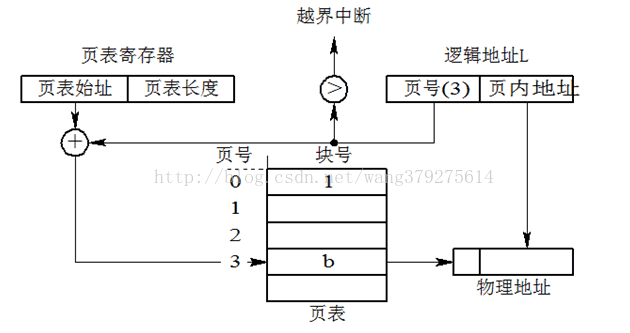
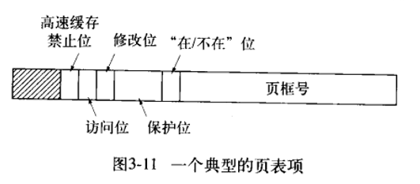
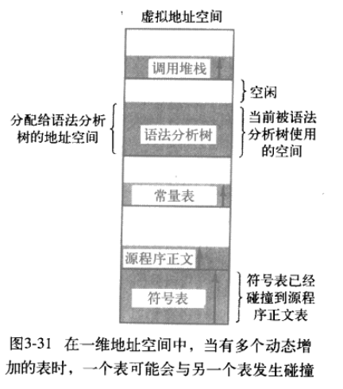
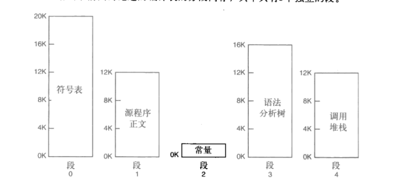
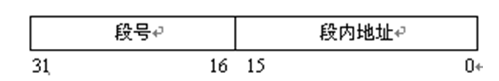
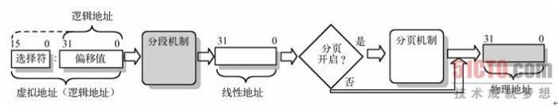
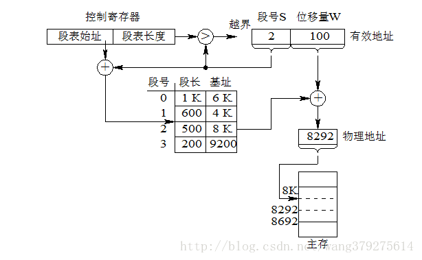
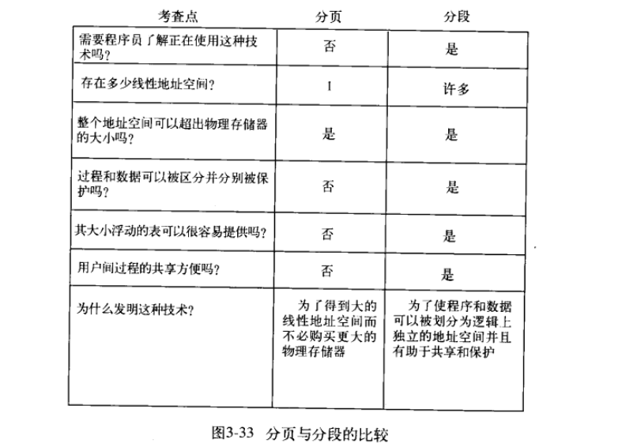
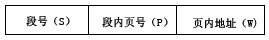

### 存储器抽象
没有存储器抽象的话，说明程序可以随意访问存储器物理地址，这样无法让两个程序同时运行，同时可能破坏操作系统，引起灾难性后果。

为了保护操作系统和同时执行各种程序，我们抽象出**地址空间**，这个概念。

 - 地址空间为程序创造了一种抽象的内存，每个进程地址空间独立于其他进程的地址空间，且每个进程的地址空间可以被映射到物理内存的不同部分。
 - 基址寄存器和界限寄存器用来重定位。

## 内核空间和用户空间
操作系统都包括内核空间和用户空间（或者说内核态和用户态），内核空间主要存放的是内核代码和数据，是供系统进程使用的空间。而用户空间主要存放的是用户代码和数据，是供用户进程使用的空间。

现在操作系统都是采用虚拟存储器，那么对32位操作系统而言，它的寻址空间（虚拟地址空间【后面有述】）为4G（2的32次方）。操作系统的核心是内核，独立于普通的应用程序，可以访问受保护的内存空间，也有访问底层硬件设备的所有权限。为了保证用户进程不能直接操作内核（kernel），保证内核的安全，操作系统将虚拟空间划分为两部分，一部分为内核空间，一部分为用户空间。针对linux操作系统而言，将最高的1G字节（从虚拟地址0xC0000000到0xFFFFFFFF），供内核使用，称为内核空间，而将较低的3G字节（从虚拟地址0x00000000到0xBFFFFFFF），供各个进程使用，称为用户空间。

## 交换技术
进程过多，内存超载时，必须采取一些技术手段。比如最通用的交换技术。

交换技术就是把一个进程完整调入内存，使该进程运行一段时间，然后把它存回磁盘

但是由于要整块转入，交换技术在内存中会产生多个空闲区。必须进行空闲内存管理才能更有效率的利用内存。

#### 内存管理技术
有两种方法管理内存使用情况**基于位图**和**基于链表**

##### 基于位图存储管理
即是把内存划分成若干字节的分配单元，然后用01标记，之后把连续的空闲分配单元分配给进程。这种方法会导致有一定数量的分配单元没被用完而导致内存浪费。并且寻找连续的0(空闲)单位也会耗时。

##### 基于链表的存储管理
维护两个链表，空闲内存块链表，已分配内存块链表。

根据空闲内存块链表搜寻，就可以很方便的分配内存。但也因此有几种内存分配方法。

 - 首次适配算法 ，一找到合适的内存块就分配。
 - 下次适配，找第二个
 - 最佳适配，扫一遍，找可容纳中最小的内存块(不仅慢而且碎片多)
 - 最差适配，找最大，性能也一般。

## 虚拟内存技术
基本思想是分页和分段技术，允许程序分割为不同片段；每个程序都有自己的地址空间，这个空间被分割为多个块，每一块称作**一页**或者**页面** ，每一页都是连续的。这些页会被映射到物理内存，但并不是所有页都必须在内存当中才能运行程序。缺失页的时候，操作系统会负责装载缺页到内存。

### 分页技术
每个程序产生的地址空间，是**虚拟地址空间**，其实这个意义的虚拟地址，**也可被称为线性地址**。具体的某一个虚拟空间的地址，在分页机制当中也可被称为**逻辑地址**。

对这些虚拟地址空间划分成称为**页面**的若干单元，在物理内存里对应的单元称为**页框**。

内存和磁盘之间的交换就是在这这些虚拟页面和页框之间进行。

在请求分页系统中，每当所要访问的页面不在内存时，便产生一个**缺页中断**，请求操作系统将所缺的页调入内存。此时应将缺页的进程阻塞（调页完成唤醒)，如果内存中有空闲块，则分配一个块，将要调入的页装入该块，并修改页表中相应页表项，若此时内存中没有空闲块，则要淘汰某页（若被淘汰页在内存期间被修改过，则要将其写回外存)。

**zwlj：分页技术用来解决的问题便是，内存中也许没有连续的空间可以装载入一个完整的进程，并且可能容易产生很多内存碎片。所以应用分页技术，可以有效减少内存碎片，也使得进程在内存之间的地址不一定是要连续的。**

### 页表
程序的虚拟地址被分为**虚拟页号**和**偏移量**。每个虚拟页号都对应着一个页表项，然后查表之后可以得到对应的页框号和物理内存地址。

所以页表用于完成逻辑页号(本进程的地址空间)到物理页面号(实际内存空间)的映射。

**某虚拟地址(逻辑地址)/页面大小=对应的页号....页内偏移量**

页表寄存器里，寄存这页表的初始地址，和页表的长度，页表将用于把逻辑地址转换为物理地址。页表里的每一个项为页表项，里面存储着“页框号”。由于物理地址早已经被划分成一个一个的页框，所以我们只要知道页框号和页面大小，就能计算出物理地址(物理地址也是从0开始)

**物理地址=页框\*页面大小**

所以当给出一个逻辑地址时，先根据其页号，在对应的页表项里找出页框号，然后根据页框找到对应物理块的起始物理地址，再加上页内地址(偏移量)就是物理地址。

#### 页表项

 - 保护位指定模式，只读或者可读可写。
 - 修改位，标记一个页面是否经过修改。如果被修改过(脏的),就必须把它覆写回磁盘反之则丢弃。同时这一位也用以辅助页面分配算法。
 - 访问位，标记访问次数，这样可以用来辅助页面分配算法。
 - 在/不在 是否已经在内存中。

### 分段技术

#### 分段的背景
一个进程有多个独立的地址空间，往往比只有一个好得多。

比如一个程序，编译之后会分成好几个功能不同的部分。比如

假设几个部分都挤压在一个地址空间中，

这样，当其中一些部分动态增加的时候就会碰撞到其他部分，而且其他的部分有空闲的空间也未必能拿来用，这就非常的不方便。

因此才有了分段技术

#### 概念
一个程序有若干相对独立的部分组成，它们各自完成不同的功能。按程序自身的逻辑关系划分为若干个程序段，每个程序段都有一个段名。同时内存空间被动态划分为若干长度不相同的区域， 称为物理段。分配时，以段为单位进行分配， 每段 在内存中占据连续空间，但各段之间可以不相邻。

上述部分可以被分为几个不同的段，编译的时候可以将他们链接到一起，哪一部分动态增长，其他部分都可以不需要进行改变。

和页式管理一样，段式管理也采用只把那些经常访问的段驻留内存，而把那些在将来一段时间内不被访问的段放在外存，待需要时自动调入内存的方法实现二维虚拟存储器。按照作业的逻辑单位--段，来分配内存，适合程序的逻辑结构，方便用户设计程序。

#### 逻辑地址
用于分段机制的地址，与当前数据在内存中的物理分配地址无关的访问地址，在执行对内存的访问之前必须转化为物理地址(是一个出于内存分段机制的概念)。

一个逻辑地址，是由一个段标识符加上一个指定段内相对地址的偏移量，表示为 \[段标识符：段内偏移量\]

具体地址结构如下

对内存访问的时候，必须先将逻辑地址转换为线性地址(也就是虚拟地址),然后再根据分页机制，转换为具体的物理地址。

#### 地址转换(纯分段)
单纯的分段机制的逻辑地址转换，跟分页机制非常相似。

给出的逻辑地址有段号，和偏移量。段寄存器里，则寄存着段表的起始地址和段表的长度。根据段号，我们可以找到该段的基址(物理起始地址)，然后再加上位移量(段内地址)就是真正的物理地址了。

#### 分段和分页的区别总结
这里节选《现代操作系统》的图

总之分页制度对于用户和程序员来说相当于透明的，而分段是出于程序的逻辑而分，为的是使程序可以逻辑上划分成独立的地址空间并且有助于共享和保护。

### 段页式存储
分页系统能有效地提高内存的利用率，而分段系统能反映程序的逻辑结构，便于段的共享与保护，将分页与分段两种存储方式结合起来，就形成了段页式存储管理方式。

#### 地址转换

地址结构如下

分为3部分，段号，段内页号，页内地址。基本规则是先分段再分页。

思路就是先找到对应段的页表，再转换为物理地址。

首先根据段号S，配合段表寄存器的段表始址(段表的实际物理内存地址)，找到对应段的段表项(每个段表项里，装的是页表长度和页表始址)，接下来就拿到了对应段的页表了。有页表则好办，再根据页号在页表里找到对应的页表项，页表项里有页框号。然后根据页框号和页面大小，就能算出实际页框的物理地址，加上偏移量(页内地址)就是最终物理地址。

### 分段分页技术总结

#### 内碎片和外碎片
 - 内部碎片是已经被分配出去的的内存空间大于请求所需的内存空间。

 - 外部碎片是指还没有分配出去，但是由于大小太小而无法分配给申请空间的新进程的内存空间空闲块。

#### 注意事项
 - 无论页表还是段表，都常驻内存
 - 在页式、段式存储管理中，为获得一条指令或数据，**须两次访问内存(先去内存里查表，然后算出实际地址以后才能去内存获得数据)**；而段页式则须三次访问内存(多一次查表过程)。多级表的时候，次数还会增多。
 - 分页技术没有外碎片，每个内碎片不超过页的大小。**分段技术容易在段间留下许多内碎片，造成存储空间利用率降低**。
 - 段页式管理是段式管理和页式管理相结合而成，具有两者的优点。由于管理软件的增加，**复杂性和开销也增加**。另外需要的硬件以及占用的内存也有所增加，使得执行速度下降。
