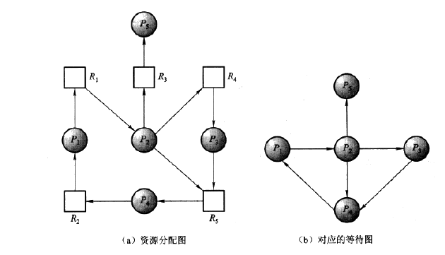
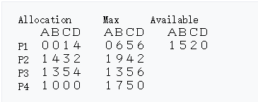
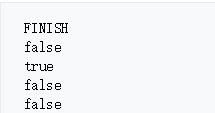
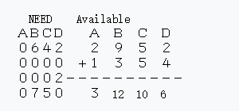

## 死锁
所谓死锁是指多个进程因竞争资源而造成的一种僵局，**若无外力作用**，这些进程都将无法向前推进。

### 死锁产生的原因

1. 因为系统资源不足。
2. 进程运行推进的顺序不合适。
3. 资源分配不当等。
如果系统资源充足，进程的资源请求都能够得到满足，死锁出现的可能性就很低，否则
就会因争夺有限的资源而陷入死锁。其次，进程运行推进顺序与速度不同，也可能产生死锁。

### 死锁产生的必要条件
产生死锁必须同时满足以下四个条件，只要其中任一个条件不成立，死锁就不会发生。

 - **互斥条件**：进程要求对所分配的资源进行排他性控制，即在一段时间内某资源仅为一个进程所占用。此时若有其他进程请求该资源，则请求进程只能等待。
 - **不剥夺条件**：进程所获得的资源在未使用完毕之前，不能被其他进程强行夺走，即只能由获得该资源的进程自己来释放。
 - **请求和保持条件**：进程已经保持了至少一个资源，但又提出了新的资源请求，而该资源已被其他进程占有，此时请求进程被阻塞，但对自己已获得的资源保持不放。
 - **循环等待条件**：存在一种进程资源的循环等待链，链中每一个进程已获得的资源同时被链中下一个进程所请求。(形成一个循环)

### 死锁的处理策略

#### 资源分配图算法(死锁检测)

先画出资源分配图，如图1，方块代表资源，圆圈代表进程。进程的出线代表所需的资源，进程的入线代表掌控的资源。因此可以得到资源分配的情况图。然后我们把方块去掉，合并一下线，就可以得到图2的进程图，出现环则说明产生了死锁(**死锁定理**)。因此需要想办法避免环的出现。

如果资源数目多于1个，也可以画出资源图

#### 死锁的预防
解决的思路为：防止死锁的四个条件同时满足

1. **破坏“互斥:”** 保证所有资源都是共享资源。比如 多次读取文件

2. **破坏“占有并等待(请求保持):”**：
要求每个进程在运行前必须一次性申请它所要求的所有资源，且仅当该进程所要资源均可满足时才给予一次性分配。
允许进程在没有资源时，才可申请资源。

3. **破坏“非抢占”:** 在允许进程动态申请资源前提下规定，一个进程在申请新的资源不能立即得到满足而变为等待状态之前，必须**隐式释放**已占有的全部资源，若需要再重新申请

4. **破坏“循环等待”条件:**
采用资源有序分配法： 把系统中所有资源编号，进程在申请资源时必须严格按资源编号的递增次序进行，否则操作系统不予分配。(也就是定义一个函数，这个函数可以给资源分配一个编号，申请资源的进程申请资源时，顺序要**按照资源的编号单调递增**.比如线程A要资源R1和R2，线程B也要R1和R2，为了避免两者各拿一个的情况(A持有R1,B持有R2)，每个线程申请资源都要先拿R1才能再拿R2，这样可以防止回路产生。

在理论上，破坏死锁的必要条件是理论上可行的，即便可以实际实现，**代价也非常巨大，因此操作系统不采用这种方式**

#### 死锁的避免
死锁的预防是防止死锁的发生，死锁的避免是通过某种方式，避免死锁发生，资源的分配状态取决于3个因素：

 - 可分配资源数
 - 已分配资源数
 - 进程对每种资源的最大需求数

利用这些信息，来**判断系统是否处于安全状态**，什么是安全状态呢，如果一个进程Pi **当前申请的资源小于系统可分配资源加上进程Pj已经拥有的资源（i < j）**，那么系统就处于安全状态，处于安全状态的系统就不会发生死锁，因为我们可以先满足Pj，然后Pj执行完毕后可以满足Pi。但是系统如果不属于安全状态，有可能会发送死锁

###### 银行家算法
银行家算法（Banker's Algorithm）是一个避免死锁（Deadlock）的著名算法，是由艾兹格·迪杰斯特拉在1965年为T.H.E系统设计的一种避免死锁产生的算法。它以银行借贷系统的分配策略为基础，判断并保证系统的安全运行。

在银行中，客户申请贷款的数量是有限的，每个客户在第一次申请贷款时要声明完成该项目所需的最大资金量，在满足所有贷款要求时，客户应及时归还。银行家在客户申请的贷款数量不超过自己拥有的最大值时，都应尽量满足客户的需要。在这样的描述中，银行家就好比操作系统，资金就是资源，客户就相当于要申请资源的进程。

流程如下(结合了安全性检测算法的银行家算法)：

Allocation表示已经拥有的资源的数量，Max表示进程最多需要的资源的数量，Available表示系统剩余的资源的数量

然后我们就可以算出，现在每个进程还需要多少资源:

**Need = Max-Allocation**

初始时，将全部进程的完成状态设置为false

接下来找出need比available小的

P2的需求小于能用的(第二行)，所以把资源配置给他再回收

available的资源变为2952，然后进程2的状态改为已完成。

接下来继续往下找，发现P3的需求为0002，小于能用的2952，所以资源配置给他再回收

以此类推，继续修改进程的状态，如果状态全True，说明死锁避免成功，如果无法继续分配，说明已经出现死锁，避免失败。

如果所有过程有可能完成执行（终止），则一个状态（如上述范例）被认为是安全的。**由于系统无法知道什么时候一个过程将终止，或者之后它需要多少资源**，系统假定所有进程将最终试图获取其声明的最大资源并在不久之后终止。**在大多数情况下，这是一个合理的假设**，因为系统不是特别关注每个进程运行了多久（至少不是从避免死锁的角度）。此外，如果一个进程终止前没有获取其它能获取的最多的资源，它只是让系统更容易处理。
基于这一假设，该算法通过尝试寻找允许每个进程获得的最大资源并结束（把资源返还给系统）的进程请求的一个理想集合，来决定一个状态是否是安全的。不存在这个集合的状态都是不安全的。

#### 死锁解除
一旦检测出死锁，就应立即釆取相应的措施，以解除死锁。死锁解除的主要方法有：

1. **资源剥夺法**。挂起某些死锁进程，并抢占它的资源，将这些资源分配给其他的死锁进程。但应防止被挂起的进程长时间得不到资源，而处于资源匮乏的状态。
2. **撤销进程法** 强制撤销部分、甚至全部死锁进程并剥夺这些进程的资源(逐一撤销进程直至死锁恢复)。撤销的原则可以按进程优先级和撤销进程代价的高低进行。
3. **进程回退法**。让一（多）个进程回退到足以回避死锁的地步，进程回退时自愿释放资源而不是被剥夺。**要求系统保持进程的历史信息**，设置还原点。
