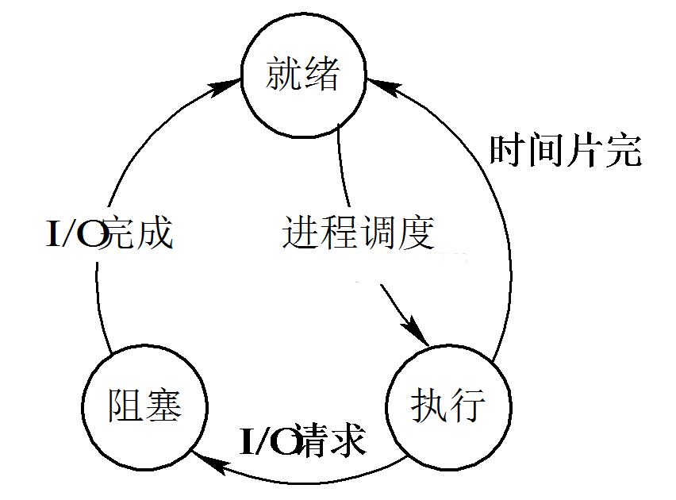
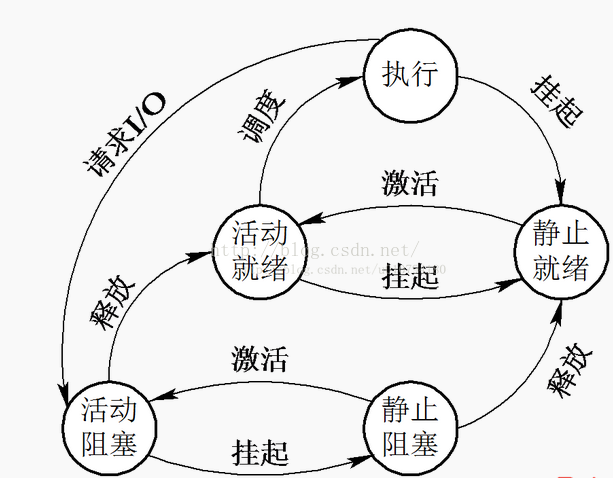

## 进程与线程
进程是系统进行资源分配的基本单位。

线程，是进程的一部分，是**CPU调度和分派的基本单位**，它是比进程更小的能独立运行的基本单位。

线程是进程的一部分，一个线程可以创建和撤销另一个线程。同一个进程中的多个线程之间可以并发执行。线程可与同属一个进程的其他的线程共享进程所拥有的全部资源，但拥有自己的栈空间，拥有独立的执行序列。线程自己基本上不拥有系统资源，只拥有在运行中必不可少的资源(程序计数器，寄存器和栈)。

1. 一个程序至少有一个进程，一个进程至少有一个线程(没有线程的进程可以被看作是单线程的)
2. 大小。线程的划分尺度小于进程，使得多线程程序的并发性高。
3. 内存。进程在执行过程中拥有独立的内存单元，而多个线程共享内存，从而极大地提高了程序的运行效率。
4. 执行过程。每个独立的线程有一个程序运行的入口、顺序执行序列和程序的出口。但是线程不能够独立执行，必须依存在应用程序中，由应用程序提供多个线程执行控制。
5. **多线程的意义在于一个应用程序中有多个执行部分可以同时执行**，但操作系统并没有将多个线程看做多个独立的应用来实现进程的调度和管理以及资源分配。这就是进程和线程的重要区别。

### 线程的需求
在网络或多用户环境下，Web服务器需要接收大量的并发请求，为每一个请求都创建一个进程显然是不行的，进程是相当重量级的，太多进程会很快让机器吃不消，问题不在于机器不够强大或者网络不好，而是实现的太差。Http连接是短暂的，资源一般很小，不会像Ftp保持数分钟或者几小时，所以早期的web性能问题不明显，但是随着使用量的增长，高流量的web服务器性能会下降。
有两种常见的解决方案：
1. 重用进程。不是为每个请求新建一个进程，而是在服务器启动时，创建固定数量的进程，当一个请求到达时放入队列，进程从队列中取出请求处理，同时删除队列中的请求，处理完成之后继续从队列中取出请求进行服务。好处是避免了建立和销毁进程所用的开销
2. 更轻量的线程。因为线程的以上优点，所以线程是个很好的选择，同时再利用线程池，可以提供很好的性能。

### 进程的几种状态

#### 三种基本状态

 - **就绪(Ready)状态** 当进程已分配到除CPU以外的所有必要资源后，只要再获得CPU，便可立即执行，进程这时的状态称为就绪状态。在一个系统中处于就绪状态的进程可能有多个，通常将**它们排成一个队列，称为就绪队列**。

 - **执行状态** 进程已获得CPU，其程序正在执行。在单处理机系统中，只有一个进程处于执行状态； 在多处理机(CPU)系统中，则有多个进程处于执行状态。

 - **阻塞状态** 正在执行的进程由于发生某事件而暂时无法继续执行时，便放弃处理机而处于暂停状态，亦即进程的执行受到阻塞，把这种暂停状态称为阻塞状态，有时也称为等待状态或封锁状态。致使进程阻塞的典型事件有：请求I/O，申请缓冲空间等。通常将这种处于阻塞状态的进程也排成一个队列。有的系统则根据阻塞原因的不同而把处于阻塞状态的进程排成多个队列。

##### 其他状态
在不少系统中进程只有上述三种状态，但在另一些系统(linux)中，又增加了一些新状态。

如挂起状态，可运行状态，深度睡眠状态，浅度睡眠状态，暂停状态，僵死状态。

最重要的是挂起状态。

**挂起进程在操作系统中可以定义为暂时被淘汰出内存的进程**，机器的资源是有限的，在资源不足的情况下，操作系统对在内存中的程序进行合理的安排，其中有的进程被暂时调离出内存，当条件允许的时候，会被操作系统再次调回内存，重新进入等待被执行的状态即就绪态

引入挂起状态的原因有：

1. 终端用户的请求。当终端用户在自己的程序运行期间发现有可疑问题时，希望暂时使自己的程序静止下来。亦即，使正在执行的进程暂停执行；若此时用户进程正处于就绪状态而未执行，则该进程暂不接受调度，以便用户研究其执行情况或对程序进行修改。我们把这种静止状态称为挂起状态。

2. 父进程请求。有时父进程希望挂起自己的某个子进程，以便考查和修改该子进程，或者协调各子进程间的活动。

3. 负荷调节的需要。当实时系统中的工作负荷较重，已可能影响到对实时任务的控制时，可由系统把一些不重要的进程挂起，以保证系统能正常运行。

4. 操作系统的需要。操作系统有时希望挂起某些进程，以便检查运行中的资源使用情况或进行记账。

一下为引入挂起状态的状态图。

