## 概率基础

### 随机变量
随机变量是指变量的值无法预先确定仅以一定的可能性(概率)取值的量。它是由于随机而获得的非确定值

在程序员的数学-概率统计一书中，作者对随机变量给出了非常有意思的描述。

假如平行世界的集合定为Ω,那么某些事情发生的概率就是，发生了这些事情的世界占Ω世界集合总体的比例。我们把世界集合Ω具体化成一个平面，那么这个世界里的元素(或者说点)我们称之为ω,随机变量本质上就是一个函数X(ω),它接受一个Ω中的世界ω(元素,或者说就是Ω平面之后的点)，返回一些取值，这些取值，就是随机变量的值。

比如我们有以下定义：

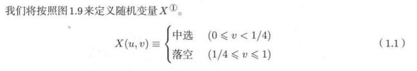

这说明，随机变量X，可以理解为一个函数，接受一个平面中的点(u,v)，返回中选或者落空两种结果。所以此时**随机变量X有两种取值，中选或者落空**，意味着Ω也只会被分成两个部分，一部分是X(w)为中选的w集合，一个是没有中选的w的集合。下图是世界Ω中，不同随机变量取值的面积。

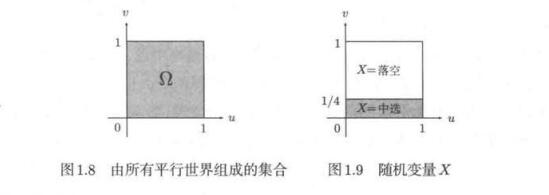

那么就很直接了，这个面积就是所谓的概率P。所以我们有

**P(X=k)=随机变量X值为k时占Ω的面积(也可以理解为面积比例)**

P就是我们所说的概率。

**随机变量，本质上是一个函数**，就算经常忽略了它的自变量，也要知道X的自变量是空间Ω中的点，或者说元素。这里还要注意，我们的Ω默认就是面积为1，这样求得的概率P就是可以理解为具体Ω上的面积。也可以理解为占Ω世界的比例。

把概率映射成一个Ω上的面积问题之后，很多抽象的概率问题便会非常好理解。

#### 离散型随机变量
随机变量取到的值是有限多个的时候，就是离散随机变量。

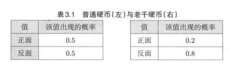

比如上面的抛硬币的取值。

在这种情况下，概率对应到Ω空间里，就是一块一块的面积。每块面积可能大概是0.5或者0.8这样。

#### 连续型随机变量
然而其实并不是所有的随机变量都是离散的。举个例子，假如我们有平面Ω空间，然后给出X随机变量是一个函数，如图所示。

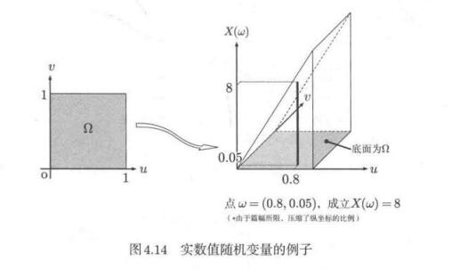

每个Ω空间里的元素点的函数值对应竖直纵坐标，也就是那个立体三角形的斜面部分。

所以当我们给出P(4<=X<=7),此时就是斜面上对应区域投影到Ω空间的面积，也就是

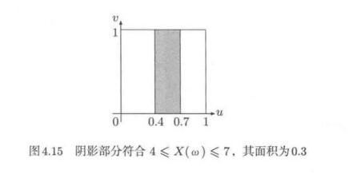

此时面积为0.3.

但是，当我们取X=2的时候，我们会惊奇的发现，投影到Ω空间上是一条线

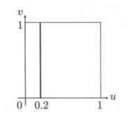

一条线没有面积，也就是说**概率为0**. 注意，概率为0是没有问题，虽然很反常识，但是这里便出现了随机变量具体取某个值时概率为0.道理很简单，在连续型随机变量中，每个取值对应到的概率就是平面上的点和线，点和线的面积为无穷小，但正是由于无数个这样的点和线聚集在一起，才构成了面积为1的这个概率空间Ω。

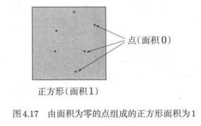

### 条件概率
理解了上面，**概率就是求面积**，这种核心认知之后，我们就不难理解条件概率的意义。

条件概率就是让我们在某个已知的条件下，求另一个已知条件的概率。这同样可以抽象成面积问题。

假如我们有16张扑克牌，在空间里他们呈以下分布。

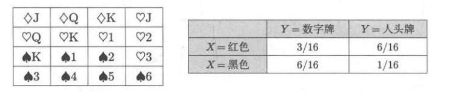

随机变量有两个，X和Y，表格中给出的是他们的联合概率分布。那么我们会有：

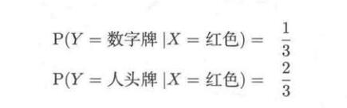

第一个式子的含义就是，在X是红色牌的情况下，其中数字牌的概率。以上投射到面积上的含义就是：

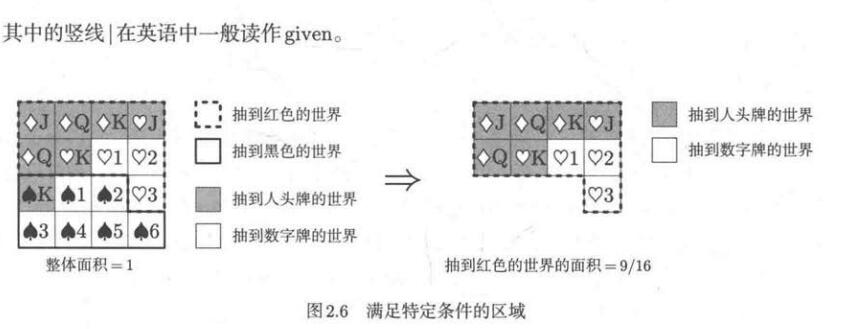

非常直观！条件概率转化成面积问题之后，无非就是在一块区域上求另一块区域的**面积的比例**。这里要注意了，是比例，为什么说是比例呢，因为符号|,也就是given，符号后给出的条件是固定的。可以理解为|符号，把X=红色的那一部分世界全部抽取出来，形成了一个新的Ω，新的Ω当然面积是1啦，然后我们在这个新的Ω上再求面积。

所以上图我们得到抽到数字牌和红色牌，两者的共同区域，占原Ω空间的3/16.但是我们事先将X=红色的世界抽出来作为一个区域了，新区域里也要当成1来求面积，也就是

(3/16)/(9/16)=1/3。

**这就得到了条件概率的通用定义：**

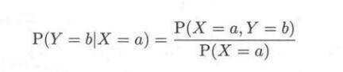

X=a这个世界下，求Y=b的面积(面积为1时，实际也就是求比例)。那么就是在原世界中求出X=a,Y=b，两者同时满足的区域部分，除以X=a的面积，得出面积比例。

### 先验概率和后验概率
在讨论一种原因结果导向的问题时，我们往往有先验概率和后验概率这种说法。

简单来说就是，有原因和结果，当做两种事件，那么**P(原因)我们称为先验概率，P(原因|结果)我们称之为后验概率**

比如说，我们有个外星人检测仪器,我们需要从一个10万人口的城市中，用这个机器随机检测一个人是否是外星人。那么，检测过程其实分为两个事件，第一个事件，从10万人中随机抽取一个人，这是原因。第二个事件是检测结果是否为外星人，这是结果。

所以，先验概率就是P(抽出一个人是否是外星人),后验概率就是P(抽出的X是否是外星人 | X检测出是外星人)，所谓的后验概率差不多就是知道了结果再去推原因。

我们假设有10w个人，10w个人里有一个外星人，而外星人检测仪的正确率高达99%。假如现在我们抽出一个人并且已经判断出他是外星人了，那么求他真的是外星人的概率。

这就是个求后验概率问题：

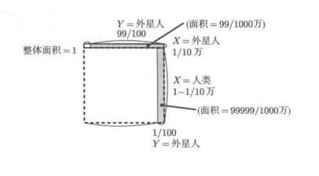

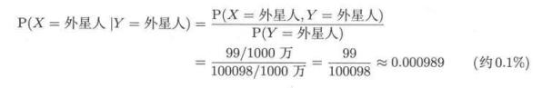

上面就是从结果倒推原因,判定Y为外星人的面积分两部分，一个是把外星人判断对，一个是把人判断错。两者面积之和是P(Y检测结果=外星人),然后根据条件概率公式可以求得，概率不到0.01%。

**如果告诉我们说，仪器检测出了一个外星人，我们很有理由相信这个人是真的外星人，因为仪器精确率有99%啊！但是实际上我们根据上面公式算得概率只有0.01%,这是因为我们计算这种问题时，必须考虑先验概率,也就是实际上我们从人群中抽出外星人的概率也只有P(原因)=10分之一。**

所以我们在遇到概率问题的时候，先考虑一下这是不是一个后验概率问题，一定要考虑先验概率的问题。

求解后验概率的公式也叫贝叶斯公式

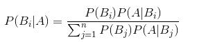

上述公式,A是结果,B是原因，我们知道了结果想往前推，也就是要求后验概率。理解了条件概率的公式之后，不难推出上面式子。

### 概率密度函数
现在我们回到连续随机变量这个点上来，之前讲随机变量的时候提到了，假如随机变量的取值不是离散的而是连续的，那么具体的某个X取值,P(X=k)=0，在这种情况下，我们用什么来表示概率呢？

由于具体的P(X=k)=0,所以我们设

`F(a)=P(X<=a)`,

画出这个图像，**这就是累积分布函数cumulative distribution function**。

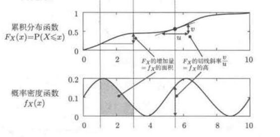

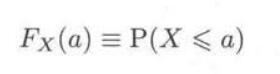

对于累积分布函数，我们可以看到越逼近X的上界，F的值越接近1,毕竟所有X的取值都要小于他的上界嘛。

对随机变量的累积分布函数求微分(求导),得到的就是下面的**概率密度函数probability mass function**。

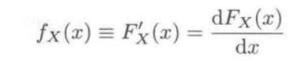

概率密度函数相当于对应累积分布函数每个点的斜率，表达了增长速度。概率密度函数取值越高，对应的**随机变量X的附近概率最大**,注意,由于具体值概率为0,所以这里说附近，可以理解为X加减δ。

且**概率在概率密度函数中表现为函数的面积**,所以不难理解，在最高点附近，面积一定最大(概率最高)。且所有面积加起来，和为1.
