## 溯因推理
在矩阵笔记中，我们知道了A是一个映射。

那么考虑y是由x经过矩阵A变换得到的

`y = Ax + (噪声)`

由x(原因)去推测y(结果)叫做 **顺问题**。由y(结果)倒推x，是 **逆问题**。

### 良性问题(可逆矩阵)
在上述问题公式中(y=Ax+b(噪声))假如`x`和`y`是具有相同维数的向量，则A是 **方阵**，如果A存在可逆矩阵，则显然

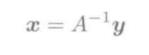

所以要知道，**存在可逆矩阵的A称为正则矩阵，不是正则矩阵的，我们都称为奇异矩阵**。注意只有方阵才有可逆的概念，也就是说不是方阵，那就一定是奇异矩阵。

实质上这种同维向量和方阵之间的问题，就是中学数学时的 **线性方程组**。

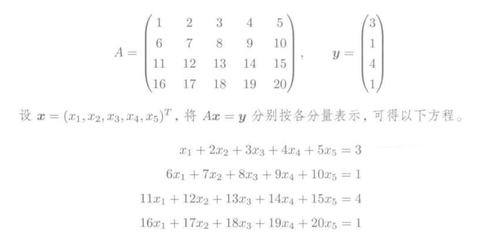

### 恶性问题
看回公式

`y = Ax + (噪声)`

假如x和y向量的维度不一样又如何呢？假定我们把y当做线索，x称为已知量，不考虑噪声。则会以下有几种情况可以讨论。

#### 线索不足(矮矩阵)
线索比未知量少的情况下，我们把矩阵称之为 **矮矩阵**。

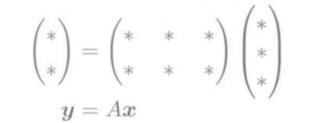

本质上就是未知量向量通过一个矮矩阵，**压缩扁平化** 之后到一个低维度向量。

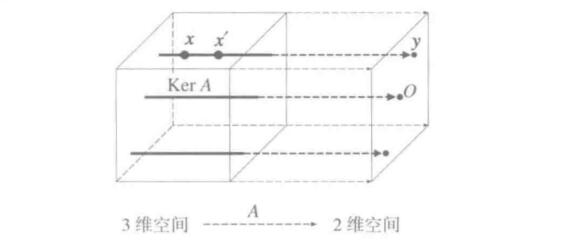

形象点来说如上图，一个立方体上的点(三维向量)映射到右边那面墙上了，一条线上的点会对应成右墙的一个点。

可以认为在转换的过程中，丢失了一部分信息。

这里还要讲一个概念，在压缩扁平化过程中，对于Ax=0(0向量)中，x的集合我们称为  **A的核(kernal)**

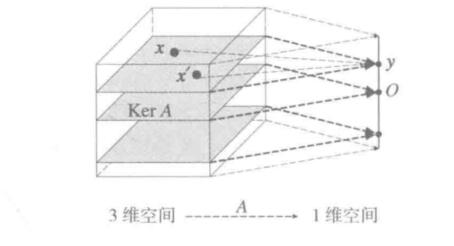

如上图，假如我们想把正方体映射成一条线，则显然正方体中间那个平面才能映射成一条线上的点y=0.则我们可以知道中间那个平面就是KerA,这个核是二维的。

同理我们也可以看上上张图，立方体映射成二维平面，则中间那条线是KerA，是一维的。

#### 线索过剩(长矩阵)

线索过剩的情况下，矩阵便是长矩阵，如下图。

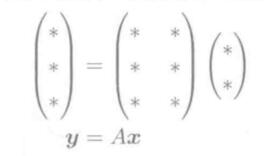

矩阵过剩，本该高兴，然后很容易出现线索一有多，就很容易出现互相矛盾的情况。

先直观来看，`y = Ax + (噪声)`。线索过多，本质上就是x从低维度到高维度的转变。

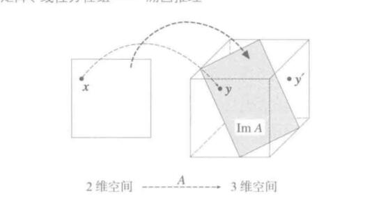

一个平面被映射成了三维空间里的一些点，这里要注意映射完之后的ImA三维平面，我们也可以称作 **像image**。

#### 线索刚好(奇异矩阵)
线索刚好的情况下也未必能求出x。显然，线索很可能会重复，这样实质上跟矮矩阵没什么两样。

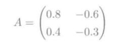

### 线性相关
线性相关是用数学式表示扁平化映射(也就是线索不够)，

也就是说，对于一个矩阵A，如果存在两个不同的向量x1和x2，有`Ax1 = Ax2`,那我们就可以认为矩阵A中的各个列向量，或者说列向量代表的数线性相关。反之，则是线性无关的。

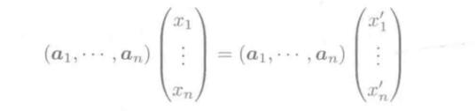

好比上述式子，注意a1....an是个矩阵，虽然每列只有一个数。最后如果存在两个向量映射到同一个y上，则可知各个列向量分量a1...an是线性相关的。

### 矩阵的秩
根据上面的讨论，我们知道一个m\*n的矩阵变换，可以把n维向量映射成一个m维向量。我们在讨论恶性问题时把y当做线索，**显然矩阵的维度m和线索的大小一致**，m*n维矩阵映射出m维变量。

那么我们所说的矩阵的 **秩**，就是 **有效线索** 的个数了。矩阵的秩用`rank(A)`来表示。

#### 瓶颈形矩阵分解
一个秩为r的矩阵，可以分解成两个瘦矩阵，一个矩阵高为r，一个矩阵宽为r。

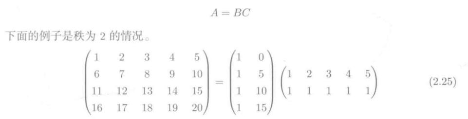

显然根据矩阵变换中的，矩阵相乘等于叠加。我们知道：

Ax = BCx

那么，根据上图的矩阵分解，意思就是我把一个变量先用一个2*5的矩阵压成一个二维平面变量，再把这个变量拉扯投到一个四维空间，显然失真了吧，且这个有效线索被压缩之后显然只有2，跟直接进行A变换是符合的。

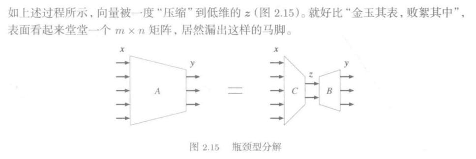

这也就是所谓的瓶颈型分解。

#### 求解矩阵的秩
一些简单的矩阵可以通过大致观察得出，一个矩阵可以看做是许多列向量的集合，那么如果某些列向量通过互相操作可以推出另一些列向量，那么显然就可以得知有 **多余线索了**。

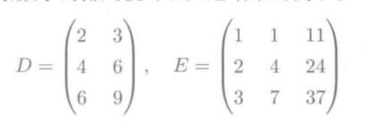

比如上面，rank(D)=1,rank(E)=2.
