## 特征值与特征向量
在向量空间和溯因推理的笔记中，我们了解了矩阵。现在来讨论特征向量方面的问题。

### 系统失控
我们有时候会需要研究一个系统是否会失控的问题。也就是说假定给定一个函数x(t),然后给出递归式子：

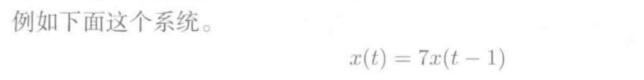

可以推倒出：

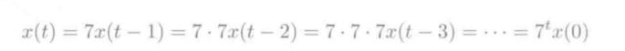

显然，当t趋向于正无穷时，x(t)也是趋向于正无穷的，那么这个系统就是失控的。

**对于一般论：**

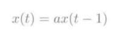

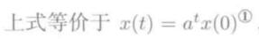

a的绝对值大于1，则系统失控，a的绝对值小于等于1，则系统不会失控。

### 矩阵表示下的系统
我们可以用一个函数表示一个系统，当然也可以用一个矩阵来囊括一组函数，从而表示一个系统。比如：

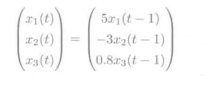

把三个x函数合成为一个x函数，如此写成向量，一一对应，本质上其实可以分解成一个对角矩阵，即：

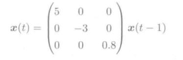

规约成对角矩阵也相当简洁。

由于上面的式子都很简单，我们显然可以得知

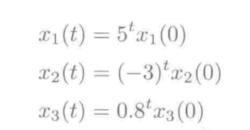

也可以表示成如下形式：

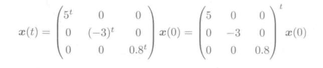

显然，可以得出推论，对于系统函数，能用对角矩阵表示的话：

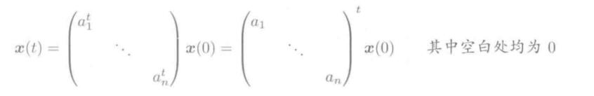

对角线上的常数a，只要有一个大于1，那么必然有一组函数要失控，那么这个系统就会失控。

### 矩阵对角化
上面有关系统的失控都是铺垫，为了引出，矩阵对角化这个概念。

矩阵如果是对角矩阵，显然可以用上面的方法简单表示，然后判断系统是否会失控，然而事实上，我们更多的会遇到矩阵非对角矩阵的情况。

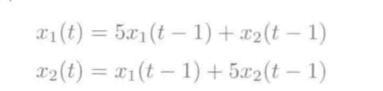

上面两组函数矩阵表示则是：

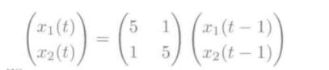

这时候我们当然会想，要是能像对角矩阵一样轻松得出最后的公式就好了。实质上确实是可以的，省略推倒过程，看下面结果。

我们这里先引入了矩阵对角化的概念：**选择合适的可逆矩阵P，使得P-1AP是对角矩阵**

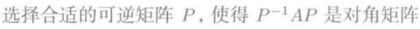

最后得出的结果(省略推导过程)为：

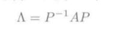

简而言之就是，对于x(t)=Ax(t-1),对于矩阵A进行对角化，找出这个矩阵P，然后计算出P^-1AP,最后公式则是:

`x(t) = P * (P^-1AP) * P^-1 * x(0)`

所以关键就在于，怎么求得这个可逆矩阵P了。

### 特征值和特征向量
对于A的对角化，为了求得这个可逆矩阵P，我们就会引出特征值和特征向量的概念了。

我们把P这个矩阵写成一组列向量：

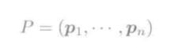

那么这个A和这些P中的这些列向量之间(p1...pn)，满足一种关系:

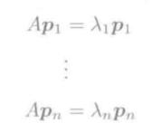

矩阵乘以列向量p等于一个数朗母达乘以列向量p。

**我们把这些列向量称为特征向量(其实也就是矩阵P分成了一组组列向量)，常数朗母达，我们称之为特征值。**

所以求出合适的P，我们就有以下步骤：

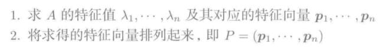

并且有：

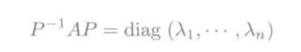

diag是对角矩阵的意思。

所以把A对角化之后生成的对角矩阵，对角值就是这些常数朗母达。

#### 几何学意义

特征值和特征向量的严格定义，就是：

显然，由于矩阵A相当于给列向量p做了一个变换，然而变换之后只是相当于给列向量做了拉伸或者缩短。
