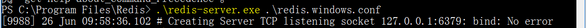
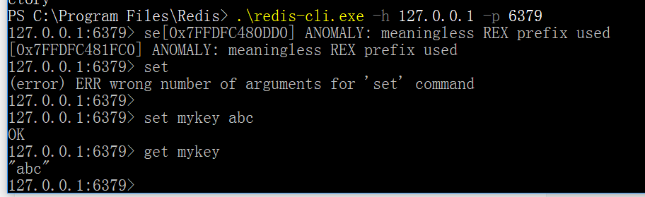

## redis基础
Redis 是完全开源免费的，遵守BSD协议，是一个高性能的key-value数据库。
Redis 与其他 key - value 缓存产品有以下三个特点：

 - Redis支持 **数据的持久化**，可以将内存中的数据保存在磁盘中，重启的时候可以再次加载进行使用。
 - Redis不仅仅支持简单的key-value类型的数据，同时还提供list，set，zset，hash等数据结构的存储。
 - Redis支持数据的备份，即master-slave模式的数据备份。

redis优势如下：

 - 性能极高 – Redis能读的速度是110000次/s,写的速度是81000次/s 。
 - 丰富的数据类型 – Redis支持二进制案例的 Strings, Lists, Hashes, Sets 及 Ordered Sets 数据类型操作。
 - 原子 – Redis的所有操作都是原子性的，意思就是要么成功执行要么失败完全不执行。单个操作是原子性的。多个操作也支持事务，即原子性，通过MULTI和EXEC指令包起来。
 - 丰富的特性 – Redis还支持 publish/subscribe, 通知, key 过期等等特性。

### 启动
安装好后进入目录启动



然后用它自带的redis-cli工具进入做简单测试操作



### 数据类型
redis有五种数据类型：
 - String
 - hash
 - list
 - set
 - zset(有序集合)

在redis中存储数据都是用的键值对的形式。

#### String

string是redis最基本的类型，一个key对应一个value。**string类型是二进制安全的。意思是redis的string可以包含任何数据。比如jpg图片或者序列化的对象** ；一个键最大能存储512MB。

#### Hash
Redis hash 是一个键值(key=>value)对集合。Redis hash 是一个 string 类型的 field 和 value 的映射表，hash 特别适合用于存储对象。

```
redis> HMSET myhash field1 "Hello" field2 "World"
"OK"
redis> HGET myhash field1
"Hello"
redis> HGET myhash field2
"World"
```

我们使用了 **Redis HMSET, HGET 命令**，HMSET 设置了两个 field=>value 对, HGET 获取对应 field 对应的 value。

#### List
Redis 列表是简单的字符串列表，按照插入顺序排序。你可以添加一个元素到列表的头部（左边）或者尾部（右边）。

```
redis 127.0.0.1:6379> lpush runoob redis
(integer) 1
redis 127.0.0.1:6379> lpush runoob mongodb
(integer) 2
redis 127.0.0.1:6379> lpush runoob rabitmq
(integer) 3
redis 127.0.0.1:6379> lrange runoob 0 10
1) "rabitmq"
2) "mongodb"
3) "redis"
redis 127.0.0.1:6379>
```

列表最多可存储 232 - 1 元素 (4294967295, 每个列表可存储40多亿)。

#### Set
Redis的Set是string类型的无序集合。集合是通过哈希表实现的，所以添加，删除，查找的复杂度都是O(1)。用C++类型来描述就是 `Map<String,Set<String>>`

**sadd命令，添加一个 string 元素到 key 对应的 set 集合中，成功返回1，如果元素已经在集合中返回 0，如果 key 对应的 set 不存在则返回错误。***

```
redis 127.0.0.1:6379> sadd runoob redis
(integer) 1
redis 127.0.0.1:6379> sadd runoob mongodb
(integer) 1
redis 127.0.0.1:6379> sadd runoob rabitmq
(integer) 1
redis 127.0.0.1:6379> sadd runoob rabitmq
(integer) 0
redis 127.0.0.1:6379> smembers runoob

1) "redis"
2) "rabitmq"
3) "mongodb"
```

上面命令用sadd添加了字符串到runoob这个位置的set中。

#### zset
Redis zset 和 set 一样也是string类型元素的集合,且不允许重复的成员。不同的是每个元素都会关联一个double类型的分数。redis正是通过分数来为集合中的成员进行从小到大的排序。zset的成员是唯一的,但分数(score)却可以重复。

**zset使用zadd命令**

```
redis 127.0.0.1:6379> zadd runoob 0 redis
(integer) 1
redis 127.0.0.1:6379> zadd runoob 0 mongodb
(integer) 1
redis 127.0.0.1:6379> zadd runoob 0 rabitmq
(integer) 1
redis 127.0.0.1:6379> zadd runoob 0 rabitmq
(integer) 0
redis 127.0.0.1:6379> > ZRANGEBYSCORE runoob 0 1000
1) "mongodb"
2) "rabitmq"
3) "redis"
```

#### HyperLogLog
Redis 在 2.8.9 版本添加了 HyperLogLog 结构。Redis HyperLogLog 是用来做基数统计的算法，HyperLogLog 的优点是，在输入元素的数量或者体积非常非常大时，计算基数所需的空间总是固定的、并且是很小的。

在 Redis 里面，每个 HyperLogLog 键只需要花费 12 KB 内存，就可以计算接近 2^64 个不同元素的基 数。这和计算基数时，元素越多耗费内存就越多的集合形成鲜明对比。

什么是基数呢？

比如数据集 {1, 3, 5, 7, 5, 7, 8}， 那么这个数据集的基数集为 {1, 3, 5 ,7, 8}, 基数(不重复元素)为5。 基数估计就是在误差可接受的范围内，快速计算基数。

**zwlj：所谓的基数其实就是集合中的不重复元素的个数**

```
redis 127.0.0.1:6379> PFADD runoobkey "redis"

1) (integer) 1

redis 127.0.0.1:6379> PFADD runoobkey "mongodb"

1) (integer) 1

redis 127.0.0.1:6379> PFADD runoobkey "mysql"

1) (integer) 1

redis 127.0.0.1:6379> PFCOUNT runoobkey

(integer) 3
```

### redis订阅
redis可以通过一种类观察者模式来分发消息。


以下实例演示了发布订阅是如何工作的。在我们实例中我们创建了订阅频道名为 redisChat:

```
redis 127.0.0.1:6379> SUBSCRIBE redisChat

Reading messages... (press Ctrl-C to quit)
1) "subscribe"
2) "redisChat"
3) (integer) 1
```

现在，我们先重新开启个 redis 客户端，然后在同一个频道 redisChat 发布两次消息，订阅者就能接收到消息。

```
redis 127.0.0.1:6379> PUBLISH redisChat "Redis is a great caching technique"

(integer) 1

redis 127.0.0.1:6379> PUBLISH redisChat "Learn redis by runoob.com"

(integer) 1

# 订阅者的客户端会显示如下消息
1) "message"
2) "redisChat"
3) "Redis is a great caching technique"
1) "message"
2) "redisChat"
3) "Learn redis by runoob.com"
```

### redis事务
Redis 事务可以一次执行多个命令， 并且带有以下两个重要的保证：

 - 批量操作在发送 EXEC 命令前被放入队列缓存。
 - 收到 EXEC 命令后进入事务执行，**事务中任意命令执行失败，其余的命令依然被执行。**
 - **在事务执行过程，其他客户端提交的命令请求不会插入到事务执行命令序列中。**

```
redis 127.0.0.1:6379> MULTI
OK

redis 127.0.0.1:6379> SET book-name "Mastering C++ in 21 days"
QUEUED

redis 127.0.0.1:6379> GET book-name
QUEUED

redis 127.0.0.1:6379> SADD tag "C++" "Programming" "Mastering Series"
QUEUED

redis 127.0.0.1:6379> SMEMBERS tag
QUEUED

redis 127.0.0.1:6379> EXEC
1) OK
2) "Mastering C++ in 21 days"
3) (integer) 3
4) 1) "Mastering Series"
   2) "C++"
   3) "Programming"
```

注意一点：**单个 Redis 命令的执行是原子性的，但 Redis 没有在事务上增加任何维持原子性的机制，所以 Redis 事务的执行并不是原子性的。事务可以理解为一个打包的批量执行脚本，但批量指令并非原子化的操作，中间某条指令的失败不会导致前面已做指令的回滚，也不会造成后续的指令不做。**

### 高级技术
见相关笔记
