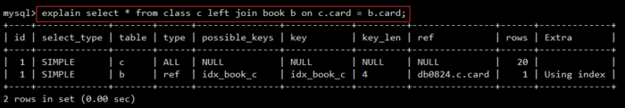

## Explain
使用 EXPLAIN 关键字可以让你知道MySQL是如何处理你的SQL语句的。这可以帮你分析你的查询语句或是表结构的性能瓶颈。

了解清楚explain输出信息的意义，有助于帮助我们优化sql语句。

**explain + 待执行的sql** 即可看到输出

从上表中我们看到,通过explain+sql执行后，显示了一张列表,那么接下来我们就详细说说这个个列表中表头各个字段的意思
从上表中我们看到,通过explain+sql执行后，显示了一张列表,那么接下来我们就详细说说这个个列表中表头各个字段的意思

#### id
**决定表的读取顺序**

SELECT识别符。这是SELECT查询序列号。这个不重要,查询序号即为sql语句执行的顺序

如果id相同，可以认为是一组，从上往下顺序执行; **id值越大，优先级越高，越先执行**；

#### select_type
select类型，它有以下几种值

 - simple:简单的select查询,查询中不包含子查询或者union;
 - **primary:查询中若包含任何复杂的子查询,最外层查询则被标记**;
 - subquery:在select或者where列表中包含了子查询;
 - derived:在from列表中包含的子查询被标记为DERIVED(衍生表),**mysql会递归执行这些子查询,把结果放临时表中**;
 - union:若第二个select出现在union之后,则被标记为union,若union包含在from子句的子查询中,外层select将被标记为:DERIVED;
 - union result:从union表(即union合并的结果集)中获取select查询的结果;

#### type：联接类型
显示查询使用了何种类型,从最好到最差依次是:

**system > const > eq_ref > ref > range > index > all**

 - system:表只有一行记录(等于系统表),这是const类型的特例,平时不会出现,这个也可忽略不计;

 - const:表示通过索引一次就找到了，const用于比较primary key或者unique索引。因为只匹配一行记录,所以很快. 如果将主键置于where列表中,mysql就能将该查询转换成一个常量;

 - eq_ref:唯一性索引扫描,对于每一个索引键,表中只有一条记录与之匹配,常用于主键或唯一索引扫描;

 - ref:非唯一性索引扫描,返回匹配某个单独值得所有行,本质上也是一种索引访问,它返回所有匹配某个单独值的行,然而,它可能会找到多个符合条件的行,所以它应该属于查找和扫描的混合体;

 - range:只检索给定范围的行,使用一个索引来选择行,key列显示使用哪个索引,一般就是在你的where语句中出现了between,<,>,in等的查询；这种范围索引扫描比全表扫描要好,因为它只需要开始于索引的某一个点,结束于另一个点,不用扫描全部索引;

 - index:index于all区别为index类型只遍历索引树,这通常比all快,因为索引文件通常比数据文件小;也就是说虽然all和index都是读写表,但index是从索引中读取的,而all是从硬盘中读的;

 - all:也就是全表扫描;

#### possible_keys
possible_keys列指出MySQL能使用哪个索引在该表中找到行。**注意，该列完全独立于EXPLAIN输出所示的表的次序**。这意味着在possible_keys中的某些键实际上不能按生成的表次序使用。

#### key
key列显示MySQL实际决定使用的键(索引)。如果没有选择索引，键是NULL。要想强制MySQL使用或忽视possible_keys列中的索引，在查询中使用FORCE INDEX、USE INDEX或者IGNORE INDEX。

#### key_len
key_len列显示MySQL决定使用的键长度。如果键是NULL，则长度为NULL。注意通过key_len值我们可以确定MySQL将实际使用一个多部关键字的几个部分。

#### ref
ref列显示使用哪个列或常数与key一起从表中选择行。

#### rows
rows列显示MySQL认为它执行查询时必须检查的行数。

#### Extra
该列包含MySQL解决查询的详细信息。

 - Distinct：MySQL发现第1个匹配行后，停止为当前的行组合搜索更多的行。

 - Not exists：MySQL能够对查询进行LEFT JOIN优化，发现1个匹配LEFT JOIN标准的行后，不再为前面的的行组合在该表内检查更多的行。

 - range checked for each record (index map: #)：MySQL没有发现好的可以使用的索引，但发现如果来自前面的表的列值已知，可能部分索引可以使用。对前面的表的每个行组合，MySQL检查是否可以使用range或index_merge访问方法来索取行。

 - Using filesort：MySQL需要额外的一次传递，以找出如何按排序顺序检索行。通过根据联接类型浏览所有行并为所有匹配WHERE子句的行保存排序关键字和行的指针来完成排序。然后关键字被排序，并按排序顺序检索行。

 - Using index：从只使用索引树中的信息而不需要进一步搜索读取实际的行来检索表中的列信息。当查询只使用作为单一索引一部分的列时，可以使用该策略。

 - Using temporary：为了解决查询，MySQL需要创建一个临时表来容纳结果。典型情况如查询包含可以按不同情况列出列的GROUP BY和ORDER BY子句时。

 - Using where：WHERE子句用于限制哪一个行匹配下一个表或发送到客户。除非你专门从表中索取或检查所有行，如果Extra值不为Using where并且表联接类型为ALL或index，查询可能会有一些错误。
Using sort_union(...), Using union(...), Using intersect(...)：这些函数说明如何为index_merge联接类型合并索引扫描。
Using index for group-by：类似于访问表的Using index方式，Using index for group-by表示MySQL发现了一个索引，可以用来查询GROUP BY或DISTINCT查询的所有列，而不要额外搜索硬盘访问实际的表。并且，按最有效的方式使用索引，以便对于每个组，只读取少量索引条目。

##### using filesort
using filesort(出现这个东西不好):说明mysql会对数据使用一个外部的索引排序,而不是按照表内的索引顺序进行读取,mysql中无法利用索引完成的排序操作称为"文件排序";

##### using temporary
using temporary(出现这个东西更不好,使用到了临时表):使用了临时表保存中间结果,Mysql在对查询结果排序时使用临时表,常见于排序order by和分组查询group by.

#### 关注rows行
通过**相乘EXPLAIN输出的rows列的所有值**，你能得到一个关于一个联接如何的提示。这应该粗略地告诉你MySQL必须检查多少行以执行查询。

查看rows列可以让我们找到潜在的性能问题。
